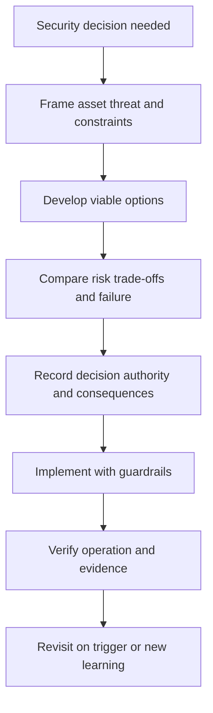

# Secure Architecture Decisions

> **One-line definition:** Making security trade-offs durable through decision records that connect context, options, risk, authority, implementation, and verification.

## Why This Is a Senior Skill

A mid-level engineer may recommend a secure design in a review or leave rationale in a chat thread. A senior security engineer makes consequential choices legible months later, including the constraints that shaped them, the options rejected, the assumptions that could fail, the residual risk accepted, and the evidence required to revisit the choice. This prevents architecture folklore and makes disagreement productive.

Security architecture decisions often cross teams. Identity, platform, product, privacy, operations, legal, and suppliers may each own part of the outcome. The senior specialist clarifies who decides, who implements, who operates, who accepts residual risk, and who verifies the result. They also distinguish reversible experiments from expensive commitments so that uncertainty is reduced before the organization locks in a boundary.

## Core Frameworks

### 1. Security ADR structure

| ADR field | What to capture |
|---|---|
| Context | Asset, threat scenario, business outcome, constraints, and scope |
| Decision drivers | Security properties, quality attributes, migration, cost, and operations |
| Options | Viable alternatives, including do nothing or defer with guardrail |
| Evaluation | Benefits, drawbacks, assumptions, dependencies, and failure modes |
| Decision | Chosen option and why it is proportionate |
| Accountability | Decision authority, implementation owner, operator, and risk owner |
| Evidence | Tests, reviews, telemetry, supplier assurance, and acceptance criteria |
| Consequences | New obligations, residual risk, follow-up, and reopening trigger |

### 2. Option comparison matrix

| Criterion | Option A | Option B | Option C |
|---|---|---|---|
| Threat reduction | What path is blocked or constrained? | What path is blocked or constrained? | What path is blocked or constrained? |
| Failure behavior | How does it behave when dependencies fail? | How does it behave when dependencies fail? | How does it behave when dependencies fail? |
| Operational burden | Who operates and audits it? | Who operates and audits it? | Who operates and audits it? |
| Migration risk | What changes must happen first? | What changes must happen first? | What changes must happen first? |
| Evidence quality | What can be tested or observed? | What can be tested or observed? | What can be tested or observed? |
| Reversibility | How easily can the decision be undone? | How easily can the decision be undone? | How easily can the decision be undone? |

### 3. Decision lifecycle

## Decision Framework

Use this review sequence for decisions that affect trust, authority, data, release integrity, or recovery:

| Gate | Passing question |
|---|---|
| Problem | Can a reader state the asset, threat, and desired outcome? |
| Alternatives | Were realistic options and their constraints considered? |
| Proportionality | Does the choice reduce risk enough for its cost and disruption? |
| Failure | Is behavior defined for identity, key, network, data, and telemetry failure? |
| Accountability | Are decision, implementation, operation, risk acceptance, and verification owners clear? |
| Evidence | Is there a test, observation, review, or contract that supports the claim? |
| Reversibility | Is there a rollback or an explicit cost of changing course? |

## In Practice

### Facilitate the review

Send the decision record before the meeting. Use the meeting to resolve missing facts and trade-offs, not to read the document aloud. Ask each stakeholder what they own and what failure they fear. Separate facts from assumptions. If uncertainty is high and the decision is reversible, propose a bounded experiment with a success measure.

### Common anti-patterns

| Anti-pattern | Problem | Better practice |
|---|---|---|
| Security sign-off only | Approval hides shared accountability | Record decision, implementation, operation, and risk owners |
| One preferred option | Alternatives and constraints stay invisible | Compare viable options and rejected choices |
| Chat-based rationale | Context and evidence disappear | Publish a versioned ADR near architecture sources |
| Permanent exception | Temporary compromise becomes design | Add expiry, guardrail, and reopening trigger |
| Diagram-only review | Failure and operation are unexamined | Include lifecycle, failure behavior, and evidence |

### Evidence and influence

A good record helps a delivery team act without a security engineer in every meeting. Provide policy patterns, test cases, reference implementations, and escalation rules. Review a sample of implementations to see whether the architecture decision survived contact with real constraints.

## Practical Exercise

Choose one security-relevant architecture choice, such as an identity boundary, data isolation design, deployment control, or recovery mechanism.

1. Write the context, asset, threat scenario, constraints, and decision drivers.
2. Compare at least three viable options, including a guarded defer option when appropriate.
3. Evaluate threat reduction, failure behavior, operation, migration, evidence, and reversibility.
4. Record the decision authority, implementation owner, operator, risk owner, and verification owner.
5. Define acceptance evidence and a trigger that would reopen the decision.
6. Review the ADR with one stakeholder from product or operations and revise unclear trade-offs.

**Evidence of completion:** A versioned ADR, option matrix, agreed acceptance evidence, named owners, and a review trigger.

## Knowledge Connections

- [[01_Security_Principles_and_Quality_Attributes|Security Principles and Quality Attributes]]
- [[03_Zero_Trust_and_Segmentation|Zero Trust and Segmentation]]
- [[05_Secrets_and_Cryptographic_Boundaries|Secrets and Cryptographic Boundaries]]
- [[../01_Threat_Modeling_and_Risk/05_Risk_Rating_and_Treatment|Risk Rating and Treatment]]
- [[../01_Threat_Modeling_and_Risk/06_Threat_Model_Maintenance|Threat Model Maintenance]]
- [[body-of-knowledge/SWEBOK/13_Software_Security|SWEBOK Software Security]]
- [[document-template/14_Security/Security-Architecture|Security Architecture Template]]

## Key Takeaways

- Durable security decisions preserve context, options, constraints, authority, and evidence.
- Compare viable alternatives instead of presenting a preferred design as inevitable.
- Record failure behavior and operational ownership, not only the desired architecture.
- Separate decision, implementation, operation, risk acceptance, and verification accountability.
- Use bounded experiments when the choice is reversible and uncertainty is high.
- Reopen architecture decisions when threats, scale, dependencies, or business context changes.
