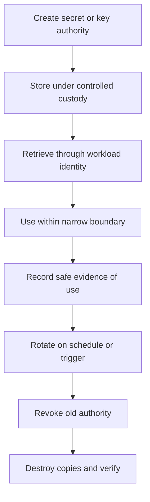

# Secrets and Cryptographic Boundaries

> **One-line definition:** Deliberately placing secret custody, key authority, cryptographic processing, and lifecycle responsibilities across system boundaries.

## Why This Is a Senior Skill

The foundational notes explain cryptographic mechanisms and secure software practices. The senior architecture question is where those mechanisms operate and who can influence them. A system can use a strong algorithm and still fail because a key is exposed in a build log, a secret is copied into too many services, rotation is untested, a cryptographic boundary terminates too early, or a supplier controls recovery without an accountable owner.

Senior engineers model secret and key flows as authority flows. They decide which components may create, retrieve, use, rotate, revoke, escrow, or destroy a secret. They separate application data protection from identity and signing authority, define algorithm and key-management ownership, and design observability that does not leak the material being protected.

## Core Frameworks

### 1. Secret lifecycle register

| Lifecycle stage | Architecture question | Evidence |
|---|---|---|
| Create | Who or what creates the secret and under which authority? | Provisioning record and policy |
| Store | Where is it stored and who can administer the store? | Secret-store configuration and access review |
| Distribute | How does the workload receive it without copying broadly? | Identity policy, delivery logs, negative test |
| Use | What action is permitted and how is use constrained? | Workload policy and audit event |
| Rotate | What triggers rotation and how is compatibility handled? | Rotation exercise and version history |
| Revoke | How quickly can access or material be invalidated? | Revocation test and incident runbook |
| Destroy | How are old copies, backups, and exports handled? | Disposal evidence and retention policy |

### 2. Cryptographic boundary canvas

For each important data or authority flow, record:

| Boundary question | Why it matters |
|---|---|
| Where is plaintext or usable authority present? | Limits the components that must be trusted |
| Where does encryption or signing terminate? | Defines the effective protection boundary |
| Who controls keys and policy? | Establishes accountability and separation of duties |
| Which data can appear in logs, traces, caches, or backups? | Finds secondary leakage paths |
| How are failures and rotation handled? | Prevents emergency shortcuts and stale secrets |
| Which supplier or platform can recover material? | Makes shared responsibility explicit |

### 3. Secret flow

## Decision Framework

Choose a boundary and lifecycle design by asking:

| Question | Decision guidance |
|---|---|
| What is the secret or authority protecting? | Classify consequence and identify the accountable owner |
| Which component truly needs usable material? | Minimize recipients and prefer delegated operations |
| Can the operation stay inside a managed boundary? | Reduce plaintext and export paths when possible |
| Who can change policy and who can use the authority? | Separate administration from routine use for high consequence |
| What happens during rotation or store outage? | Define safe fallback without creating permanent copies |
| How will misuse be detected without leakage? | Log identity, action, resource, and outcome, never secret material |
| What proves the lifecycle works? | Test provisioning, use, rotation, revocation, recovery, and disposal |

## In Practice

### Boundary review

Start with the asset and the business action, then trace secret and key authority through build, deployment, runtime, support, backup, and recovery. Look for environment variables, configuration files, logs, traces, crash dumps, test fixtures, snapshots, and supplier support paths. Record which paths are necessary, which are accidental, and which can be removed.

### Common anti-patterns

| Anti-pattern | Problem | Better practice |
|---|---|---|
| Secret in source or pipeline output | Broad exposure and long retention | Use workload identity and controlled secret delivery |
| One key for many purposes | Compromise has a wide blast radius | Separate purpose, owner, environment, and lifecycle |
| Rotation as a calendar task | Rotation breaks clients or is skipped | Test rotation and define compatibility and rollback |
| Encryption endpoint ignored | Plaintext exists in an unreviewed component | Treat termination as a trust boundary and evidence target |
| Logging for debugging | Material or sensitive context leaks | Log safe identifiers and decision outcomes only |
| Emergency copy becomes permanent | Recovery shortcut creates unmanaged authority | Time-bound, monitor, revoke, and verify disposal |

### Specialist accountability

Platform teams may operate a secret store or KMS. Service teams own correct usage and scope. Security defines patterns, reviews high-consequence boundaries, and tests control assumptions. Business or data owners decide protection requirements and acceptable recovery trade-offs.

## Practical Exercise

Choose one production secret, signing key, encryption key, or token authority.

1. Trace its creation, storage, delivery, use, logging, backup, rotation, revocation, and destruction paths.
2. Identify every component, human role, supplier, and environment that can access or influence it.
3. Remove one unnecessary copy or broad permission.
4. Run a rotation or revocation exercise in a safe environment and record failure behavior.
5. Inspect logs, traces, crash artifacts, and backups for leakage without exposing the material.
6. Write an ADR for the cryptographic boundary, ownership split, evidence, and trigger for review.

**Evidence of completion:** Lifecycle register, boundary map, permission change, rotation or revocation result, leakage review, and ADR.

## Knowledge Connections

- [[01_Security_Principles_and_Quality_Attributes|Security Principles and Quality Attributes]]
- [[04_Secure_Architecture_Decisions|Secure Architecture Decisions]]
- [[06_Resilient_and_Fail_Secure_Design|Resilient and Fail-Secure Design]]
- [[../01_Threat_Modeling_and_Risk/03_Attack_Surface_and_Trust_Boundaries|Attack Surface and Trust Boundaries]]
- [[software-engineering-note/13_Software_Security/Software Security Overview|Software Security Overview]]
- [[software-engineering-note/13_Software_Security/01_Security_Fundamentals|Security Fundamentals]]
- [[body-of-knowledge/CyBOK/09_Software_Security|CyBOK Software Security]]
- [[document-template/14_Security/Security-Architecture|Security Architecture Template]]

## Key Takeaways

- Cryptographic strength does not compensate for poor key custody or boundary placement.
- Model secrets and keys as authority flows across build, runtime, support, backup, and recovery.
- Minimize components that receive usable material and separate administration from routine use.
- Rotation, revocation, recovery, and disposal need exercises, not only policy statements.
- Treat encryption and signing termination points as explicit trust boundaries.
- Evidence should prove lifecycle behavior while never exposing the secret itself.
