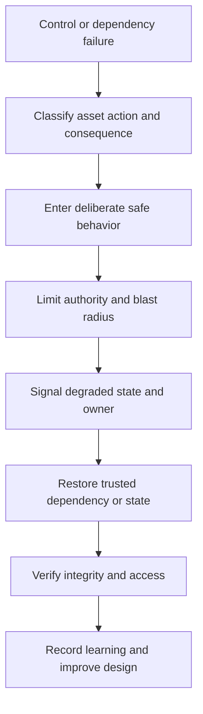

# Resilient and Fail-Secure Design

> **One-line definition:** Designing deliberate behavior for control, dependency, and component failure so that the system limits harm, preserves critical safety properties, and recovers trust.

## Why This Is a Senior Skill

A simplistic rule says every security control should fail closed. Real systems also need availability, safety, emergency access, offline work, and recovery. A senior security engineer decides what must be denied, what may degrade, what can be queued, what needs human approval, and how the system returns to a trusted state. They distinguish a controlled safe mode from an accidental fail-open path.

Resilience is broader than uptime. It includes preserving integrity during partial failure, limiting blast radius, revoking compromised authority, restoring trustworthy data, and giving operators enough evidence to act. Senior engineers test these behaviors under realistic dependency failures and make the trade-off visible to the owners who bear the consequence.

## Core Frameworks

### 1. Failure behavior matrix

| Failure condition | Preferred security behavior | Availability or usability trade-off | Evidence |
|---|---|---|---|
| Identity provider unavailable | Deny new privileged actions, preserve safe read or queued work where possible | Some actions are delayed | Failure exercise and recovery timing |
| Policy service unavailable | Use bounded, versioned cache only for defined low-risk actions | Fresh policy changes may wait | Cache expiry and deny tests |
| Key service unavailable | Stop operations that require new authority; avoid unsafe key reuse | Writes or releases may pause | Key outage exercise |
| Telemetry unavailable | Do not silently expand access; raise degraded-mode signal | Response visibility is reduced | Independent health signal |
| Data store inconsistent | Stop destructive actions and isolate affected data | Service may enter read-only mode | Integrity check and restore test |
| Dependency compromised | Revoke or narrow trust and isolate path | Some integrations stop | Segmentation and credential revocation exercise |

### 2. Fail behavior decision

For each control, decide based on the consequence of allowing and denying the action:

| Question | If allowing is worse | If denying is worse |
|---|---|---|
| Is the action high-impact or irreversible? | Prefer deny or require explicit emergency authority | Define a controlled break-glass path |
| Is the action safety-critical or needed for recovery? | Use a bounded safe mode and dual control | Preserve the minimal safe capability |
| Can a cached decision become dangerous? | Expire quickly and deny on uncertainty | Limit cache to low-risk, reversible actions |
| Can the system queue work safely? | Queue with integrity and replay controls | Avoid local copies that become untrusted |
| Can operators see the mode? | Make degraded state explicit and alertable | Never hide a security fallback |

### 3. Failure and recovery loop

## Decision Framework

Review failure behavior at four levels:

| Level | Questions |
|---|---|
| Action | Which action is allowed, denied, queued, or human-approved? |
| Boundary | Which identities, resources, data, and zones remain reachable? |
| Evidence | How do operators know the system is degraded or compromised? |
| Recovery | What makes it safe to resume and how is trust re-established? |

A fail-secure decision is not complete until the resume condition is defined. Otherwise a system may remain unavailable, or operators may bypass the control without a record.

## In Practice

### Design for partial failure

For each important dependency, document timeout, retry, cache, queue, circuit-breaker, and emergency behavior. Review whether retries amplify abuse, whether cached authority outlives its context, whether local fallback creates data exposure, and whether recovery can verify integrity. Keep break-glass access narrow, time-bound, dual-controlled where appropriate, and fully observable.

### Common anti-patterns

| Anti-pattern | Why it fails | Better practice |
|---|---|---|
| Blanket fail closed | Critical work stops without a safe recovery path | Define action-specific safe modes and recovery |
| Blanket fail open | Dependency failure silently expands authority | Permit only bounded low-risk behavior with expiry |
| Hidden degraded mode | Operators and users cannot interpret behavior | Signal mode, impact, owner, and next action |
| Retry storm | Failure creates load and amplifies denial of service | Bound retries, use backoff, and protect dependencies |
| Break-glass without expiry | Emergency authority becomes normal access | Time-bound, approve, monitor, revoke, and review |
| Restore without trust check | Compromised or stale state returns to service | Verify integrity, provenance, permissions, and evidence |

### Tabletop and technical evidence

Use both architecture reasoning and exercises. A tabletop reveals ownership and communication gaps. A technical game day reveals cache, timeout, retry, policy, key, and recovery behavior. Record time to detect, time to contain, authority exposed, data affected, and conditions for safe resume.

## Practical Exercise

Choose a critical workflow and inject four failures in a test environment or tabletop: identity unavailability, policy or key-store failure, telemetry loss, and a compromised dependency.

1. Define the acceptable action, denial, queue, or emergency behavior for each failure.
2. Identify the authority and data that remain reachable in each mode.
3. Add explicit degraded-state signals, owners, runbook steps, and resume conditions.
4. Test timeout, retry, cache expiry, revocation, restore, and integrity verification behavior.
5. Record where the design chose availability over confidentiality or integrity, and who accepted that trade-off.
6. Feed the results into an ADR and a threat-model maintenance trigger.

**Evidence of completion:** Failure matrix, exercise results, degraded-mode telemetry, recovery proof, updated ADR, and a named follow-up owner.

## Knowledge Connections

- [[02_Defense_in_Depth|Defense in Depth]]
- [[03_Zero_Trust_and_Segmentation|Zero Trust and Segmentation]]
- [[05_Secrets_and_Cryptographic_Boundaries|Secrets and Cryptographic Boundaries]]
- [[../01_Threat_Modeling_and_Risk/05_Risk_Rating_and_Treatment|Risk Rating and Treatment]]
- [[../01_Threat_Modeling_and_Risk/06_Threat_Model_Maintenance|Threat Model Maintenance]]
- [[software-engineering-note/13_Software_Security/Software Security Overview|Software Security Overview]]
- [[body-of-knowledge/SWEBOK/13_Software_Security|SWEBOK Software Security]]
- [[document-template/14_Security/Security-Architecture|Security Architecture Template]]

## Key Takeaways

- Fail secure means deliberate protection of important outcomes, not an automatic deny rule everywhere.
- Choose behavior per action, asset, consequence, and recovery need.
- Bound caches, retries, queues, and break-glass authority so failure does not expand trust.
- Make degraded state visible and assign an owner who can restore service safely.
- Recovery must re-establish integrity, provenance, access, and evidence before resuming.
- Exercises turn failure assumptions into architecture improvements and accountable decisions.
