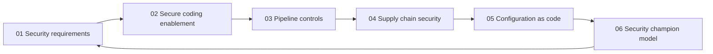

# Secure Development and DevSecOps

> **Core idea:** A senior security engineer makes secure delivery the default by turning security intent into backlog decisions, developer enablement, automated controls, trustworthy supply chains, and shared ownership.

## What This Capability Means at Senior Level

Secure development is not a security team checklist placed beside delivery. It is the engineering system that makes security decisions repeatable from product discovery through operation. The senior security engineer connects threat context, security requirements, implementation guidance, pipeline controls, dependency governance, and release evidence so that a team can move quickly without losing control of material risk.

A mid-level practitioner may configure a scanner, review a pull request, or advise a team on a vulnerability. A senior practitioner asks whether the control is placed at the right point in the delivery flow, whether the signal is trustworthy, whether the developer can act on it, and whether an exception has an owner and an expiry. They build paved roads and feedback loops rather than becoming a manual approval gate.

The goal is not zero findings or maximum tool coverage. The goal is a delivery system in which important security properties are explicit, checked at the cheapest reliable point, backed by evidence, and revisited when architecture, dependencies, or threats change.

## Why It Matters

Security defects become more expensive and more political when they are discovered after release. Clear requirements let developers make correct choices. Good enablement reduces repeated mistakes. Pipeline controls create fast feedback and prevent known bad states from progressing. Supply-chain and configuration practices address risks that are outside the application code itself. A champion model spreads judgment across teams while preserving a path to specialist help.

Senior-level outcomes include:

- Security requirements that are traceable to threats, assets, controls, and acceptance evidence
- Developers who have safe APIs, examples, rules, and feedback they can use without waiting for a specialist
- Pipeline gates that block only when the signal and consequence justify the delivery cost
- Dependency, artifact, and build provenance that can be investigated after a supplier event
- Configuration that is reviewed, tested, drift-aware, and safe by default
- Security champions who increase local capability without becoming honorary security approvers

## Topic Notes

| # | Topic | Senior-level focus | Status | File |
|---|---|---|---|---|
| 01 | [[01_Security_Requirements_in_Backlog|Security Requirements in Backlog]] | Convert risk into testable, prioritized delivery work | Done | `01_Security_Requirements_in_Backlog.md` |
| 02 | [[02_Secure_Coding_Enablement|Secure Coding Enablement]] | Build developer capability and safe paved roads | Done | `02_Secure_Coding_Enablement.md` |
| 03 | [[03_DevSecOps_Pipeline_Controls|DevSecOps Pipeline Controls]] | Place proportionate, trustworthy controls in the flow | Done | `03_DevSecOps_Pipeline_Controls.md` |
| 04 | [[04_Dependency_and_Supply_Chain_Security|Dependency and Supply Chain Security]] | Manage transitive risk, provenance, and response | Done | `04_Dependency_and_Supply_Chain_Security.md` |
| 05 | [[05_Security_Configuration_as_Code|Security Configuration as Code]] | Encode security invariants and control drift | Done | `05_Security_Configuration_as_Code.md` |
| 06 | [[06_Security_Champion_Operating_Model|Security Champion Operating Model]] | Scale security judgment through product teams | Done | `06_Security_Champion_Operating_Model.md` |

**Completion:** 6/6 topics, 100%

## How the Topics Connect

**Reading order:** Start with requirements because they define the security outcome. Read coding enablement and pipeline controls together to understand the developer experience. Then cover supply chain and configuration as code, which extend the trust boundary beyond application source. Finish with the champion model to see how a senior engineer scales the operating model across teams.

## Existing Vault Anchors

These notes overlay senior application on existing foundations rather than restating them:

| Senior topic | Existing foundation notes |
|---|---|
| Security requirements | [[document-template/14_Security/Security-Requirements-Specification|Security Requirements Specification]], [[body-of-knowledge/SWEBOK/13_Software_Security|SWEBOK Software Security]], [[body-of-knowledge/CyBOK/09_Software_Security|CyBOK Software Security]] |
| Secure coding enablement | [[software-engineering-note/13_Software_Security/Software Security Overview|Software Security Overview]], [[software-engineering-note/13_Software_Security/Cybersecurity/02 Secure Development/02 Secure Coding Practices|Secure Coding Practices]], [[document-template/14_Security/Secure-Coding-Guidelines|Secure Coding Guidelines]] |
| Pipeline controls | [[software-engineering-note/13_Software_Security/05_Secure_Development_and_Assurance|Secure Development and Assurance]], [[document-template/14_Security/DevSecOps-Pipeline-Configuration|DevSecOps Pipeline Configuration]], [[software-engineering-note/05_Software_Testing/Software Testing Overview|Software Testing Overview]] |
| Supply chain security | [[software-engineering-note/13_Software_Security/Cybersecurity/02 Secure Development/02 Dependency & Supply Chain|Dependency and Supply Chain]], [[body-of-knowledge/CyBOK/09_Software_Security|CyBOK Software Security]], [[document-template/14_Security/SCA-Report|SCA Report]] |
| Configuration as code | [[software-engineering-note/13_Software_Security/Cybersecurity/03 Infrastructure Security/03 Container & Cloud Security|Container and Cloud Security]], [[document-template/14_Security/DevSecOps-Pipeline-Configuration|DevSecOps Pipeline Configuration]], [[software-engineering-note/13_Software_Security/03_Access_Control_and_Architecture|Access Control and Architecture]] |
| Security champions | [[software-engineering-note/13_Software_Security/05_Secure_Development_and_Assurance|Secure Development and Assurance]], [[career-path/10_Quality_and_Test_Engineering/00_overview|Quality and Test Engineering]], [[document-template/14_Security/SSDLC-Process-Documentation|SSDLC Process Documentation]] |

## Senior Decision Framework: Where to Put a Control

Use the following questions before adding a new security check:

| Question | Strong signal | Senior decision |
|---|---|---|
| Can the issue be detected before code is shared? | Deterministic local rule | Prefer editor, pre-commit, or developer feedback |
| Does the issue require repository or build context? | Dependency, provenance, or cross-file rule | Run in pull request or build validation |
| Does the issue require a running system? | Auth flow, network behavior, deployment policy | Run in an isolated environment or deployment gate |
| Is the signal noisy or exploratory? | Heuristic scanner or manual attack path | Make it advisory until validated, then tune or gate selectively |
| What happens if the control is unavailable? | Control protects a critical release property | Define fail-closed behavior and a time-bounded break-glass path |
| Who owns the result? | Team can fix it directly | Route to the owning team with evidence and a due date |

## Self-Assessment Checklist

- [ ] I can turn a threat or abuse case into a testable backlog item with an owner and evidence target.
- [ ] I can explain which security controls belong in developer tools, pull requests, builds, deployments, or runtime.
- [ ] I can design a security gate that balances signal quality, latency, and consequence.
- [ ] I can trace a vulnerable dependency through a lockfile, build, artifact, and deployed service.
- [ ] I can define configuration invariants and detect drift without relying on manual inspection.
- [ ] I can create secure coding guidance that includes examples, automation, and a feedback path.
- [ ] I can distinguish a useful security champion from a distributed approval bottleneck.
- [ ] I can write an exception with scope, compensating controls, owner, evidence, and expiry.
- [ ] I can use pipeline and finding metrics to improve controls rather than to rank teams.
- [ ] I can show how a security decision will be verified and represented in release evidence.

## Related

- [[02_Secure_Architecture_and_Design/00_overview|Secure Architecture and Design]]: threat and trust-boundary decisions that feed this area
- [[04_Security_Verification_and_Testing/00_overview|Security Verification and Testing]]: verification depth and evidence for the controls built here
- [[07_Vulnerability_Management_and_Governance/00_overview|Vulnerability Management and Governance]]: remediation, exceptions, and lifecycle governance
- [[career-path/10_Quality_and_Test_Engineering/00_overview|Quality and Test Engineering]]: quality practices that support secure delivery
- [[career-path/03_Staff_Engineer/00_overview|Staff Engineer]]: broader organizational influence and technical strategy
