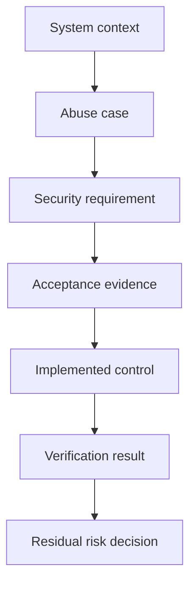

# Security Requirements in Backlog

> **One-line definition:** Turn security risk and stakeholder obligations into prioritized backlog items with observable acceptance evidence.

## Why This Is a Senior Skill

A mid-level engineer may add a security task when a specialist points out a missing control. A senior security engineer makes security intent visible before implementation begins. They connect assets, actors, abuse cases, trust boundaries, business impact, regulatory obligations, and operational assumptions to work that a product team can estimate and verify.

The senior skill is not writing the longest requirement. It is choosing the right level of precision. A requirement must be specific enough to guide design and testing, but not so prescriptive that it prevents a better implementation. It must also have an owner, a priority rationale, and a verification method. This turns security from an opinion in a review into a product property with a lifecycle.

Use [[document-template/14_Security/Security-Requirements-Specification|Security Requirements Specification]] for the structured document form. This note focuses on how to decide what belongs in the backlog and how to keep it connected to delivery.

## Core Frameworks

### 1. The Security Requirement Quality Frame

For each proposed requirement, capture the following dimensions. The frame helps distinguish a useful requirement from a vague request such as "make it secure."

| Dimension | Question to answer | Example evidence |
|---|---|---|
| Asset | What data, capability, or trust is protected? | Customer export, signing key, administrative action |
| Actor | Which legitimate and hostile actors matter? | Tenant member, support operator, external attacker |
| Action | What behavior must be allowed, prevented, or detected? | Prevent cross-tenant reads, record privileged changes |
| Boundary | Where does trust change? | API gateway to service, service to queue, build to registry |
| Condition | Under what context must the rule hold? | Anonymous request, degraded dependency, replayed token |
| Assurance | How strong or durable must the property be? | MFA for privileged action, rotation within a defined interval |
| Evidence | How will the team demonstrate it? | Automated test, configuration check, review record, log sample |

Write acceptance criteria from the observable behavior. Avoid prescribing a library unless the choice is itself a risk decision.

### 2. Risk-to-Backlog Prioritization

Security work competes with feature work. Make the trade-off explicit rather than hiding it in a severity label.

| Criterion | Low signal | Medium signal | High signal |
|---|---|---|---|
| Asset impact | Internal convenience data | Sensitive business data | Safety, identity, payment, or regulated data |
| Exposure | Isolated administrative path | Authenticated product path | Public, partner, or machine-facing path |
| Attack feasibility | Strong controls and rare preconditions | Some attacker effort or access | Cheap, repeatable, or known exploit path |
| Change leverage | Local fix with little dependency | Cross-module change | Architectural decision or migration |
| Evidence gap | Existing test and telemetry | Partial verification | No credible verification for a critical claim |

Use the resulting profile to choose treatment:

| Profile | Backlog treatment | Escalation |
|---|---|---|
| High impact and high exposure | Prioritize with the feature or block unsafe scope | Security and product owner decision |
| High impact and low exposure | Define compensating control and a dated follow-up | Risk owner accepts residual exposure |
| Low impact and high noise | Improve the control or defer with rationale | Team decision, no emergency language |
| Unknown impact | Do not silently lower priority | Ask for asset and threat context |

### 3. Traceability From Risk to Evidence

A senior engineer keeps a short chain that survives changes in implementation:

The chain does not require a heavyweight tool. A backlog key, a requirement identifier, a test identifier, and a release record can be enough if the links remain readable.

## In Practice

### Security Refinement Workshop

Run a 60 to 90 minute session when a feature changes trust, data handling, authorization, or deployment boundaries:

1. **Context, 10 minutes:** Confirm actors, assets, data flows, entry points, and the intended business outcome.
2. **Abuse cases, 15 minutes:** Ask how a user, compromised account, malicious tenant, or altered dependency could misuse the capability.
3. **Requirements, 20 minutes:** Write a small set of SHALL statements and negative acceptance criteria.
4. **Verification, 15 minutes:** Name the test, scan, review, or operational evidence that will prove each requirement.
5. **Prioritization, 10 minutes:** Record impact, exposure, feasibility, owner, and release consequence.
6. **Review, 10 minutes:** Check that the requirement is feasible, testable, and linked to the right design decision.

### Senior Review Heuristics

| Weak pattern | Why it fails | Better approach |
|---|---|---|
| "Use best practices" | No observable behavior or owner | Name the required property and evidence |
| "Encrypt everything" | May obscure key scope, lifecycle, and access | Identify data class, boundary, key owner, and failure behavior |
| One security epic at the end | Security is disconnected from design and estimates | Place requirements beside the feature work |
| Scanner severity as priority | Tool score lacks product context | Combine impact, exposure, exploitability, and evidence gap |
| Permanent exception ticket | Risk becomes invisible technical debt | Add compensating controls, owner, and expiry |

### Handling Change

Revisit security requirements when a feature adds a new actor, changes data classification, exposes an API, introduces a dependency, or changes deployment topology. Do not reopen every requirement for cosmetic refactoring. A small change trigger matrix keeps review proportional.

## Practical Exercise

Take one feature in your current project that changes access to data or a privileged action:

1. Identify the protected asset, legitimate actors, hostile actors, and trust boundary.
2. Write two abuse cases and one failure consequence for each.
3. Convert each abuse case into a security requirement with an owner and acceptance evidence.
4. Score impact, exposure, feasibility, and evidence gap using the tables above.
5. Add the requirements to the backlog beside the feature work, then link them to a test or review artifact.
6. Ask a developer, tester, and product owner to review the wording independently.

**Deliverable:** A traceable mini-set of requirements that a different engineer can implement and a tester can verify without asking what "secure" means.

## Knowledge Connections

- [[software-engineering-note/13_Software_Security/Software Security Overview|Software Security Overview]]: lifecycle framing for software security
- [[body-of-knowledge/SWEBOK/13_Software_Security|SWEBOK Software Security]]: security requirements, risk, and assurance foundations
- [[body-of-knowledge/CyBOK/09_Software_Security|CyBOK Software Security]]: software security knowledge framework
- [[document-template/14_Security/Security-Requirements-Specification|Security Requirements Specification]]: reusable requirements artifact
- [[01_Threat_Modeling_and_Risk/00_overview|Threat Modeling and Risk]]: threat context that feeds backlog decisions
- [[03_DevSecOps_Pipeline_Controls|DevSecOps Pipeline Controls]]: automation and evidence points for the requirements
- [[04_Security_Verification_and_Testing/01_Security_Test_Strategy|Security Test Strategy]]: selecting verification depth

## Key Takeaways

- Security requirements describe an observable property, not a general desire for safety.
- Senior engineers connect every important requirement to context, an owner, and evidence.
- Prioritize by product impact and exposure, not by scanner severity alone.
- Negative acceptance criteria make abuse resistance visible to developers and testers.
- Requirements should evolve when actors, data, trust boundaries, or deployment topology changes.
- A short traceability chain is more useful than a large document that no team uses.
