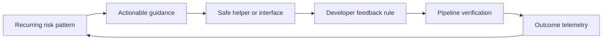

# Secure Coding Enablement

> **One-line definition:** Help engineers produce secure code by combining clear guidance, safe interfaces, automated feedback, and coaching at the point of work.

## Why This Is a Senior Skill

A mid-level security engineer may deliver training, publish a checklist, or comment on insecure code. A senior security engineer treats developer behavior as a system to enable. They look for repeated failure modes, remove unsafe choices from the paved road, create examples that fit the team's language and framework, and use automation to provide feedback before a defect becomes an incident.

Enablement is not a transfer of responsibility from developers to security. Developers still own the code and its behavior. The senior specialist owns the quality of the security interface: whether advice is discoverable, whether a safe API is easier to use, whether a rule explains how to fix the issue, and whether teams can obtain help without opening a queue for every decision.

Use [[software-engineering-note/13_Software_Security/Cybersecurity/02 Secure Development/02 Secure Coding Practices|Secure Coding Practices]] and [[document-template/14_Security/Secure-Coding-Guidelines|Secure Coding Guidelines]] for foundational practices and reusable guidance. This note focuses on the operating model that makes those practices stick.

## Core Frameworks

### 1. Enablement Portfolio

Choose interventions according to the cause of the recurring problem:

| Observed problem | Best first intervention | Senior measure |
|---|---|---|
| Engineers do not know a safe pattern | Short guide with positive and negative examples | Time to find and apply the pattern |
| Safe pattern is hard to implement | Library, wrapper, or secure default | Adoption and reduction in unsafe variants |
| Mistake is easy to repeat | Editor rule, pre-commit rule, or review check | Prevented recurrence with acceptable noise |
| Issue requires design judgment | Threat-informed clinic or design review | Decisions made before implementation |
| Finding arrives too late | Earlier pipeline signal with fix guidance | Lead time from introduction to feedback |
| Teams cannot tell when to ask for help | Clear escalation path and office hours | Time to useful answer, not ticket count |

A training session without a paved road often creates awareness but not behavior change. Pair education with an example, automation, and a way to measure whether the safe choice became easier.

### 2. The Secure Coding Feedback Loop

The loop is valuable only if the telemetry leads to improvement. Count recurring categories, fix time, bypass reasons, and adoption of safe interfaces. Avoid using raw finding volume to shame teams.

### 3. Guardrail Selection Matrix

| Control characteristic | Advisory guidance | Pull request check | Release gate |
|---|---:|---:|---:|
| Rule is deterministic | Good | Strong | Strong when impact is high |
| Fix is local and clear | Good | Strong | Usually unnecessary |
| False positive rate | High tolerance | Low tolerance | Very low tolerance |
| Consequence of escape | Moderate | High | Critical or regulated |
| Feedback latency | Seconds to minutes | Minutes | Minutes to hours acceptable |
| Needs full environment | No | Sometimes | Often |

The senior choice is often to start advisory, measure precision, improve the rule and fix path, then gate only the subset that is both material and trustworthy.

### 4. Learning Path by Role

| Audience | Minimum capability | Practice format |
|---|---|---|
| All developers | Common failure modes and safe defaults | Short examples in the normal onboarding path |
| Feature owners | Threat-aware design and security acceptance criteria | Refinement workshop and pairing |
| Reviewers | How to recognize risky boundaries and data flows | Review heuristics with sample diffs |
| Platform engineers | Secure build, secrets, artifact, and environment controls | Paved-road implementation session |
| Champions | Facilitation, triage, and escalation judgment | Community practice and case review |

## In Practice

### Build a Paved Road

For a high-risk language or framework, provide a small path that includes:

- A secure starter repository with safe defaults
- Approved authentication, authorization, logging, and secrets interfaces
- Examples for input handling, output encoding, error handling, and outbound calls
- Local commands that match the continuous integration checks
- Clear rule messages with a safe alternative and an exception path
- A maintainer and a published support window

Do not promise that a library makes all usage safe. Document the security boundary and the decisions the caller still owns.

### Run a Secure Coding Clinic

Use a real pull request or a small intentionally flawed example. In 45 minutes:

1. Ask the author to explain the trust boundary and expected behavior.
2. Let the team find the risky path before revealing a scanner result.
3. Compare an unsafe implementation, a minimal fix, and the preferred paved-road abstraction.
4. Add one automated regression check.
5. Capture the lesson as a short rule or example in the team repository.

### Anti-Patterns

| Anti-pattern | Cost | What to do instead |
|---|---|---|
| Annual training only | Knowledge decays and does not reach the point of work | Pair short learning with examples and automation |
| Security owns every code review | Creates a queue and weakens team ownership | Review high-risk changes and coach local reviewers |
| Tool output with no fix advice | Engineers learn to dismiss findings | Include a safe pattern, rationale, and test strategy |
| Copying a generic checklist | Advice does not match the stack | Tailor guidance to language, framework, and architecture |
| Blocking on immature rules | Developers bypass or disable the control | Measure precision, tune, then gate a narrow rule set |

## Practical Exercise

Choose one recurring weakness in your current codebase, such as unsafe deserialization, authorization checks scattered across handlers, or secrets in configuration:

1. Collect three real examples and describe the common trust boundary.
2. Write a one-page rule with a bad example, a preferred example, and the reason for the choice.
3. Identify whether a safe wrapper, starter template, or framework configuration can remove the unsafe choice.
4. Implement a lightweight local check or review prompt with an actionable message.
5. Add a regression test that proves the preferred pattern handles the abuse case.
6. Run a 30 minute clinic with two developers and revise the guidance from their questions.

**Deliverable:** A small enablement package containing guidance, a safe example, one automated or review guardrail, and a measure that shows whether adoption improves.

## Knowledge Connections

- [[software-engineering-note/13_Software_Security/Software Security Overview|Software Security Overview]]: software security lifecycle context
- [[software-engineering-note/13_Software_Security/Cybersecurity/02 Secure Development/02 Secure Coding Practices|Secure Coding Practices]]: foundational coding patterns
- [[document-template/14_Security/Secure-Coding-Guidelines|Secure Coding Guidelines]]: document structure for team guidance
- [[body-of-knowledge/SWEBOK/13_Software_Security|SWEBOK Software Security]]: secure construction and assurance foundations
- [[01_Security_Requirements_in_Backlog|Security Requirements in Backlog]]: requirements that guide examples and acceptance tests
- [[03_DevSecOps_Pipeline_Controls|DevSecOps Pipeline Controls]]: where developer feedback becomes automated control
- [[04_Security_Verification_and_Testing/02_SAST_and_Taint_Analysis|SAST and Taint Analysis]]: interpreting static signals used for coaching

## Key Takeaways

- Enablement succeeds when the secure choice is easier to discover and use than the unsafe choice.
- Senior engineers fix repeated causes through interfaces, examples, and feedback loops rather than repeating warnings.
- A scanner message must explain the risk, the safe alternative, and how to verify the fix.
- Start noisy controls as advice, then gate only rules with trustworthy signals and material consequences.
- Developers own code security while security engineers own the enablement system and escalation path.
- Measure behavior change and time to useful feedback, not training attendance alone.
