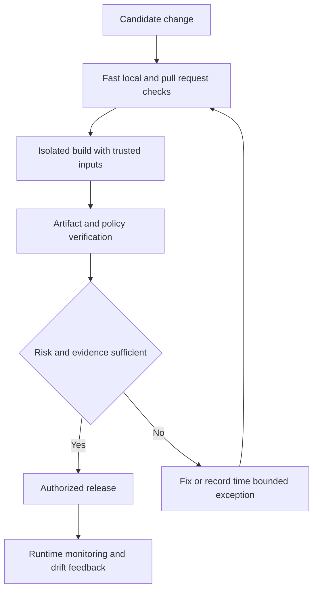

# DevSecOps Pipeline Controls

> **One-line definition:** Design delivery pipeline controls that produce fast, actionable security signals and stop only changes whose risk and evidence justify blocking.

## Why This Is a Senior Skill

A mid-level engineer often adds a scan to a build and treats the result as the control. A senior security engineer designs the whole control contract: what is checked, at which stage, with which identity and input, what counts as failure, who owns remediation, how exceptions work, and how evidence is retained. They understand that a control can fail even when the scanner is accurate if developers cannot reproduce it, results arrive too late, or a bypass is easier than a fix.

Pipeline security also has a two-sided threat model. The pipeline handles source, credentials, dependencies, artifacts, and deployment authority. A control that protects application code but allows untrusted build steps, mutable artifacts, or over-privileged runners leaves a critical attack path open.

Use [[document-template/14_Security/DevSecOps-Pipeline-Configuration|DevSecOps Pipeline Configuration]] for a configuration artifact. This note focuses on choosing and operating controls proportionately.

## Core Frameworks

### 1. Control Placement by Delivery Stage

| Stage | Security question | Typical signal | Senior concern |
|---|---|---|---|
| Developer environment | Can the author get immediate feedback? | Formatting, secrets, simple patterns | Keep feedback fast and reproducible |
| Pull request | Does the change introduce a known risky pattern? | SAST, secret scan, policy review | Require owner and diff-scoped results |
| Build | Are inputs and outputs trustworthy? | SCA, SBOM, provenance, artifact scan | Protect runner identity and artifact lineage |
| Pre-deploy | Does the target environment satisfy policy? | IaC, image, and configuration checks | Validate the exact release candidate |
| Deploy | Is the release authorized and constrained? | Signature, approval, admission policy | Prevent tag substitution and privilege drift |
| Runtime | Did assumptions remain true? | Drift, exposure, and detection signals | Feed learning back into earlier stages |

### 2. Blocking Decision Matrix

Do not use a single global fail threshold. Evaluate each control against signal quality and consequence.

| Signal quality | Consequence if missed | Default mode | Required improvement |
|---|---|---|---|
| High precision | Critical release risk | Block | Time-bounded break-glass and audit trail |
| High precision | Moderate risk | Block or warn by change scope | Define owner and service-level target |
| Mixed precision | Critical risk | Block validated subset, warn the rest | Tune rules and add manual validation |
| Mixed precision | Moderate risk | Warn with due date | Group findings and measure fix rate |
| Low precision | Any consequence | Do not block on raw output | Improve configuration or change technique |

### 3. Pipeline Control Contract

Every important control should document its operating contract:

| Field | Required decision |
|---|---|
| Owner | Team accountable for the input and remediation |
| Scope | Repositories, branches, artifacts, environments, and change types |
| Identity | Which service account or workload identity runs the check |
| Input | Exact commit, dependency lock, image digest, or environment snapshot |
| Rule set | Versioned rules and configuration used for the result |
| Failure | Finding threshold, unavailable service behavior, and retry policy |
| Exception | Compensating control, approver, expiry, and recorded reason |
| Evidence | Result location, retention, integrity, and link to release |

### 4. Secure Control Flow

## In Practice

### Establish a Pipeline Baseline

Start with the assets and authority in the pipeline:

- Source repositories, build runners, package registries, artifact stores, and deployment systems
- Secrets and workload identities available at each stage
- Trust transitions between developer input, generated code, dependencies, and release artifacts
- Branch and environment protection rules
- Logs and evidence needed to investigate a compromised build

Then add checks in a staged rollout. First observe and baseline. Next give actionable feedback. Finally block a narrow set of high-confidence failures. Publish the reason for every gate so teams can predict it before submitting a change.

### Operate Exceptions Safely

A break-glass path is not a waiver from security. It is a controlled alternative when availability, urgent remediation, or a tool outage changes the decision. Record scope, reason, owner, compensating control, expiry, and follow-up. Alert on expired exceptions and review repeated uses as a control-design problem.

### Anti-Patterns

| Anti-pattern | Failure mode | Better approach |
|---|---|---|
| Add every scanner to every build | Slow feedback and contradictory noise | Map each control to a security question and stage |
| Block on severity alone | Context-free gates stop useful delivery | Combine severity with reachability, exposure, and evidence |
| Share one long-lived pipeline credential | A compromised job can deploy broadly | Use short-lived identity and least privilege per stage |
| Scan only source | Dependencies, images, and configuration remain unexamined | Verify the release candidate and its provenance |
| Allow silent bypass | The organization cannot explain residual risk | Use visible, expiring exceptions with ownership |

## Practical Exercise

Design a pipeline for a service that handles sensitive customer data:

1. Draw the source, build, artifact, registry, deployment, and runtime trust transitions.
2. List one security question for each stage from developer environment to runtime.
3. Choose one control for each question and classify it as advisory, pull request, build, or release gate.
4. Write a control contract for the two gates with the highest consequence.
5. Define the unavailable-service behavior and a time-bounded break-glass procedure.
6. Specify which evidence will be attached to a release and how a reviewer can reproduce the result.

**Deliverable:** A concise pipeline control matrix plus one exception record template. Have a developer and platform engineer challenge the latency, ownership, and bypass assumptions.

## Knowledge Connections

- [[software-engineering-note/13_Software_Security/05_Secure_Development_and_Assurance|Secure Development and Assurance]]: secure lifecycle and assurance framing
- [[document-template/14_Security/DevSecOps-Pipeline-Configuration|DevSecOps Pipeline Configuration]]: reusable pipeline documentation
- [[software-engineering-note/13_Software_Security/Software Security Overview|Software Security Overview]]: DevSecOps lifecycle context
- [[software-engineering-note/05_Software_Testing/Software Testing Overview|Software Testing Overview]]: continuous testing and evidence foundations
- [[02_Secure_Coding_Enablement|Secure Coding Enablement]]: developer feedback that precedes pipeline gates
- [[04_Dependency_and_Supply_Chain_Security|Dependency and Supply Chain Security]]: provenance and artifact trust
- [[04_Security_Verification_and_Testing/06_Security_Release_Evidence|Security Release Evidence]]: turning pipeline results into release decisions

## Key Takeaways

- A pipeline control is a contract, not merely a scanner command.
- Place feedback at the earliest reliable point and block only high-confidence, material failures.
- Protect the pipeline itself: runners, identities, dependencies, artifacts, and deployment authority are in scope.
- Validate the exact release candidate, not only the source branch.
- Make exceptions visible, owned, compensating, and time bounded.
- Measure time to useful feedback, bypass behavior, and escaped risk to improve the system.
