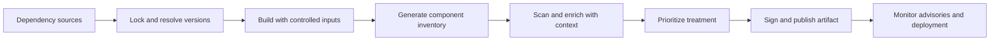

# Dependency and Supply Chain Security

> **One-line definition:** Manage the security risk of dependencies, build inputs, artifacts, and suppliers across their complete path into production.

## Why This Is a Senior Skill

A mid-level practitioner may run a dependency audit and open tickets for known CVEs. A senior security engineer understands that the real question is not "does a CVE exist" but "what trusted path allows this component to affect this system, under which conditions, and how quickly can we respond if the assumption changes".

Supply-chain risk includes direct and transitive packages, base images, build plugins, generated code, source repositories, maintainers, registries, signing keys, CI runners, and deployment metadata. A package can be safe today and become risky after a maintainer change, compromised release, newly disclosed vulnerability, or altered build process. Senior engineers create inventory, provenance, policy, response, and recovery instead of chasing a static list.

Use [[software-engineering-note/13_Software_Security/Cybersecurity/02 Secure Development/02 Dependency & Supply Chain|Dependency and Supply Chain]] for foundational concepts and [[document-template/14_Security/SCA-Report|SCA Report]] for reporting structure.

## Core Frameworks

### 1. Dependency Decision Matrix

| Signal | Lower concern | Higher concern | Senior treatment |
|---|---|---|---|
| Reachability | Not loaded or code path unavailable | Affected function is reachable | Confirm with call path or runtime evidence |
| Exposure | Internal job with restricted input | Public or partner-facing service | Combine with data and attacker context |
| Privilege | Isolated process with narrow identity | Can write data or deploy code | Prefer removal, isolation, or rapid patch |
| Fix path | Maintained project with compatible update | Abandoned or breaking upgrade | Plan replacement or compensating control |
| Provenance | Reproducible and signed artifact | Mutable source or unknown build | Pin, verify, and investigate before release |
| Response time | Inventory and owner are known | No owner or notification path | Treat the inventory gap as a risk |

A CVSS score is an input, not the final decision. The product context determines whether an issue is urgent, scheduled, isolated, or accepted with evidence.

### 2. SBOM to Action Flow

An SBOM is useful when it can answer operational questions:

- Which release contains this component?
- Which service can reach the vulnerable code?
- Which supplier or maintainer owns the fix?
- Which versions are permitted by policy?
- Who can approve a temporary exception?
- Can we revoke or rebuild the affected artifact?

### 3. Provenance Chain

| Link | Evidence to retain | Failure question |
|---|---|---|
| Source | Commit identity, review, and repository protection | Could unreviewed code enter the build? |
| Dependency | Lockfile, checksum, source and version | Could a mutable or unexpected package enter? |
| Build | Runner identity, inputs, toolchain, logs | Could the build be altered or impersonated? |
| Artifact | Digest, signature, SBOM, attestation | Can this deployed object be tied to its inputs? |
| Deployment | Admission decision, environment, actor | Could an unapproved object run? |
| Runtime | Inventory, exposure, and alerting | Can we find and contain it after disclosure? |

### 4. Remediation Strategy

| Situation | Preferred action | Evidence needed |
|---|---|---|
| Reachable critical issue with compatible fix | Upgrade, rebuild, and redeploy quickly | Test result and new artifact lineage |
| Issue not reachable but inventory is credible | Document reachability analysis and monitor | Code path, configuration, and expiry |
| No patch available | Isolate, disable feature, or add compensating control | Threat rationale and owner |
| Supplier integrity is uncertain | Stop promotion and verify provenance | Signature, source, build, and incident review |
| Repeated dependency exception | Replace component or improve policy | Design decision and transition plan |

## In Practice

### Build a Living Inventory

Collect more than package names. Record version, digest, direct or transitive relationship, license where relevant, source, maintainer, owner, runtime location, data access, and update path. Generate the inventory from the build so it represents what ships, not merely what a manifest claims.

### Define Supplier Controls

For critical components, ask suppliers or internal platform teams for version support, vulnerability notification, release integrity, provenance, update cadence, and end-of-life policy. Do not turn a questionnaire into assurance by itself. Verify important claims through artifacts, signatures, build evidence, and observed response.

### Avoid the Zero-CVE Trap

A zero-CVE dashboard can hide untracked code, unreachable findings, unmaintained packages, and unknown provenance. A better posture combines:

- Inventory completeness
- Critical component reachability
- Time to triage and remediate material issues
- Percentage of artifacts with provenance
- Age and owner of exceptions
- Ability to identify and withdraw affected releases

## Practical Exercise

Choose one service and its deployment artifact:

1. Export direct and transitive dependencies, base image layers, build plugins, and generated inputs.
2. Create a small SBOM table with component, version, digest, owner, runtime location, and update path.
3. Select three components and assess reachability, exposure, privilege, fix path, and provenance.
4. Write a treatment decision for each component, including one temporary exception with an expiry.
5. Trace the current production digest back to source, build identity, dependency lock, and SBOM.
6. Simulate a new critical advisory and record who is notified, how affected releases are found, and how a replacement is verified.

**Deliverable:** A dependency risk register plus a provenance diagram or evidence list that another engineer can use during an incident.

## Knowledge Connections

- [[software-engineering-note/13_Software_Security/Cybersecurity/02 Secure Development/02 Dependency & Supply Chain|Dependency and Supply Chain]]: dependency risk foundations
- [[body-of-knowledge/CyBOK/09_Software_Security|CyBOK Software Security]]: software security knowledge framework
- [[software-engineering-note/13_Software_Security/Software Security Overview|Software Security Overview]]: lifecycle and cloud supply-chain context
- [[document-template/14_Security/SCA-Report|SCA Report]]: report artifact for component findings
- [[03_DevSecOps_Pipeline_Controls|DevSecOps Pipeline Controls]]: pipeline trust and artifact gates
- [[05_Security_Configuration_as_Code|Security Configuration as Code]]: policy and deployment invariants
- [[04_Security_Verification_and_Testing/03_SCA_and_Container_Scanning|SCA and Container Scanning]]: interpreting scan evidence
- [[07_Vulnerability_Management_and_Governance/00_overview|Vulnerability Management and Governance]]: lifecycle treatment and exception governance

## Key Takeaways

- Supply-chain security covers the path from source and dependency selection to build, artifact, deployment, and runtime.
- An SBOM is an operational index only when it is generated from what ships and linked to owners and releases.
- Reachability, exposure, privilege, provenance, and response capability matter more than a raw CVE count.
- Reproducible builds and signed artifacts improve both prevention and incident response.
- Unknown ownership and unknown provenance are security findings even when no CVE is present.
- The senior outcome is the ability to identify, treat, rebuild, and withdraw affected software quickly.
