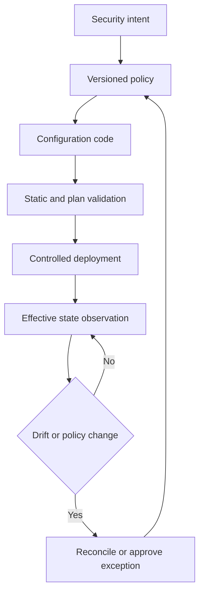

# Security Configuration as Code

> **One-line definition:** Encode security invariants in versioned configuration and policy so environments can be reviewed, tested, deployed, and checked for drift.

## Why This Is a Senior Skill

A mid-level engineer may review an infrastructure change or fix a misconfigured resource. A senior security engineer defines which properties must always hold, where those properties are enforced, how exceptions are represented, and how drift is detected after deployment. They understand that configuration is executable behavior. A secure application can still be exposed by an open storage policy, a broad identity, an unsigned image, an unprotected pipeline, or a production setting that differs from the reviewed code.

Configuration as code includes infrastructure definitions, deployment manifests, container settings, identity policies, network rules, pipeline configuration, admission policies, and security tool configuration. The senior challenge is managing inheritance and change: a local override, provider default, module update, or manual emergency action can alter effective security without changing the application source.

Use [[software-engineering-note/13_Software_Security/Cybersecurity/03 Infrastructure Security/03 Container & Cloud Security|Container and Cloud Security]] for domain foundations and [[document-template/14_Security/DevSecOps-Pipeline-Configuration|DevSecOps Pipeline Configuration]] for a reusable configuration document.

## Core Frameworks

### 1. Configuration Invariant Map

Start with desired properties rather than provider-specific syntax.

| Invariant | Example scope | Verification |
|---|---|---|
| Identity is least privilege | Workload role and service account | Policy test and access review |
| Data is protected | Storage, queues, backups, logs | Encryption and exposure check |
| Network paths are intentional | Ingress, egress, service links | Reachability and policy test |
| Artifacts are trusted | Image, package, and deployment object | Digest and signature validation |
| Changes are attributable | Repository, pipeline, and operator | Version control and audit log |
| Sensitive settings are not exposed | Secrets, variables, and debug modes | Secret scan and runtime check |
| Recovery is possible | Backups, restore, and key lifecycle | Restore exercise and evidence |

### 2. Control Lifecycle

The loop distinguishes configuration drift from policy drift. A newly approved policy can make an existing environment noncompliant even when no deployment occurred. Record which kind of change happened so the response is appropriate.

### 3. Enforcement Placement Matrix

| Property | Developer and review | Build or plan | Admission or deploy | Runtime |
|---|---|---|---|---|
| No public storage by default | Useful | Strong | Strong | Detect exposure |
| Signed image required | Limited | Strong | Strong | Verify running digest |
| Least-privilege identity | Review design | Policy test | Strong | Observe access |
| Secret not in source | Strong | Strong | Prevent injection mistakes | Detect leakage |
| Network segmentation | Design review | Plan check | Strong | Flow monitoring |
| Log and audit coverage | Review | Configuration test | Deploy check | Query and alert |

Use multiple layers for critical properties. A single gate is easier to bypass and harder to diagnose.

### 4. Exception Record

A configuration exception should identify the resource, effective setting, reason, threat impact, compensating control, owner, approval authority, start date, expiry, and rollback or remediation plan. Avoid encoding a permanent exception as a hidden `allow` value. Make the exception searchable and alert when it expires.

## In Practice

### Establish a Secure Baseline

Inventory the configuration layers that affect a service. Include module defaults, provider defaults, environment overlays, deployment values, identity policies, and runtime mutations. For each high-impact invariant, define a safe default, a validation test, an owner, and a response when the test fails.

### Review Effective State

A code review sees desired configuration. A security review also asks what the platform will actually create. Compare plan output, rendered manifests, image digests, policy decisions, and runtime state. Keep a small sample of effective state in release evidence so reviewers are not forced to infer behavior from templates.

### Common Failure Modes

| Failure mode | Why it happens | Senior response |
|---|---|---|
| Policy checks only source syntax | Effective values appear after rendering | Validate the rendered plan or manifest |
| Manual emergency fix is forgotten | Operations prioritize recovery | Record change, reconcile code, and test drift detection |
| Module update changes defaults | Shared abstractions hide behavior | Pin versions and review change impact |
| One global policy blocks local needs | Context and exceptions are ignored | Use scoped policies and governed exceptions |
| Secrets are treated as configuration | Convenience mixes data and credentials | Separate secret delivery and verify no leakage |

## Practical Exercise

Choose a non-production service deployed with infrastructure or container configuration:

1. List five security invariants that should hold regardless of environment.
2. Locate the code, module, overlay, and platform setting that influence each invariant.
3. Write one automated policy test for each invariant using the tools already available to the team.
4. Render the effective deployment configuration and record any default or override that is not obvious from source.
5. Introduce a controlled drift in a sandbox, verify it is detected, and document reconciliation behavior.
6. Create one time-bounded exception with a compensating control and an owner.

**Deliverable:** A configuration security baseline containing invariants, tests, owners, and one verified drift scenario.

## Knowledge Connections

- [[software-engineering-note/13_Software_Security/Cybersecurity/03 Infrastructure Security/03 Container & Cloud Security|Container and Cloud Security]]: container and cloud configuration foundations
- [[document-template/14_Security/DevSecOps-Pipeline-Configuration|DevSecOps Pipeline Configuration]]: reusable configuration artifact
- [[software-engineering-note/13_Software_Security/03_Access_Control_and_Architecture|Access Control and Architecture]]: authorization and security boundary foundations
- [[software-engineering-note/13_Software_Security/Software Security Overview|Software Security Overview]]: software security lifecycle context
- [[03_DevSecOps_Pipeline_Controls|DevSecOps Pipeline Controls]]: control contracts and pipeline enforcement
- [[04_Dependency_and_Supply_Chain_Security|Dependency and Supply Chain Security]]: trusted images and artifacts
- [[04_Security_Verification_and_Testing/01_Security_Test_Strategy|Security Test Strategy]]: selecting configuration verification depth
- [[07_Vulnerability_Management_and_Governance/00_overview|Vulnerability Management and Governance]]: exception and remediation lifecycle

## Key Takeaways

- Configuration is executable security behavior, not deployment paperwork.
- Define invariants first, then choose the code, policy, and runtime checks that enforce them.
- Validate effective rendered state because defaults and overlays can change the result.
- Drift detection must lead to reconciliation, an explicit exception, or both.
- Critical properties need layered enforcement across review, build, deployment, and runtime.
- A senior engineer makes exceptions visible, scoped, owned, and temporary.
