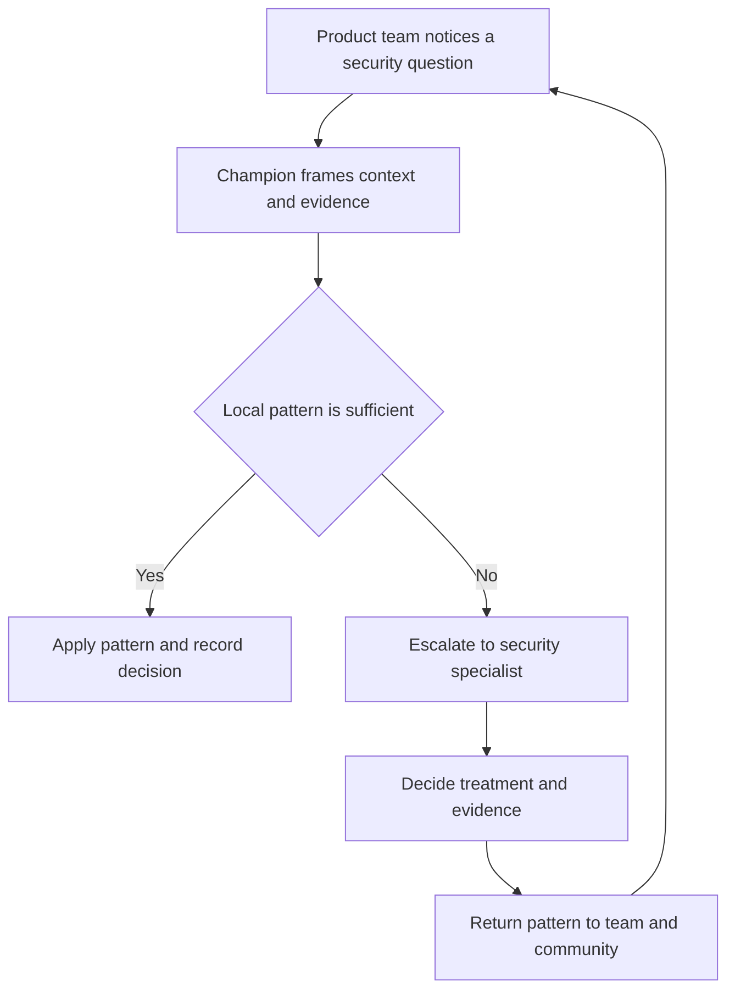

# Security Champion Operating Model

> **One-line definition:** Scale security judgment through product teams by giving trusted engineers a clear role, practical support, and an explicit path to specialist escalation.

## Why This Is a Senior Skill

A mid-level security engineer may nominate a champion or ask a developer to attend security training. A senior security engineer designs the operating model around that role. They clarify accountability, protect the champion from becoming an unpaid security gate, provide a community of practice, and measure whether decisions happen earlier and with better evidence.

Champions are not a substitute for security specialists. They are local connectors who understand the product context and help teams notice security questions during planning, design, implementation, and testing. The senior engineer makes the relationship productive by offering office hours, reusable patterns, lightweight review triggers, and a response path for risks outside the team's authority.

The model should fit the team's capacity and risk. A small internal service may need a quarterly review and an asynchronous channel. A payment or identity service may need a named champion, recurring threat-model updates, release evidence checks, and direct specialist partnership.

## Core Frameworks

### 1. Role Charter and Accountability

| Activity | Product team | Security champion | Security specialist | Product owner |
|---|---|---|---|---|
| Notice security change triggers | Responsible | Facilitates | Advises | Accountable for scope |
| Draft requirements and abuse cases | Responsible | Facilitates | Advises high-risk cases | Accountable for priority |
| Implement and test controls | Responsible | Helps coordinate | Reviews selected designs | Accepts delivery trade-off |
| Triage findings | Responsible | Coordinates local context | Sets method and escalation | Owns schedule or risk decision |
| Approve residual risk | Provides evidence | Recommends | Challenges material risk | Accountable with authority |
| Improve patterns and tooling | Contributes | Brings local feedback | Owns shared capability | Funds or prioritizes |

The champion is a multiplier and early-warning role. They should not silently inherit product security accountability or sign off on risk they cannot control.

### 2. Operating Cadence

| Cadence | Purpose | Useful output |
|---|---|---|
| Weekly or fortnightly office hour | Unblock active work | Decisions, examples, escalations |
| Monthly champion community | Share patterns and cases | Reusable guidance and rule improvements |
| Quarterly risk review | Reassess important products | Updated risks, owners, and evidence gaps |
| Release or architecture trigger | Review material change | Requirements, design decision, or exception |
| Annual capability review | Improve the model | Training, tooling, and staffing priorities |

### 3. Maturity Ladder

| Stage | Observable behavior | Next move |
|---|---|---|
| Named | A person is listed but rarely involved | Define triggers and office hours |
| Connected | Champion can obtain guidance and escalate | Add local backlog and evidence tracking |
| Practicing | Team performs recurring reviews and triage | Automate common checks and share cases |
| Influential | Champion improves patterns across teams | Rotate facilitation and mentor new champions |
| Distributed | Security decisions are normal engineering work | Keep specialist focus on novel and systemic risk |

### 4. Escalation Flow

## In Practice

### Launch With a Pilot

Select two or three teams with different risk profiles. Agree on a charter, change triggers, office-hour schedule, escalation channel, and first capability goal. Run the pilot for one quarter. Capture concrete outcomes such as earlier requirements, faster finding triage, reduced repeated weaknesses, or improved release evidence.

### Support the Community

Provide a small champion kit:

- One-page role charter and change-trigger checklist
- Security requirements and abuse-case examples
- Links to safe coding patterns and pipeline guidance
- Triage rubric for common scanner findings
- Security specialist contact and expected response time
- Template for decisions, exceptions, and evidence
- Monthly case review that treats mistakes as learning material

### Measure Outcomes, Not Activity

| Weak metric | Why it misleads | Better question |
|---|---|---|
| Number of champions | A roster does not show capability | Which decisions changed earlier because of the model? |
| Training attendance | Attendance can be passive | Can the team apply the pattern and verify it? |
| Findings reported | More reports can mean better detection or worse code | Are material findings fixed or accepted with evidence? |
| Reviews completed | A completed meeting can still be shallow | Did the review reduce uncertainty or change design? |
| Tickets closed | Closure can reward suppression | Is residual risk understood and owned? |

### Anti-Patterns

| Anti-pattern | Failure mode | What to do instead |
|---|---|---|
| Champion as final approver | Local engineer becomes a bottleneck or rubber stamp | Keep product ownership and use specialist escalation |
| Champion with no time | The role becomes symbolic | Allocate capacity and make work visible |
| Security channel as help desk only | Repeated questions never improve the system | Turn cases into patterns, automation, or training |
| One curriculum for every team | Risk and architecture differ | Use a common core plus product-specific practice |
| Metrics as team ranking | Teams hide problems and bypass controls | Use metrics to improve capability and feedback |

## Practical Exercise

Design a pilot for three teams:

1. Select one product team with public exposure, one internal platform team, and one data-sensitive service.
2. Write the champion charter, including responsibilities, non-responsibilities, time allocation, and escalation triggers.
3. Define a six-week cadence with office hours, community review, and one practical capability goal per team.
4. Create a champion kit containing one requirements template, one coding pattern, one triage rubric, and one evidence checklist.
5. Choose three outcome measures and record a baseline before the pilot begins.
6. Run a retrospective that asks what the champion could decide locally, what required escalation, and which repeated question should become a paved road.

**Deliverable:** A one-quarter operating model with a charter, cadence, escalation path, pilot teams, and outcome measures.

## Knowledge Connections

- [[software-engineering-note/13_Software_Security/05_Secure_Development_and_Assurance|Secure Development and Assurance]]: security responsibility and secure lifecycle foundations
- [[career-path/10_Quality_and_Test_Engineering/00_overview|Quality and Test Engineering]]: distributed quality ownership and improvement practices
- [[document-template/14_Security/SSDLC-Process-Documentation|SSDLC Process Documentation]]: process artifact for the operating model
- [[document-template/14_Security/Security-Policy|Security Policy]]: policy context and accountability
- [[02_Secure_Coding_Enablement|Secure Coding Enablement]]: learning and paved-road capabilities
- [[03_DevSecOps_Pipeline_Controls|DevSecOps Pipeline Controls]]: automated feedback and exception paths
- [[04_Security_Verification_and_Testing/05_Findings_Triage_and_False_Positives|Findings Triage and False Positives]]: shared interpretation of evidence
- [[07_Vulnerability_Management_and_Governance/00_overview|Vulnerability Management and Governance]]: ownership and risk acceptance lifecycle

## Key Takeaways

- Champions scale security judgment, but they do not replace specialists or product accountability.
- A useful charter states both responsibilities and non-responsibilities.
- Office hours, community case review, and reusable patterns turn local questions into organizational capability.
- Choose champions for context and influence, then give them time and a clear escalation path.
- Measure earlier decisions, faster useful feedback, and reduced repeated risk rather than attendance or ticket counts.
- A mature model makes security normal engineering work and reserves specialist attention for novel or systemic risk.
