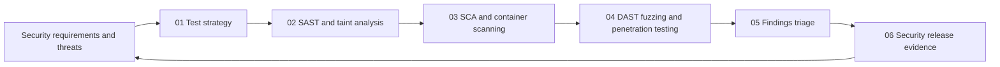

# Security Verification and Testing

> **Core idea:** A senior security engineer selects verification depth according to risk, interprets imperfect evidence with judgment, and produces a release decision that makes residual risk visible.

## What This Capability Means at Senior Level

Security verification asks whether the system and its delivery controls satisfy security requirements under relevant conditions. Testing is one source of evidence, not a substitute for a threat model, a sound design, or operational control. A senior security engineer chooses techniques that answer specific questions, understands the limits of each signal, and combines static, composition, dynamic, manual, and operational evidence without pretending that any single tool proves security.

A mid-level practitioner may run a SAST, SCA, DAST, or penetration test and report the output. A senior practitioner decides what must be verified for this release, how much depth the risk warrants, what the result actually means, and whether an unresolved issue changes the release decision. They distinguish absence of evidence from evidence of absence, challenge weak or duplicated findings, and make test limitations explicit.

The outcome is risk-based confidence. It is not a large report or a green dashboard. It is a credible explanation of what was tested, what was not tested, what was found, how findings were treated, and why the remaining uncertainty is acceptable or requires action.

## Why It Matters

Exhaustive security testing is impossible. A public authentication change, a private batch job, and a safety-relevant API do not need the same verification depth. Over-testing wastes scarce specialist time. Under-testing creates false confidence. The senior engineer makes the depth decision visible and revisits it when threat, exposure, architecture, change scope, or evidence quality changes.

Senior-level outcomes include:

- A test strategy tied to threat scenarios, security requirements, and release risk
- Static and composition scanners tuned to produce actionable results
- Dynamic testing that is safe, authorized, and selected for the questions it can answer
- Findings that are validated, deduplicated, prioritized, owned, and retested
- Release evidence that supports a decision rather than merely proving that tools ran

## Topic Notes

| # | Topic | Senior-level focus | Status | File |
|---|---|---|---|---|
| 01 | [[01_Security_Test_Strategy|Security Test Strategy]] | Select the right verification depth for the risk | Done | `01_Security_Test_Strategy.md` |
| 02 | [[02_SAST_and_Taint_Analysis|SAST and Taint Analysis]] | Interpret source-to-sink evidence and tool limits | Done | `02_SAST_and_Taint_Analysis.md` |
| 03 | [[03_SCA_and_Container_Scanning|SCA and Container Scanning]] | Contextualize component, image, and runtime exposure | Done | `03_SCA_and_Container_Scanning.md` |
| 04 | [[04_DAST_Fuzzing_and_Penetration_Testing|DAST, Fuzzing, and Penetration Testing]] | Choose dynamic methods and run them safely | Done | `04_DAST_Fuzzing_and_Penetration_Testing.md` |
| 05 | [[05_Findings_Triage_and_False_Positives|Findings Triage and False Positives]] | Turn imperfect signals into fair risk decisions | Done | `05_Findings_Triage_and_False_Positives.md` |
| 06 | [[06_Security_Release_Evidence|Security Release Evidence]] | Explain confidence, limitations, and residual risk | Done | `06_Security_Release_Evidence.md` |

**Completion:** 6/6 topics, 100%

## How the Topics Connect

**Reading order:** Start with strategy so every technique has a question and a stopping rule. Read static and composition analysis next because they provide scalable feedback. Then cover dynamic methods for runtime behavior and adversarial exploration. Triage explains how to interpret imperfect output. Finish with release evidence to connect results to an accountable decision.

## Existing Vault Anchors

These notes overlay senior verification judgment on existing foundations:

| Senior topic | Existing foundation notes |
|---|---|
| Test strategy | [[software-engineering-note/05_Software_Testing/Software Testing Overview|Software Testing Overview]], [[career-path/10_Quality_and_Test_Engineering/00_overview|Quality and Test Engineering]], [[document-template/13_Testing_and_Verification/Test-Strategy|Test Strategy]] |
| SAST and taint analysis | [[body-of-knowledge/SWEBOK/13_Software_Security|SWEBOK Software Security]], [[software-engineering-note/13_Software_Security/Software Security Overview|Software Security Overview]], [[document-template/14_Security/SAST-Report|SAST Report]] |
| SCA and container scanning | [[body-of-knowledge/CyBOK/09_Software_Security|CyBOK Software Security]], [[software-engineering-note/13_Software_Security/Cybersecurity/02 Secure Development/02 Dependency & Supply Chain|Dependency and Supply Chain]], [[document-template/14_Security/SCA-Report|SCA Report]] |
| DAST, fuzzing, and penetration testing | [[software-engineering-note/05_Software_Testing/Software Testing Overview|Software Testing Overview]], [[document-template/14_Security/DAST-Report|DAST Report]], [[document-template/14_Security/Penetration-Test-Report|Penetration Test Report]] |
| Findings triage | [[software-engineering-note/13_Software_Security/07_Vulnerability_Management|Vulnerability Management]], [[document-template/14_Security/Vulnerability-Management-Report|Vulnerability Management Report]], [[career-path/10_Quality_and_Test_Engineering/00_overview|Quality and Test Engineering]] |
| Security release evidence | [[document-template/13_Testing_and_Verification/Security-Test-Report|Security Test Report]], [[document-template/14_Security/Security-Requirements-Specification|Security Requirements Specification]], [[document-template/13_Testing_and_Verification/Verification-Reports|Verification Reports]] |

## Verification Depth Decision Framework

Increase depth when multiple signals combine:

| Driver | Lower depth | Higher depth |
|---|---|---|
| Asset impact | Internal, recoverable, low sensitivity | Safety, identity, payment, regulated, or irreversible impact |
| Exposure | Restricted network and strong identity | Public, partner, anonymous, or machine-facing exposure |
| Change novelty | Well-understood small change | New trust boundary, protocol, parser, or privilege |
| Threat activity | Stable and monitored | Known exploitation, targeted adversary, or active incident |
| Evidence quality | Mature automation and repeatable environment | Weak oracle, limited test data, or unverified assumptions |
| Release consequence | Easy rollback and low blast radius | Hard rollback, broad blast radius, or contractual obligation |

Depth can mean more than more tests. It may require a design review, a manual abuse-case test, stronger environment parity, independent review, fuzzing, a targeted penetration test, or a release condition that remains monitored after deployment.

## Self-Assessment Checklist

- [ ] I can state the security question that each planned test is intended to answer.
- [ ] I can choose verification depth using impact, exposure, novelty, threat activity, and evidence quality.
- [ ] I can explain what a scanner result proves and what it cannot prove.
- [ ] I can review a SAST path from source through propagation to sink and identify missing context.
- [ ] I can distinguish component presence from reachable runtime exposure.
- [ ] I can plan DAST, fuzzing, or penetration testing with authorization, scope, safety limits, and an oracle.
- [ ] I can validate, deduplicate, and prioritize findings without treating severity as the final decision.
- [ ] I can document coverage gaps and limitations without making the release evidence meaningless.
- [ ] I can link requirements, tests, results, findings, treatments, and release decisions.
- [ ] I can explain residual risk and monitoring conditions to a non-specialist decision maker.

## Related

- [[03_Secure_Development_and_DevSecOps/00_overview|Secure Development and DevSecOps]]: controls and evidence created during delivery
- [[01_Threat_Modeling_and_Risk/00_overview|Threat Modeling and Risk]]: risk scenarios that determine verification questions
- [[02_Secure_Architecture_and_Design/00_overview|Secure Architecture and Design]]: design properties that require assurance
- [[07_Vulnerability_Management_and_Governance/00_overview|Vulnerability Management and Governance]]: lifecycle management after findings are accepted
- [[career-path/10_Quality_and_Test_Engineering/00_overview|Quality and Test Engineering]]: general testing strategy and measurement
- [[career-path/03_Staff_Engineer/00_overview|Staff Engineer]]: broader decision influence and evidence culture
