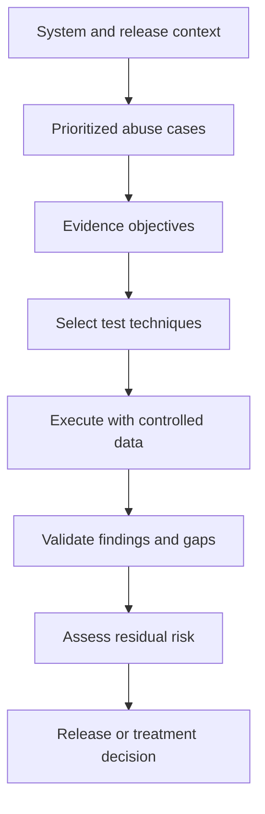

# Security Test Strategy

> **One-line definition:** Choose a proportionate set of verification activities that answers the important security questions for a system and release.

## Why This Is a Senior Skill

A mid-level tester may select familiar tools or repeat a previous test plan. A senior security engineer begins with risk and evidence objectives. They decide which abuse cases matter, which test level can reveal them, how much independence or depth is needed, and when evidence is sufficient for the release decision. They also state what the strategy cannot establish.

A strategy is not a catalog of SAST, DAST, fuzzing, and penetration testing. Each technique has a different view of the system, a different oracle, and a different blind spot. Senior judgment is visible in the trade-off: less effort on low-consequence paths, more depth where a weak assumption could cause material harm, and a monitoring condition when pre-release evidence cannot cover the risk.

Use [[software-engineering-note/05_Software_Testing/Software Testing Overview|Software Testing Overview]] for testing fundamentals and [[document-template/13_Testing_and_Verification/Test-Strategy|Test Strategy]] for a reusable artifact.

## Core Frameworks

### 1. Risk to Test Objective Map

| Risk question | Useful verification objective | Candidate technique |
|---|---|---|
| Can an unauthorized actor cross a tenant boundary? | Prove authorization decisions across identities and object references | API tests, negative tests, targeted DAST |
| Can untrusted input reach a dangerous interpreter? | Exercise source-to-sink paths and encoding behavior | SAST, taint analysis, dynamic payloads |
| Can a vulnerable component affect production? | Establish component inventory, reachability, and exposure | SCA, SBOM review, container scan |
| Can deployment configuration expose data? | Verify effective policy and environment state | IaC checks, admission policy, runtime inspection |
| Can an attacker abuse a critical workflow at scale? | Observe rate limits, state transitions, and recovery | Fuzzing, abuse-case tests, targeted penetration testing |
| Can we detect and respond to a failure? | Prove telemetry, alerting, and containment steps | Detection test, game day, release evidence review |

### 2. Verification Depth Matrix

| Driver | Basic depth | Standard depth | High depth |
|---|---|---|---|
| Impact | Low sensitivity and reversible | Sensitive business data | Safety, identity, payment, or regulated impact |
| Exposure | Restricted and authenticated | Product users or partners | Public, anonymous, or broad machine access |
| Novelty | Existing pattern and small change | New code path or dependency | New protocol, trust boundary, parser, or privilege |
| Threat | Low known activity | Relevant abuse cases | Active exploitation or targeted adversary |
| Recovery | Easy rollback and monitoring | Tested rollback | Difficult rollback or high blast radius |
| Evidence | Mature automation | Mixed automation and review | Independent review and adversarial testing |

Choose the highest relevant driver rather than averaging away a critical concern. High depth may involve manual review, stronger environment parity, independent testing, or post-release controls.

### 3. Strategy Flow

### 4. Exit Criteria and Limitations

State exit criteria in observable terms:

- All high-impact requirements have a mapped verification result or an approved exception.
- Critical and high findings have treatment, owner, and release disposition.
- Test scope, environment, data, tool versions, and time window are recorded.
- Known blind spots have a compensating monitor, follow-up test, or explicit acceptance.
- The evidence can be reproduced or its integrity can be checked.

Do not claim that a passing scan proves absence of vulnerabilities. Record the tested attack surface and the assumptions behind the oracle.

## In Practice

### Strategy Workshop Agenda

For a 90 minute release or architecture review:

1. **Scope, 10 minutes:** Confirm release candidate, interfaces, data classes, environments, and changed trust boundaries.
2. **Threats, 20 minutes:** Select abuse cases from the threat model and recent incidents.
3. **Objectives, 15 minutes:** Define what evidence would increase confidence for each risk.
4. **Depth, 20 minutes:** Choose techniques, independence, data, and stopping rules.
5. **Evidence, 15 minutes:** Assign owners, artifacts, and retention.
6. **Gaps, 10 minutes:** Record limitations, compensating controls, and release conditions.

### Anti-Patterns

| Anti-pattern | Why it fails | Senior alternative |
|---|---|---|
| Repeat last release unchanged | Threat and architecture may have changed | Reassess change, exposure, and active threats |
| More tools equals more assurance | Tools can share the same blind spot | Add a technique with a different view or oracle |
| Coverage percentage as proof | Coverage does not show meaningful abuse behavior | Link coverage to requirements and attack paths |
| Pen test as a certificate | A time-boxed test cannot prove ongoing security | Use targeted testing plus continuous controls |
| No stopping rule | Testing consumes time without changing decisions | Define exit criteria and residual-risk triggers |

## Practical Exercise

Select a release that changes authentication, authorization, data processing, or deployment configuration:

1. List five changed or newly exposed attack paths.
2. Write one evidence objective for each path.
3. Choose a technique and verification depth using the tables above.
4. Define the test data, environment, oracle, owner, and stopping rule.
5. Record one blind spot and choose a compensating control or post-release monitor.
6. Create a one-page strategy and ask a developer and product owner whether the effort matches the consequence.

**Deliverable:** A security test strategy with a risk-to-test matrix, exit criteria, scope limitations, and named evidence artifacts.

## Knowledge Connections

- [[software-engineering-note/05_Software_Testing/Software Testing Overview|Software Testing Overview]]: testing concepts, levels, techniques, and measures
- [[career-path/10_Quality_and_Test_Engineering/00_overview|Quality and Test Engineering]]: specialist test strategy and quality practices
- [[document-template/13_Testing_and_Verification/Test-Strategy|Test Strategy]]: strategy artifact structure
- [[document-template/13_Testing_and_Verification/Security-Test-Report|Security Test Report]]: result artifact for the chosen strategy
- [[01_Threat_Modeling_and_Risk/00_overview|Threat Modeling and Risk]]: abuse cases and risk context
- [[03_Secure_Development_and_DevSecOps/01_Security_Requirements_in_Backlog|Security Requirements in Backlog]]: requirements and acceptance evidence
- [[02_SAST_and_Taint_Analysis|SAST and Taint Analysis]]: static verification depth
- [[04_DAST_Fuzzing_and_Penetration_Testing|DAST, Fuzzing, and Penetration Testing]]: dynamic verification depth

## Key Takeaways

- Start with the security question and evidence objective, not a favorite tool.
- Increase depth when impact, exposure, novelty, threat activity, recovery difficulty, or evidence weakness increases.
- Test techniques complement one another because each has different visibility and blind spots.
- Every strategy needs scope, oracle, owner, exit criteria, and limitations.
- A compensating monitor can be part of a sound decision when pre-release verification cannot answer the whole question.
- Senior strategy makes effort proportional and residual uncertainty explicit.
