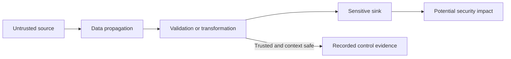

# SAST and Taint Analysis

> **One-line definition:** Use source analysis and source-to-sink reasoning to identify security-relevant paths, then validate whether the reported path is exploitable and actionable.

## Why This Is a Senior Skill

A mid-level engineer may run a SAST tool, sort findings by severity, and fix the first result. A senior security engineer understands how the analyzer built its path, which assumptions created the result, and where the analysis can be incomplete. They tune sources, propagators, sanitizers, sinks, framework models, and baselines so the signal reflects the application. They also know when static evidence must be confirmed dynamically or by code review.

Taint analysis is especially useful for tracking untrusted data through transformations toward a sensitive operation. It is not a proof that an exploit works. A path may be infeasible, sanitized by a framework the tool does not model, protected by an authorization condition, or exploitable only under a deployment assumption. Conversely, a clean result can reflect missing models or unreachable code that the scanner never analyzed.

Use [[document-template/14_Security/SAST-Report|SAST Report]] for result structure and [[software-engineering-note/13_Software_Security/Software Security Overview|Software Security Overview]] for security testing context.

## Core Frameworks

### 1. Finding Interpretation Rubric

| Question | Evidence to inspect | Decision impact |
|---|---|---|
| Is the source attacker-controlled? | Request, message, file, environment, or user input | Determines whether the path begins in a threat-relevant place |
| Is propagation modeled correctly? | Calls, transformations, deserialization, framework behavior | Shows whether the reported path is complete or speculative |
| Is the sink security-sensitive? | Query, command, template, redirect, file, serializer, policy decision | Determines consequence and control needed |
| Is there a real sanitizer or validator? | Context-specific encoding, allowlist, parameterization, authorization | Can reduce or eliminate exploitability if correctly applied |
| Is the path feasible? | Branch conditions, types, configuration, feature flags | Distinguishes reachable risk from a theoretical path |
| What is the business context? | Asset, exposure, identity, data, privilege | Determines priority beyond tool severity |

### 2. Source-to-Sink Path

The reviewer should be able to point to the exact source, path, control, sink, and deployment condition. If the tool cannot show the path, ask whether the rule is a pattern heuristic rather than a taint result.

### 3. Tool Fit and Tuning Matrix

| Need | Useful analysis | Senior tuning choice |
|---|---|---|
| Fast repeated pattern check | Pattern or semantic rule | Run early with clear fix guidance |
| Cross-file data flow | Taint or interprocedural analysis | Model framework sources, sinks, and sanitizers |
| Compiled language behavior | Semantic or compiler-integrated analysis | Match build flags and generated code |
| Custom framework | Query or extension model | Validate model with seeded examples |
| Legacy repository | Baseline and incremental analysis | Prevent new risk while reducing backlog |
| High-consequence path | Static plus independent confirmation | Link to dynamic or review evidence |

### 4. Precision and Recall Trade-off

A rule that reports everything can be ignored. A rule that reports only obvious cases can miss important variants. Tune for the decision being made:

- Use high precision for release gates.
- Use broader, advisory analysis for discovery and research.
- Track suppressed results and recheck them when frameworks change.
- Seed known vulnerable and safe examples to test the rule set.
- Version rules with the pipeline evidence so results remain interpretable.

## In Practice

### Review a Finding With the Author

Ask the author to explain the input, expected trust boundary, and intended security property before showing the tool path. Then inspect the evidence together. This teaches developers to reason about data flow and often reveals a missing model or a real design issue earlier than a ticket would.

### Establish a Baseline

For a legacy codebase, record the existing result set, owner, severity rationale, and suppression expiry. Gate new material findings first. Work down the inherited backlog by risk and recurrence. A baseline without an expiry becomes a permanent blind spot, so measure age and revisit it after framework or architecture changes.

### Anti-Patterns

| Anti-pattern | Failure mode | Better approach |
|---|---|---|
| Treat every high label as critical | Tool severity is context free | Validate path, exposure, and asset impact |
| Suppress without reason | Learning and audit trail are lost | Record evidence, owner, and expiry |
| Scan without matching build | Generated or conditional code differs | Use the same build model and flags |
| Ignore framework models | Sources and sanitizers are wrong | Add representative safe and unsafe tests |
| Fix the line without the design | Variant remains elsewhere | Improve the interface or shared guardrail |

## Practical Exercise

Use a small service or intentionally flawed sample:

1. Select one input-to-sink weakness such as injection, unsafe file access, or template rendering.
2. Run a SAST rule or inspect a report and copy the reported path into a worksheet.
3. Mark the source, propagation steps, transformations, sink, branch conditions, and asset impact.
4. Determine whether the path is feasible and whether the current control is context appropriate.
5. Create one safe test and one negative test that demonstrate the intended property.
6. If the result is a false positive, record the exact evidence and add a scoped suppression with an expiry. If it is valid, fix the shared pattern and rerun the analysis.

**Deliverable:** A reviewed finding record containing the data-flow path, exploitability rationale, fix or suppression decision, and verification result.

## Knowledge Connections

- [[body-of-knowledge/SWEBOK/13_Software_Security|SWEBOK Software Security]]: static analysis and security testing foundations
- [[software-engineering-note/13_Software_Security/Software Security Overview|Software Security Overview]]: security lifecycle and tooling context
- [[document-template/14_Security/SAST-Report|SAST Report]]: reporting artifact
- [[software-engineering-note/13_Software_Security/Cybersecurity/02 Secure Development/02 Secure Coding Practices|Secure Coding Practices]]: coding patterns that shape rule models
- [[01_Security_Test_Strategy|Security Test Strategy]]: selecting static analysis depth
- [[03_Secure_Development_and_DevSecOps/02_Secure_Coding_Enablement|Secure Coding Enablement]]: converting findings into developer feedback
- [[05_Findings_Triage_and_False_Positives|Findings Triage and False Positives]]: validation and disposition
- [[06_Security_Release_Evidence|Security Release Evidence]]: connecting results to a release decision

## Key Takeaways

- A SAST result is a hypothesis about a security-relevant path, not a final risk decision.
- Review source, propagation, transformations, sink, feasibility, and business context together.
- Tune models with seeded examples so framework behavior is represented accurately.
- Use high-precision rules for gates and broader analysis for discovery and coaching.
- Suppress only with evidence, ownership, scope, and expiry.
- Fix recurring risk in shared interfaces or design patterns, not only at the reported line.
