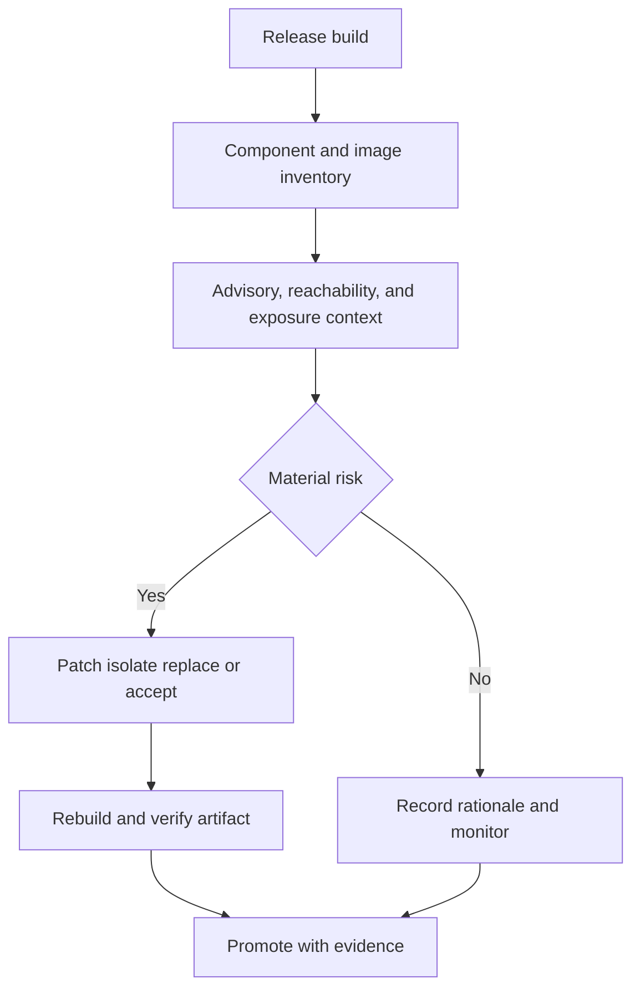

# SCA and Container Scanning

> **One-line definition:** Determine whether software components and container images create material risk in their actual build, deployment, and runtime context.

## Why This Is a Senior Skill

A mid-level engineer may run a package or image scanner and request upgrades for every reported CVE. A senior security engineer interprets component evidence in context. They distinguish direct from transitive dependencies, package presence from code reachability, image content from runtime exposure, and severity from exploitability. They also check whether the inventory represents the artifact that will run and whether the organization can respond when a new advisory arrives.

Container scanning has similar limits. A base-image CVE may be present in a dormant layer, unavailable to the running process, or still material because an attacker can execute a shell or exploit a loaded library. A clean image report does not prove safe application behavior, runtime configuration, or provenance.

Use [[document-template/14_Security/SCA-Report|SCA Report]] for the reporting artifact and [[software-engineering-note/13_Software_Security/Cybersecurity/02 Secure Development/02 Dependency & Supply Chain|Dependency and Supply Chain]] for supply-chain foundations.

## Core Frameworks

### 1. Component Finding Context

| Dimension | Lower concern | Higher concern | Evidence to seek |
|---|---|---|---|
| Dependency relation | Unused or test-only transitive component | Direct runtime dependency | Lockfile, build graph, runtime import |
| Reachability | Vulnerable function unavailable | Affected function reachable | Call path, feature flag, execution trace |
| Exposure | Isolated internal workload | Public service or multi-tenant path | Network, identity, and data flow |
| Privilege | Non-sensitive worker | Can read secrets, write data, or deploy | Workload identity and permissions |
| Exploit status | No exploit evidence and difficult preconditions | Known exploit or active exploitation | Advisory, threat intelligence, observed attempts |
| Fix confidence | Maintained patch with tests | No patch, abandoned project, or breaking change | Maintainer, release notes, compatibility tests |

### 2. Container Risk Review

Review the image as a build and runtime object:

| Area | Review question |
|---|---|
| Base | Is the base image supported, minimal, and pinned by digest? |
| Packages | Which operating-system and language packages are present and needed? |
| Build | Are build tools and secrets excluded from the final image? |
| User | Does the process run with the least privilege available? |
| Filesystem | Is the filesystem immutable or writable only where needed? |
| Network | Are egress and ingress paths constrained? |
| Provenance | Can the digest be tied to source, build, and SBOM? |
| Runtime | Does deployed configuration match the scanned image assumptions? |

### 3. Treatment Matrix

| Finding context | Default disposition | Additional evidence |
|---|---|---|
| Critical, reachable, public, compatible fix | Patch and rebuild before release | Regression and artifact verification |
| High, reachable, restricted service | Prioritize with compensating control if needed | Access, exposure, and expiry |
| Present but unreachable with credible proof | Monitor and document | Reachability analysis and recheck trigger |
| In image but not loaded, image can execute arbitrary shell | Treat as material until hardening proves otherwise | Runtime user, shell, and capability controls |
| No owner or unknown image provenance | Stop promotion or isolate | Inventory and build investigation |

### 4. Scan and Response Flow

## In Practice

### Normalize Scanner Output

Different tools may report the same component with different names, paths, or CVE aliases. Normalize by package identity, version, image digest, advisory, and deployed release. Group duplicates without losing evidence from each tool. Keep raw reports for audit and a context-rich record for decisions.

### Make Reachability Useful

Reachability analysis can be static, dynamic, or architectural. It is not always conclusive. Record its assumptions, such as enabled features, routes, plugin loading, and runtime configuration. If the evidence is weak and the consequence is high, use a compensating control or deeper verification rather than treating uncertainty as safety.

### Anti-Patterns

| Anti-pattern | Failure mode | Better approach |
|---|---|---|
| Upgrade everything immediately | Breakage and unreviewed transitive changes | Patch material risk with compatibility and regression evidence |
| Treat CVSS as priority | Product exposure and exploit status are hidden | Enrich with reachability, exposure, privilege, and response |
| Scan only the source manifest | The shipped artifact differs | Scan the built digest and retain its SBOM |
| Ignore operating-system packages | Image vulnerabilities remain exploitable | Review image hardening and runtime capabilities |
| Delete a vulnerable package without verification | New behavior or hidden dependency appears | Rebuild, test, and confirm the deployed digest |

## Practical Exercise

Choose a service image and its dependency lockfile:

1. Generate or collect an SBOM and container scan for the exact image digest intended for deployment.
2. Select five findings across direct, transitive, operating-system, and language packages.
3. Record reachability, exposure, privilege, exploit status, fix path, owner, and due date.
4. Compare the scanned digest with the production digest and explain any difference.
5. Patch one material finding, rebuild, rerun the scan, and execute a regression test.
6. Write a release note for one finding that is not fixed, including evidence, compensating control, and expiry.

**Deliverable:** A context-rich SCA and container review that shows why each selected finding is treated, monitored, or accepted.

## Knowledge Connections

- [[body-of-knowledge/CyBOK/09_Software_Security|CyBOK Software Security]]: software security and supply-chain foundations
- [[software-engineering-note/13_Software_Security/Cybersecurity/02 Secure Development/02 Dependency & Supply Chain|Dependency and Supply Chain]]: dependency lifecycle and provenance
- [[software-engineering-note/13_Software_Security/Cybersecurity/03 Infrastructure Security/03 Container & Cloud Security|Container and Cloud Security]]: image and cloud foundations
- [[document-template/14_Security/SCA-Report|SCA Report]]: reporting artifact
- [[03_Secure_Development_and_DevSecOps/04_Dependency_and_Supply_Chain_Security|Dependency and Supply Chain Security]]: prevention and response operating model
- [[01_Security_Test_Strategy|Security Test Strategy]]: selecting composition and image verification depth
- [[05_Findings_Triage_and_False_Positives|Findings Triage and False Positives]]: contextualizing scanner output
- [[06_Security_Release_Evidence|Security Release Evidence]]: release evidence for component treatment

## Key Takeaways

- Component and image findings require product, reachability, exposure, privilege, and provenance context.
- An SBOM and scan are meaningful only when tied to the exact artifact that runs.
- A package in an image is not automatically exploitable, but uncertainty is not proof of safety.
- Patch material risk with regression and artifact evidence rather than upgrading blindly.
- Unknown ownership or provenance is a supply-chain risk even without a CVE.
- Senior practice preserves raw reports while creating a concise decision record that teams can act on.
