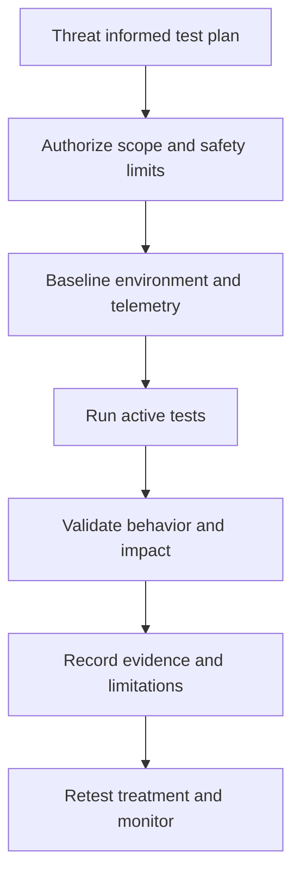

# DAST, Fuzzing, and Penetration Testing

> **One-line definition:** Use runtime scanning, generated input, and controlled adversarial testing to answer questions that source and component analysis cannot answer.

## Why This Is a Senior Skill

A mid-level practitioner may run a web scanner or schedule a penetration test because a policy requires it. A senior security engineer selects dynamic methods according to the attack surface, threat model, test oracle, safety constraints, and release decision. They know when a broad automated scan is useful, when a stateful API needs a custom harness, and when an independent penetration test is justified by consequence or novelty.

Dynamic testing exercises behavior in an environment. It can reveal authentication and authorization failures, configuration mistakes, parser behavior, error leakage, race conditions, and unexpected interactions. It can also miss unlinked endpoints, require valid workflows, overload a service, or report an issue without proving business impact. Senior engineers design authorization, scope, credentials, rate limits, stop conditions, data handling, and retest before execution.

Use [[document-template/14_Security/DAST-Report|DAST Report]] and [[document-template/14_Security/Penetration-Test-Report|Penetration Test Report]] for artifact structures.

## Core Frameworks

### 1. Method Selection Matrix

| Method | Best question | Strength | Blind spot |
|---|---|---|---|
| DAST | Does the running interface expose common weaknesses? | Repeatable broad coverage | Needs reachable routes, workflow, and useful authentication |
| Fuzzing | Does the system handle unexpected input and state safely? | Finds parser, boundary, and robustness failures | Needs an oracle and careful resource limits |
| Penetration testing | Can an informed adversary chain weaknesses to impact? | Human creativity and business context | Time bound, variable coverage, and requires skilled scope design |
| Runtime abuse test | Do controls hold under operational conditions? | Validates deployment and telemetry | Can affect production if poorly controlled |

### 2. Engagement Safety Contract

Before active testing, define:

| Field | Decision |
|---|---|
| Authorization | Written owner approval, target, dates, and techniques |
| Scope | Hosts, APIs, accounts, data, and excluded systems |
| Credentials | Test identities, privileges, rotation, and storage |
| Traffic | Rate limits, concurrency, payload size, and schedule |
| Data | Synthetic data, capture rules, and destruction procedure |
| Stop conditions | Outage, data corruption, unexpected access, or detection trigger |
| Communication | On-call contact, escalation path, and incident handling |
| Evidence | Logs, request identifiers, reproduction steps, and report owner |

### 3. Dynamic Test Flow

### 4. Technique Depth Choice

| Situation | Starting depth | Increase depth when |
|---|---|---|
| Stable public API with mature tests | Authenticated DAST and negative cases | New authorization model or active threat appears |
| New parser or file upload | Targeted fuzzing with resource limits | Parser has high impact or complex formats |
| Critical workflow with business abuse risk | Human review and scenario testing | Controls depend on chained roles or race conditions |
| Major architecture or identity change | Independent penetration test | Rollback is difficult or exposure is broad |

## In Practice

### Build a Useful DAST Campaign

Map routes and workflows before scanning. Provide test identities for each relevant role. Start with passive and baseline traffic, then run authenticated active checks in a non-production environment. Correlate results with server logs and application behavior. Tune exclusions for irrelevant assets without hiding unknown routes.

### Make Fuzzing Testable

A useful fuzz harness has a generator, a target, resource limits, and an oracle. The oracle may be crash absence, invariant preservation, authorization consistency, bounded response time, or rejection of malformed input. Save minimized reproductions and seed corpus versions. Treat hangs and resource exhaustion as security findings when they affect availability.

### Work With External Testers

Provide architecture, threat model, test accounts, known limitations, and reporting expectations while preserving independent thinking. Ask testers to explain attack paths and business impact, not only enumerate tool output. Retest fixes against the original evidence and adjacent variants.

### Anti-Patterns

| Anti-pattern | Failure mode | Better approach |
|---|---|---|
| Scan production without a safety plan | Test traffic can cause outage or data exposure | Use isolated environments and explicit stop conditions |
| Unauthenticated scan only | Important behavior is behind identity and workflow | Model roles and state transitions |
| Fuzz random bytes without an oracle | Noise and no decision value | Define invariants, limits, and minimization |
| Pen test as a compliance ritual | Scope misses current risks | Derive objectives from threats and change |
| Report only screenshots | Evidence is hard to reproduce and fix | Include request, response, preconditions, impact, and retest |

## Practical Exercise

Plan a one-week campaign for a public API that manages sensitive records:

1. Use the threat model to select three abuse paths and one parser or boundary risk.
2. Define DAST workflows for two roles, including negative authorization cases.
3. Design one fuzz harness with a generator, oracle, resource limits, and seed corpus.
4. Write the engagement safety contract with authorization, scope, credentials, stop conditions, and communication.
5. Execute in a test environment, validate at least one finding manually, and record one coverage limitation.
6. Produce a report and retest plan using the provided templates.

**Deliverable:** An authorized dynamic testing plan with evidence objectives, safety controls, and a clear link between findings and release decisions.

## Knowledge Connections

- [[software-engineering-note/05_Software_Testing/Software Testing Overview|Software Testing Overview]]: testing levels, techniques, and test oracles
- [[body-of-knowledge/SWEBOK/13_Software_Security|SWEBOK Software Security]]: fuzzing and penetration testing foundations
- [[document-template/14_Security/DAST-Report|DAST Report]]: dynamic scan report artifact
- [[document-template/14_Security/Penetration-Test-Report|Penetration Test Report]]: adversarial engagement artifact
- [[document-template/13_Testing_and_Verification/Security-Test-Report|Security Test Report]]: consolidated security test evidence
- [[01_Security_Test_Strategy|Security Test Strategy]]: risk-based method selection
- [[01_Threat_Modeling_and_Risk/00_overview|Threat Modeling and Risk]]: abuse paths and attacker context
- [[05_Findings_Triage_and_False_Positives|Findings Triage and False Positives]]: validating dynamic findings

## Key Takeaways

- Dynamic methods answer behavior questions that source and composition analysis cannot fully answer.
- Choose DAST, fuzzing, or penetration testing by attack surface, oracle, consequence, and novelty.
- Authorization, credentials, rate limits, data handling, stop conditions, and communication are part of test design.
- Fuzzing needs an oracle and resource limits, not only a payload generator.
- Independent testing is most valuable when scope is threat informed and findings are reproducible.
- Safety and evidence quality determine whether dynamic testing increases confidence or creates new risk.
