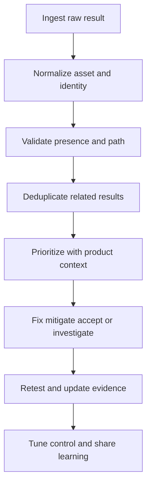

# Findings Triage and False Positives

> **One-line definition:** Convert scanner and tester output into validated, prioritized, owned decisions while preserving evidence and learning from noise.

## Why This Is a Senior Skill

A mid-level practitioner may forward findings to a development team or close items marked false positive. A senior security engineer protects both sides of the system: real risk must not be dismissed, and teams must not be buried under unvalidated noise. They establish a repeatable triage rubric, ask for product context, deduplicate across tools, distinguish false positive from not applicable, and make exceptions visible.

Triage is a decision discipline. Severity scores, confidence, exploitability, reachability, asset impact, exposure, and compensating controls all matter. A false positive is not simply an annoying report. It may indicate a missing framework model, a broken rule, a misunderstood architecture, or a control that the organization cannot prove. The senior response improves the signal and the underlying system.

Use [[software-engineering-note/13_Software_Security/07_Vulnerability_Management|Vulnerability Management]] for lifecycle foundations and [[document-template/14_Security/Vulnerability-Management-Report|Vulnerability Management Report]] for reporting structure.

## Core Frameworks

### 1. Finding Validation Rubric

| Question | Evidence | Outcome |
|---|---|---|
| Is the affected asset and release real? | Repository, image digest, endpoint, or environment | Remove stale or unmatched finding |
| Is the condition present? | Code path, package, configuration, or runtime behavior | Confirm or reject presence |
| Is it reachable or exposed? | Call path, route, network, identity, or deployment state | Refine likelihood and impact |
| Can it affect a protected asset? | Data flow, privilege, business operation | Refine consequence |
| Is there a compensating control? | Validation, isolation, monitoring, rate limit, or access control | Adjust residual risk, not existence |
| Can a different tool or person reproduce it? | Reproduction steps and evidence | Increase confidence or escalate analysis |

Disposition labels should be precise. Use categories such as valid, false positive, not applicable, duplicate, accepted risk, mitigated, and needs more evidence. Do not use false positive as a synonym for low priority.

### 2. Risk Prioritization Matrix

| Impact | Exposure and exploitability | Default priority | Typical action |
|---|---|---|---|
| High | Public and practical | Critical | Contain, fix, or explicitly block release |
| High | Restricted or uncertain | High | Validate reachability and apply near-term treatment |
| Medium | Public but difficult | High or medium | Fix by service target and monitor exploit signals |
| Low | Restricted and well controlled | Low | Schedule or accept with owner and rationale |
| Unknown | Unknown | Escalate | Do not lower priority until context is known |

A finding with low tool confidence can still be important if the impact is high. A high-confidence finding can be low priority if exposure and consequence are demonstrably limited.

### 3. Triage Workflow

### 4. Suppression and Appeal Governance

A suppression record should contain the finding identity, affected scope, evidence, reason, reviewer, owner, compensating control, creation date, expiry, and recheck trigger. Reopen a suppression when the framework, route, data class, exposure, dependency version, or deployment model changes.

## In Practice

### Run a Triage Session

Use a small, representative sample rather than attempting to close a large queue in one meeting:

1. Group related findings by root cause, component, asset, or rule.
2. Ask the owning engineer to explain the path and intended control.
3. Verify presence, reachability, impact, and compensating controls.
4. Agree on disposition, owner, due date, and evidence required for closure.
5. Capture one rule or process improvement for recurring noise.

### Separate Risk From Work Planning

Triage sets the security decision. Planning sets the delivery sequence. A critical finding may require immediate containment even when the permanent refactor belongs in a later sprint. A low-risk valid finding should not be mislabeled false positive merely because it is inconvenient to schedule.

### Anti-Patterns

| Anti-pattern | Failure mode | Better approach |
|---|---|---|
| Close all old findings | Age is mistaken for safety | Reassess with current context and record uncertainty |
| Treat severity as priority | Product impact is omitted | Use exposure, exploitability, privilege, and asset value |
| One ticket per scanner alert | Duplicates overwhelm teams | Group by root cause while preserving raw evidence |
| Suppress noisy rules globally | A real issue disappears everywhere | Scope suppression and add expiry and recheck trigger |
| Security decides without owner context | Reachability and compensating controls are missed | Triage with the team that owns the system |

## Practical Exercise

Take ten findings from one service across at least two scanners:

1. Normalize asset, release, component, rule, and location for each finding.
2. Group duplicates and identify shared root causes.
3. Validate presence, reachability, exposure, impact, and compensating controls.
4. Assign a disposition, owner, due date, and required closure evidence.
5. Select one false positive and write a scoped suppression with expiry and recheck trigger.
6. Select one valid but low-priority issue and document why it is not a false positive.
7. Review the results with the service owner and tune one rule or guidance item.

**Deliverable:** A triage log that demonstrates fair decisions, preserved evidence, and at least one improvement to the signal or workflow.

## Knowledge Connections

- [[software-engineering-note/13_Software_Security/07_Vulnerability_Management|Vulnerability Management]]: finding lifecycle and remediation foundations
- [[document-template/14_Security/Vulnerability-Management-Report|Vulnerability Management Report]]: reporting artifact
- [[body-of-knowledge/SWEBOK/13_Software_Security|SWEBOK Software Security]]: vulnerability and assurance context
- [[career-path/10_Quality_and_Test_Engineering/00_overview|Quality and Test Engineering]]: quality metrics and continuous improvement
- [[02_SAST_and_Taint_Analysis|SAST and Taint Analysis]]: static finding validation
- [[03_SCA_and_Container_Scanning|SCA and Container Scanning]]: component and image context
- [[04_DAST_Fuzzing_and_Penetration_Testing|DAST, Fuzzing, and Penetration Testing]]: dynamic evidence validation
- [[06_Security_Release_Evidence|Security Release Evidence]]: carrying dispositions into release decisions

## Key Takeaways

- Triage is not ticket forwarding. It is validation, contextual risk judgment, and accountable disposition.
- False positive, not applicable, low priority, and accepted risk are different states.
- Group findings by root cause while preserving raw scanner and tester evidence.
- Suppress narrowly, record why, assign an owner, and set an expiry or recheck trigger.
- The owning team provides context while security provides method, challenge, and escalation.
- Noise should lead to better models, rules, interfaces, or process rather than silent dismissal.
