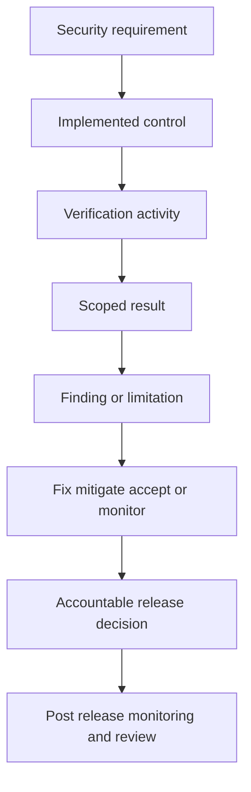

# Security Release Evidence

> **One-line definition:** Assemble credible, scoped evidence that supports a release decision and makes residual security risk, limitations, and ownership explicit.

## Why This Is a Senior Skill

A mid-level practitioner may attach scan reports to a release ticket. A senior security engineer builds an evidence argument. They state the security claims that matter, connect each claim to requirements and tests, identify the exact release candidate and environment, explain findings and exceptions, and make a decision with an accountable owner. They know that evidence volume is not assurance. A hundred pages of unscoped output can be weaker than a short, reproducible record tied to the threat model.

Release evidence is also a communication tool. Developers need actionable gaps. product owners need trade-offs. auditors need traceability. Operations needs monitoring and rollback conditions. The senior engineer preserves the technical detail while giving each decision maker a clear view of confidence and residual risk.

Use [[document-template/13_Testing_and_Verification/Security-Test-Report|Security Test Report]] for the report structure and [[document-template/14_Security/Security-Requirements-Specification|Security Requirements Specification]] for the claims that evidence should support.

## Core Frameworks

### 1. Evidence Claim Chain

For every important security claim, capture:

| Element | Question |
|---|---|
| Claim | What security property do we believe holds? |
| Scope | Which release, artifact, environment, identities, and interfaces are covered? |
| Method | Which review, test, scan, or operational exercise examined the claim? |
| Result | What was observed, including limitations and failures? |
| Finding treatment | Which issues remain and how were they handled? |
| Owner | Who can act on or accept the residual risk? |
| Time | When was the evidence produced and when must it be refreshed? |
| Integrity | How can a reviewer confirm the result was not altered? |

### 2. Release Evidence Matrix

| Evidence area | Minimum evidence | Increase depth when |
|---|---|---|
| Requirements | Security requirements and acceptance status | New assets, actors, trust boundaries, or obligations |
| Design | Threat model and security decisions | Architecture, identity, crypto, or data-flow change |
| Source | Review and static analysis result | High-risk code, new parser, authorization, or unsafe interface |
| Components | SBOM, SCA, image result, and provenance | Public exposure, critical dependency, or supplier event |
| Runtime behavior | DAST, fuzzing, or penetration evidence | New external interface or active threat |
| Configuration | Effective policy and drift checks | Environment, privilege, network, or secret change |
| Findings | Validated dispositions and retest | Material unresolved findings or repeated exceptions |
| Operations | Monitoring, rollback, and response readiness | High blast radius or hard rollback |

### 3. Release Decision Flow

### 4. Decision Categories

| Category | Meaning | Evidence expectation |
|---|---|---|
| Ready | Claims have adequate evidence and no blocking unresolved risk | Matrix complete with reproducible results |
| Ready with conditions | Residual risk is understood and controlled | Owner, compensating control, monitor, and expiry |
| Not ready | Material risk or evidence gap needs treatment | Specific blocker, action, and decision owner |
| Evidence incomplete | The risk may be acceptable, but confidence is insufficient | Scope gap, rationale, and plan to close it |

Do not collapse evidence incomplete into ready. Uncertainty is itself a release consideration.

## In Practice

### Build the Evidence Pack

Collect the smallest useful set of linked artifacts:

- Release identifier, artifact digest, and deployment target
- Security requirements and changed threat assumptions
- Design or threat-model decisions for changed boundaries
- Test strategy and results with scope, time, tool versions, and environment
- SAST, SCA, image, DAST, fuzzing, or penetration outputs as applicable
- Validated finding log with owners, dispositions, and retest evidence
- Exceptions and risk acceptances with expiry and compensating controls
- Monitoring, rollback, and incident response readiness

Prefer links and hashes to copied reports. Preserve raw evidence in a controlled location and summarize decisions in the release record.

### Run a Risk-Based Release Review

A 30 to 45 minute review should answer:

1. What changed and which security claims matter?
2. Which evidence covers each claim, and what are its limits?
3. What unresolved findings or assumptions remain?
4. Who owns the residual risk and what conditions apply?
5. What will be monitored after release and when will evidence be refreshed?

### Anti-Patterns

| Anti-pattern | Failure mode | Better approach |
|---|---|---|
| Green dashboard equals approval | Tool status hides scope and limitations | Review claims, evidence, findings, and ownership |
| Attach every report | Important decisions are lost in volume | Create a linked evidence matrix with concise conclusions |
| Security signs for the product owner | Accountability becomes unclear | Security challenges and advises, authorized owners decide |
| Permanent risk acceptance | Residual risk stops receiving attention | Set expiry, conditions, and reapproval trigger |
| No artifact identity | Results may not match what shipped | Record commit, image digest, SBOM, and deployment target |

## Practical Exercise

Create an evidence pack for a release that changes a public API and its container image:

1. Write three security claims based on requirements and the threat model.
2. Identify the exact commit, artifact digest, environment, roles, and interfaces in scope.
3. Map each claim to a test or review result, including one limitation.
4. Select two findings and document treatment, owner, evidence, expiry, and monitoring.
5. Write a release decision as ready, ready with conditions, not ready, or evidence incomplete.
6. Ask a product owner and an operations engineer to explain what they would do differently after reading it.

**Deliverable:** A concise security release record plus an evidence matrix that a reviewer can follow from claim to result to residual-risk decision.

## Knowledge Connections

- [[document-template/13_Testing_and_Verification/Security-Test-Report|Security Test Report]]: consolidated security test artifact
- [[document-template/14_Security/Security-Requirements-Specification|Security Requirements Specification]]: security claims and acceptance expectations
- [[software-engineering-note/05_Software_Testing/Software Testing Overview|Software Testing Overview]]: testing process, evidence, and limitations
- [[body-of-knowledge/SWEBOK/13_Software_Security|SWEBOK Software Security]]: assurance and security testing foundations
- [[01_Security_Test_Strategy|Security Test Strategy]]: depth, scope, and exit criteria
- [[05_Findings_Triage_and_False_Positives|Findings Triage and False Positives]]: validated dispositions and retest
- [[03_Secure_Development_and_DevSecOps/03_DevSecOps_Pipeline_Controls|DevSecOps Pipeline Controls]]: automated evidence and artifact identity
- [[career-path/10_Quality_and_Test_Engineering/00_overview|Quality and Test Engineering]]: quality evidence and release practices
- [[07_Vulnerability_Management_and_Governance/00_overview|Vulnerability Management and Governance]]: residual risk after release

## Key Takeaways

- Release evidence is an argument tied to claims, scope, methods, results, limitations, and ownership.
- A passing tool result is useful only when it applies to the artifact and environment that will run.
- Unresolved findings need treatment, owner, expiry, and monitoring, not vague approval language.
- Security engineers provide challenge and evidence; authorized product owners remain accountable for delivery risk.
- Keep raw reports, but summarize the release decision in a readable evidence matrix.
- The strongest evidence supports learning after release and makes the next verification decision easier.
