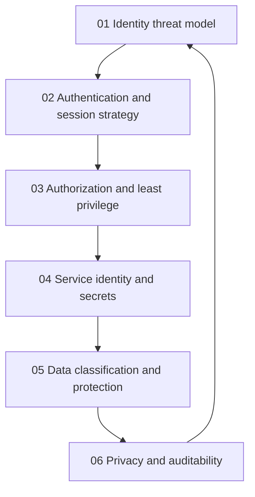

# Identity, Access and Data Protection

> **Core idea:** Make every identity, authorization decision, secret, and sensitive data use accountable, proportionate, observable, and recoverable.

## What This Capability Means at Senior Level

Identity and data controls are not isolated configuration tasks. They form the control plane for the product: who can act, what they can reach, what evidence is produced, and what happens when a credential, session, or data store is compromised. A senior security engineer connects those decisions to threat paths, user experience, privacy obligations, operational ownership, and the cost of failure.

The specialist does not respond to every risk with maximum friction. They set assurance levels, define reusable authorization patterns, reduce secret blast radius, and make data protection practical for delivery teams. They can explain why a control is needed, who owns it, how it will be tested, and what evidence proves it works.

## Topic Notes

| # | Topic | Senior-specialist focus | Status | File |
|---|---|---|---|---|
| 01 | Identity Threat Model | Map identity attack paths, trust boundaries, and accountable owners | ✅ Done | `01_Identity_Threat_Model.md` |
| 02 | Authentication and Session Strategy | Choose assurance, recovery, and session controls without unnecessary friction | ✅ Done | `02_Authentication_and_Session_Strategy.md` |
| 03 | Authorization and Least Privilege | Design enforceable permissions, delegation, and reviewable entitlements | ✅ Done | `03_Authorization_and_Least_Privilege.md` |
| 04 | Service Identity and Secrets | Manage workload identity, rotation, provenance, and blast radius | ✅ Done | `04_Service_Identity_and_Secrets.md` |
| 05 | Data Classification and Protection | Translate data value and sensitivity into lifecycle controls | ✅ Done | `05_Data_Classification_and_Protection.md` |
| 06 | Privacy and Auditability | Make sensitive processing explainable, traceable, and evidence-ready | ✅ Done | `06_Privacy_and_Auditability.md` |

**Completion:** 6/6 : 100%

## How the Topics Connect

**Reading order:** Start with threat paths and trust boundaries. Then set human authentication and session assurance, design authorization, and extend the model to workload identities and secrets. Finish with data lifecycle decisions, privacy, and evidence so controls remain accountable after deployment.

## Existing Vault Anchors

These notes layer senior judgment over existing foundations rather than repeating them:

| Senior topic | Existing foundation |
|---|---|
| Identity threat model | [[software-engineering-note/13_Software_Security/03_Access_Control_and_Architecture]] and [[software-engineering-note/13_Software_Security/Cybersecurity/01 Security Fundamentals/01 Authentication Security]] |
| Authentication and session strategy | [[software-engineering-note/13_Software_Security/Cybersecurity/01 Security Fundamentals/01 Authentication Security]] |
| Authorization and least privilege | [[software-engineering-note/13_Software_Security/03_Access_Control_and_Architecture]] |
| Service identity and secrets | [[software-engineering-note/13_Software_Security/03_Access_Control_and_Architecture]] and [[software-engineering-note/13_Software_Security/08_Security_Management_and_Governance]] |
| Data classification and protection | [[body-of-knowledge/DMBOK/05_Data_Security]] |
| Privacy and auditability | [[body-of-knowledge/DMBOK/05_Data_Security]] and [[software-engineering-note/13_Software_Security/08_Security_Management_and_Governance]] |

## Self-Assessment Checklist

- [ ] I can draw the identity trust boundaries and abuse paths for a critical user journey.
- [ ] I can choose authentication assurance by consequence rather than applying one MFA rule everywhere.
- [ ] I can explain every high-risk permission in terms of subject, action, resource, context, and owner.
- [ ] I can show how workload identities are issued, rotated, revoked, and attributed.
- [ ] I can identify where secrets or logs could expand the blast radius of a compromise.
- [ ] I can classify data with an explicit business owner and lifecycle decision.
- [ ] I can demonstrate that privacy-sensitive actions produce useful, protected audit evidence.
- [ ] I can design a safe exception path that is time-bound and reviewable.
- [ ] I can balance user friction, engineering cost, privacy, and security consequence in one decision record.

## Evidence of Capability

A strong evidence set includes an identity threat model, an authentication decision record, an authorization contract, a service identity inventory, a data flow classification, and an auditability or privacy impact review. Each artifact names owners, assumptions, control tests, and the next review trigger.

## Related

- [[career-path/08_Security_Engineer/00_overview|Security Engineer]]
- [[career-path/08_Security_Engineer/06_Detection_Incident_Response_and_Resilience/00_overview|Detection, Incident Response and Resilience]]
- [[career-path/08_Security_Engineer/07_Vulnerability_Management_and_Governance/00_overview|Vulnerability Management and Governance]]
- [[career-path/07_SRE_and_Platform_Engineer/06_Developer_Platform/00_overview|Developer Platform]]
