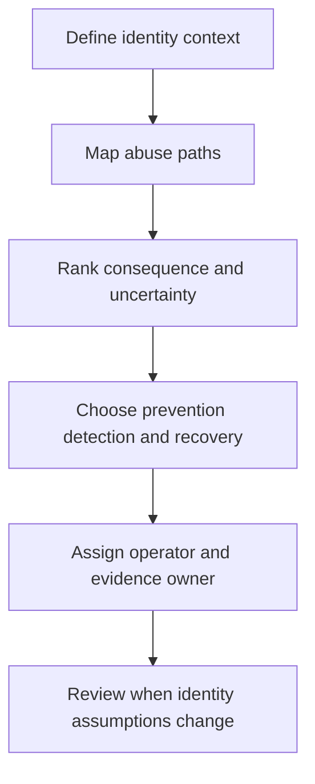

# Identity Threat Model

> **One-line definition:** A senior identity threat model connects people, workloads, credentials, sessions, trust boundaries, and business consequences into prioritized attack paths with owners.

## Why This Is a Senior Skill

A mid-level engineer may review a login endpoint or fix a reported access-control defect. A senior security engineer models the identity system as a whole: enrollment, authentication, recovery, session use, delegation, service-to-service calls, privileged operations, and deprovisioning. They look for paths that cross components and organizational boundaries, not only weaknesses in one API.

The goal is not to produce a large diagram. The goal is to make important identity decisions explicit: which identities are trusted, what evidence establishes that trust, what an attacker can gain, how quickly the organization can detect misuse, and which owner can change the control. The threat model becomes a decision instrument that can be revisited when providers, tenants, data, or privilege change.

| Dimension | Mid-level approach | Senior-specialist approach |
|---|---|---|
| Scope | Reviews an authentication component | Follows identity lifecycle and trust boundaries end to end |
| Threats | Lists common attacks | Prioritizes plausible abuse paths and business consequences |
| Controls | Recommends familiar controls | Selects controls by assurance, usability, detection, and recovery needs |
| Ownership | Sends findings to a team | Names accountable owners and verification evidence |
| Change | Treats the model as a document | Defines triggers that require a model refresh |

## Core Frameworks

### 1. Identity Attack Surface Map

Start with the identities and transitions that change authority. For each boundary, record the trust assumption and the evidence required to cross it.

| Boundary or transition | Questions to ask | Failure consequence | Evidence and owner |
|---|---|---|---|
| Enrollment | Who can create or link an identity? | Fraudulent account or tenant access | Enrollment controls, product owner |
| Authentication | What establishes user or workload assurance? | Account takeover | Factor events, identity owner |
| Recovery | Who can regain access and through which channel? | Bypass of strong authentication | Recovery audit trail, support owner |
| Session use | How long does authority persist? | Stolen session abuse | Session telemetry, platform owner |
| Delegation | Can one identity act for another? | Privilege laundering | Delegation records, service owner |
| Deprovisioning | How quickly is authority removed? | Orphaned access | Revocation test, HR or tenant owner |

### 2. Abuse Path Prioritization

Use a qualitative scorecard rather than pretending that uncertain inputs are precise. Rank paths by consequence and actionability.

| Criterion | Low | Medium | High |
|---|---|---|---|
| Privilege gained | Read-only or isolated | Sensitive data or one service | Administrative or cross-tenant |
| Reachability | Narrow internal path | Authenticated broad path | Internet, federation, or support path |
| Business impact | Local inconvenience | Material customer or operational harm | Safety, regulatory, or systemic harm |
| Detection confidence | Strong signal and owner | Partial signal | Little or no useful signal |
| Recovery difficulty | Revoke and restore quickly | Coordinated response | Uncertain scope or irreversible change |

Prioritize paths that combine high privilege, broad reachability, weak detection, and difficult recovery. Document uncertainty as a reason to gather evidence, not as a reason to ignore the path.

### 3. Identity Control Decision Record

For each material path, capture:

1. **Context:** system, tenant model, identity types, data, and business process.
2. **Adversary:** capability, access, motivation, and likely route.
3. **Path:** sequence of actions and trust-boundary crossings.
4. **Treatment:** prevent, detect, contain, recover, or consciously accept.
5. **Owner:** person or team able to operate and change the control.
6. **Evidence:** test, event, dashboard, review, or audit artifact.
7. **Trigger:** provider change, new privilege, incident, or expiry date that reopens the decision.

## In Practice

### Run a focused threat-model workshop

A useful 60 to 90 minute session includes:

1. **Context and success:** 10 minutes to define the protected outcome and critical identities.
2. **Lifecycle walk:** 20 minutes from enrollment through deprovisioning.
3. **Boundary challenge:** 20 minutes to ask what happens when a token, support channel, federation link, or workload credential is compromised.
4. **Prioritization:** 15 minutes to rank the three most consequential paths.
5. **Ownership:** 15 minutes to assign controls, evidence, and review triggers.

Invite an engineer, service owner, operations representative, product or support representative, and a privacy or compliance partner when the path touches regulated data.

### Avoid these anti-patterns

| Anti-pattern | Why it fails | Better senior move |
|---|---|---|
| Checklist-only review | Misses chained attacks across boundaries | Walk a realistic identity journey |
| Threat actor theater | Produces generic lists without decisions | Tie each threat to privilege and business harm |
| Diagram without ownership | No one operates the control | Name an owner and evidence source for every high path |
| One-time model | Drifts as providers and permissions change | Add refresh triggers to the change process |
| Maximum controls everywhere | Creates friction and bypass pressure | Match assurance and monitoring to consequence |

## Practical Exercise

Choose one critical journey such as administrator login, customer account recovery, or a deployment pipeline.

1. List every human and workload identity involved.
2. Mark each trust boundary and the authority gained at that boundary.
3. Write at least five abuse paths, including one support or recovery path.
4. Score each path using privilege, reachability, business impact, detection, and recovery difficulty.
5. Select the top three paths and record one preventive, detective, containment, and recovery control for each.
6. Name the owner and evidence for every selected control.
7. Present the model to the service owner and record one decision, one open uncertainty, and one refresh trigger.

**Completion test:** Another engineer can use your model to explain what should happen when a credential is suspected to be compromised.

## Knowledge Connections

- [[software-engineering-note/13_Software_Security/03_Access_Control_and_Architecture]] : architectural access-control foundations
- [[software-engineering-note/13_Software_Security/Cybersecurity/01 Security Fundamentals/01 Authentication Security]] : authentication security foundations
- [[02_Authentication_and_Session_Strategy]] : turns identity threats into assurance and session decisions
- [[03_Authorization_and_Least_Privilege]] : limits authority after identity is established
- [[06_Privacy_and_Auditability]] : makes identity actions explainable and reviewable

## Key Takeaways

- Model identity as a lifecycle and control plane, not only a login screen.
- Prioritize attack paths by consequence, reachability, detection, and recovery difficulty.
- Treat recovery, support, federation, and delegation as first-class trust boundaries.
- Every high-risk path needs an operator, evidence source, and refresh trigger.
- Uncertainty is a reason to collect telemetry or test a control, not a reason to lower priority.
- A useful threat model changes a design or an operating decision.
