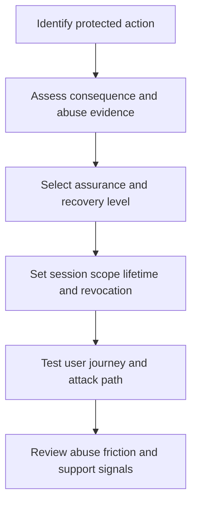

# Authentication and Session Strategy

> **One-line definition:** An authentication and session strategy assigns the right assurance, recovery, lifetime, and reauthentication controls to each consequence level.

## Why This Is a Senior Skill

A mid-level engineer implements a selected identity provider or adds a required factor. A senior security engineer decides where stronger proof is justified, how recovery avoids becoming a bypass, how sessions carry authority, and how controls affect conversion, support load, accessibility, privacy, and incident response. They treat authentication as a product and operational system, not a single protocol choice.

Good strategy distinguishes authentication assurance from authorization. Strong proof does not make every action safe, and a low-friction login may be reasonable for low-consequence activity. The senior decision explains the threat model, the user journey, the failure modes, and the evidence that the chosen controls are working.

| Decision | Mid-level approach | Senior-specialist approach |
|---|---|---|
| Assurance | Applies one organization-wide rule | Tiers assurance by consequence and threat path |
| Recovery | Treats support as an exception | Designs recovery as an equally protected authentication path |
| Sessions | Uses provider defaults | Sets lifetime, binding, revocation, and reauthentication intentionally |
| Friction | Measures only implementation effort | Balances abuse reduction, accessibility, conversion, and support cost |
| Evidence | Checks that MFA is enabled | Verifies factor use, bypass resistance, revocation, and incident signals |

## Core Frameworks

### 1. Authentication Assurance Ladder

Define levels in terms of what an attacker must defeat and what the business is protecting. Names vary by organization, so document the local mapping.

| Consequence level | Example action | Preferred assurance decision | Recovery expectation |
|---|---|---|---|
| Low | Browse public or low-value workspace | Passwordless or low-friction proof may be sufficient | Self-service with abuse monitoring |
| Standard | Access ordinary customer or team data | Phishing-resistant or strong multi-factor proof where practical | Recovery cannot weaken the standard path |
| Sensitive | Export sensitive data or change billing | Step-up authentication close to the action | Revoke sessions and notify affected owner |
| Privileged | Change identity policy or production access | Hardware-backed or equivalent strong proof, separate admin context | Human-reviewed recovery and break-glass evidence |

### 2. Session Lifecycle Review

Review the whole session state machine instead of choosing a single timeout.

| Stage | Senior questions | Evidence to retain |
|---|---|---|
| Issue | Is the session bound to the correct identity, device, and client? | Issuance event and assurance level |
| Use | Are sensitive actions step-up protected? | Authentication context and action record |
| Refresh | Can a stolen refresh path extend authority indefinitely? | Refresh, rotation, and reuse signals |
| Revoke | Can the user, operator, or incident process revoke it quickly? | Revocation event and propagation time |
| Expire | Does expiration reflect risk and user need? | Policy version and expiry behavior |

### 3. Friction and Risk Decision Matrix

Use a reversible experiment when evidence is weak. Do not relax a control merely because a team reports inconvenience.

| Signal | Consequence low | Consequence high |
|---|---|---|
| Attack evidence weak | Prefer low friction and monitor | Keep strong proof if compromise would be severe |
| Attack evidence strong | Add step-up or rate limits | Require stronger proof, reduce session scope, and improve detection |
| Recovery abuse high | Tighten recovery and support verification | Suspend high-risk recovery and require independent review |
| Accessibility impact high | Offer equivalent accessible factors | Preserve assurance with alternative strong factors |

## In Practice

### Review a login and recovery journey together

Ask the team to demonstrate:

1. New enrollment and factor binding.
2. Normal sign-in from a known device.
3. Sign-in from a changed context.
4. Lost factor recovery through every support channel.
5. Session refresh, logout, password or factor change, and global revocation.
6. Step-up for the highest-consequence action.
7. Signals available to the detection and incident teams.

Record the exact assurance context carried into authorization. If the system cannot answer why a sensitive action was allowed, the design is not finished.

### Common trade-offs

| Pressure | Weak response | Senior response |
|---|---|---|
| Conversion drops | Remove the factor | Segment assurance by action and test alternatives |
| Support volume rises | Let support reset factors freely | Protect recovery and measure root causes |
| Provider outage | Disable authentication checks | Use a rehearsed degraded mode with bounded authority |
| Session theft | Shorten every timeout | Combine binding, step-up, revocation, and detection |
| Legacy clients | Keep weak flows forever | Isolate legacy risk and create an explicit migration path |

## Practical Exercise

Select the highest-value action in a product you know, such as exporting customer data or changing an administrator.

1. Describe the user, business consequence, and likely attack path.
2. Document the current authentication, session, and recovery behavior.
3. Assign the action an assurance level and explain why.
4. Define what should trigger step-up authentication.
5. Test factor enrollment, factor loss, session refresh, logout, and global revocation.
6. Capture usability, accessibility, support, privacy, and telemetry impacts.
7. Write a one-page decision record with a rollout experiment and rollback trigger.

**Completion test:** The record states how the organization will know whether stronger assurance reduced risk without creating unsafe bypass behavior.

## Knowledge Connections

- [[01_Identity_Threat_Model]] : threat paths determine assurance priorities
- [[software-engineering-note/13_Software_Security/Cybersecurity/01 Security Fundamentals/01 Authentication Security]] : authentication foundations
- [[software-engineering-note/13_Software_Security/03_Access_Control_and_Architecture]] : access-control architecture
- [[03_Authorization_and_Least_Privilege]] : authorization still evaluates the requested action
- [[06_Privacy_and_Auditability]] : authentication events must be useful without over-collecting data

## Key Takeaways

- Authentication assurance should follow consequence and threat evidence, not habit.
- Recovery and support flows are authentication paths and deserve equal scrutiny.
- Session scope, refresh, revocation, and reauthentication are separate decisions.
- Strong authentication does not replace least privilege or useful detection.
- Treat friction, accessibility, privacy, and support cost as design inputs.
- Verify the control in the full user journey and record how it will be measured.
