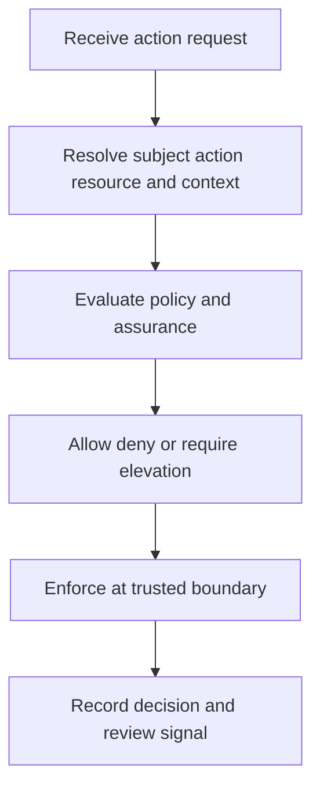

# Authorization and Least Privilege

> **One-line definition:** Design authorization as an owned, testable decision contract that grants only the authority required for a task and context.

## Why This Is a Senior Skill

A mid-level engineer adds a role check or fixes a forbidden response. A senior security engineer defines the authorization model, identifies the highest-consequence actions, keeps policy decisions consistent across services, and makes permissions explainable to operators and users. They understand that a correct decision depends on subject, action, resource, context, policy version, and enforcement point.

Least privilege is not simply making roles smaller. It is limiting authority in time, scope, purpose, and execution context while keeping the resulting system operable. The senior specialist chooses a model that teams can maintain, tests the negative space, plans migration from accumulated entitlements, and creates an exception path that cannot quietly become a permanent role.

| Aspect | Mid-level approach | Senior-specialist approach |
|---|---|---|
| Model | Adds roles as features arrive | Selects a permission model tied to business actions |
| Enforcement | Checks at one endpoint | Protects every relevant path and trust boundary |
| Review | Reviews membership lists | Reviews high-risk entitlements, usage, owners, and expiry |
| Exceptions | Grants broad access to unblock work | Uses bounded, time-limited, observable elevation |
| Testing | Tests allowed examples | Tests denied paths, cross-tenant access, and policy drift |

## Core Frameworks

### 1. Authorization Decision Contract

For every sensitive action, make these fields explicit:

| Field | Decision question | Example evidence |
|---|---|---|
| Subject | Which human or workload is acting? | Stable identity and assurance context |
| Action | What exact operation is requested? | Named business capability, not a vague role |
| Resource | Which object, tenant, environment, or dataset? | Resource owner and classification |
| Context | What time, device, network, workflow, or approval matters? | Context attributes and freshness |
| Decision | Why allow, deny, or require elevation? | Policy version and decision reason |
| Enforcement | Where is the decision enforced? | Server-side control and integration test |
| Audit | What evidence is created and protected? | Correlated authorization event |

### 2. Least-Privilege Dimensions

Evaluate privilege across more than one axis.

| Dimension | Strong design question | Warning sign |
|---|---|---|
| Scope | Can the permission be limited to one resource or tenant? | Global role for a local task |
| Action | Can read, write, delete, and policy change be separated? | One permission covers all operations |
| Time | Can access expire or require just-in-time elevation? | Permanent access for occasional work |
| Context | Can production, device, network, or approval context reduce risk? | Same authority everywhere |
| Purpose | Can access be tied to a support case or change? | Unexplained browsing of sensitive data |
| Delegation | Is acting for another identity explicit and bounded? | Shared accounts or invisible impersonation |

### 3. Entitlement Review Matrix

Prioritize review effort using privilege, use, and control strength.

| Entitlement | Privilege | Recent use | Owner clarity | Review action |
|---|---|---|---|---|
| Global administrator | High | Unclear | Weak | Remove, replace, or investigate immediately |
| Tenant operator | High | Active | Clear | Keep with step-up and frequent review |
| Read-only sensitive data | Medium | Active | Clear | Confirm purpose and data minimization |
| Dormant project role | Medium | None | Weak | Revoke or require re-request |
| Temporary elevation | High | Bounded | Clear | Verify expiry and event evidence |

## In Practice

### Build an authorization review

Use a high-risk workflow such as production deployment, customer data export, or tenant deletion.

1. Name the business action and its irreversible consequences.
2. Trace every service and data store that can perform it.
3. Document the authorization contract at each boundary.
4. Test direct calls, alternate APIs, asynchronous jobs, and support tools.
5. Review active entitlements and recent use with the resource owner.
6. Decide where just-in-time elevation, dual control, or approval is justified.
7. Define denial telemetry and an operator path for safe diagnosis.

### Anti-patterns and better moves

| Anti-pattern | Risk | Better move |
|---|---|---|
| Role explosion | Unmaintainable permissions and review fatigue | Model stable capabilities and use attributes for context |
| Client-side checks | Attacker can bypass the UI | Enforce on the server or trusted policy boundary |
| Shared administrator | No attribution or individual revocation | Use named identities and delegated elevation |
| Deny only at the UI | Alternate endpoint remains exposed | Test every execution path and job boundary |
| Unbounded break-glass | Emergency access becomes normal access | Log, notify, expire, and review every use |

## Practical Exercise

Choose one sensitive action and create an authorization contract.

1. Write the subject, action, resource, context, decision, enforcement point, and audit event.
2. List the smallest permission set needed for the normal workflow.
3. Add one denied path for each of cross-tenant, stale session, wrong environment, and missing approval.
4. Inspect current roles and identify one broad or unused entitlement.
5. Design a safer alternative using scope, time, context, or approval.
6. Define a test that proves the denial is enforced outside the user interface.
7. Run a review with the service owner and record the migration or exception plan.

**Completion test:** The result makes both allowed and denied behavior testable without relying on tribal knowledge.

## Knowledge Connections

- [[02_Authentication_and_Session_Strategy]] : authentication context informs authorization assurance
- [[04_Service_Identity_and_Secrets]] : workloads need attributable permissions too
- [[software-engineering-note/13_Software_Security/03_Access_Control_and_Architecture]] : access-control architecture foundation
- [[software-engineering-note/13_Software_Security/08_Security_Management_and_Governance]] : governance and accountability context
- [[06_Privacy_and_Auditability]] : sensitive access needs privacy-aware evidence

## Key Takeaways

- Treat authorization as a decision contract, not a scattered role check.
- Limit privilege by scope, action, time, context, purpose, and delegation.
- Test denied paths and alternate execution routes as deliberately as allowed paths.
- Review high-risk entitlements using usage, ownership, and consequence evidence.
- Just-in-time access is useful only when elevation, expiry, and evidence work in practice.
- A permission model is successful when teams can operate it without broad permanent access.
