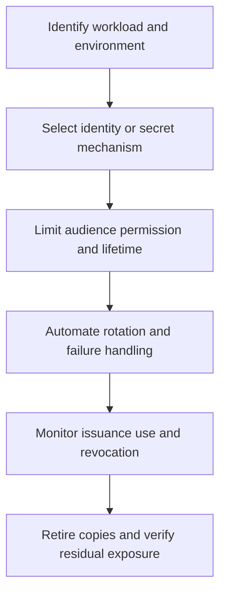

# Service Identity and Secrets

> **One-line definition:** Give every workload an attributable identity and manage credentials as short-lived, scoped, rotatable, and observable dependencies.

## Why This Is a Senior Skill

A mid-level engineer stores a credential in an approved secret manager or rotates a key after a finding. A senior security engineer reduces the need for static secrets, defines workload identity patterns, maps trust between services and environments, and owns the operational path for issuance, rotation, revocation, recovery, and incident investigation.

The important question is not only whether a secret is encrypted at rest. It is what an attacker can do after obtaining it, how quickly the organization can distinguish legitimate from suspicious use, and whether rotation can happen without an outage. Senior practice makes identity and secret lifecycle part of platform design so teams do not invent unsafe patterns under delivery pressure.

| Aspect | Mid-level approach | Senior-specialist approach |
|---|---|---|
| Credential | Stores a value in an approved location | Chooses workload identity and minimizes static material |
| Scope | Grants access to make the integration work | Limits audience, action, environment, and lifetime |
| Rotation | Performs periodic manual rotation | Designs automated rotation with failure handling |
| Incident | Revokes the known secret | Traces use, bounds blast radius, and verifies replacement |
| Ownership | Assumes the platform owns it | Names application, platform, and data owners explicitly |

## Core Frameworks

### 1. Service Identity Selection

Choose the strongest practical mechanism for the trust boundary and operating environment.

| Pattern | Best fit | Main risk | Senior decision signal |
|---|---|---|---|
| Static application secret | Legacy integration with no federation | Long lifetime and copying | Isolated, scoped, monitored, and on a retirement plan |
| Platform workload identity | Cloud or orchestrator managed workload | Misbound role or environment | Preferred default when platform binding is reliable |
| Federated short-lived token | Cross-environment or external trust | Federation configuration drift | Use with audience, issuer, and claim validation |
| Delegated user context | User-driven action across services | Confused deputy or overbroad delegation | Bind purpose, audience, and user assurance |
| Break-glass credential | Recovery when normal identity fails | Unreviewed emergency use | Separate storage, strong approval, alerting, and expiry |

### 2. Secret Lifecycle Readiness

| Stage | Required decision | Failure question |
|---|---|---|
| Discover | Where is the secret, who uses it, and what does it reach? | Can inventory find copies in code, logs, images, and backups? |
| Issue | Who can request and approve it? | Can an attacker mint an equivalent credential? |
| Use | Is exposure limited to the needed process and time? | Can child processes, logs, or developers read it? |
| Rotate | Can replacement happen before expiry without outage? | What happens when old and new credentials overlap? |
| Revoke | Can use be stopped quickly and globally enough? | How is active use detected after revocation? |
| Retire | Are copies, references, and recovery material removed? | Can the secret reappear from an artifact or backup? |

### 3. Blast-Radius Worksheet

For every credential, record audience, permissions, environment, data reach, lifetime, rotation owner, and detection signal. Use the worksheet to compare a proposed design with a safer alternative.

## In Practice

### Make rotation a production capability

Before approving a secret-based integration, require a rehearsal that covers:

1. Issuing a replacement while the old credential remains valid.
2. Deploying consumers without exposing the value in logs or configuration output.
3. Validating both credentials during a bounded overlap window.
4. Revoking the old credential and confirming traffic continues.
5. Detecting use of the revoked credential.
6. Rolling back safely if the new credential is invalid.
7. Removing old references from repositories, images, caches, and documentation.

### Anti-patterns and better moves

| Anti-pattern | Operational consequence | Better move |
|---|---|---|
| Secret in source control | Long-lived copies and difficult revocation | Use workload identity or managed injection and scan history |
| One credential for many services | Compromise spreads across the estate | Issue per workload, environment, and audience |
| Rotation without rehearsal | Rotation causes an outage or is skipped | Exercise overlap, revoke, rollback, and alerting |
| Secret in logs | Incident scope expands silently | Redact at source and test log pipelines |
| Emergency key with no owner | Break-glass becomes permanent | Set named owner, expiry, approval, and review |

## Practical Exercise

Pick one deployment pipeline, scheduled job, or service-to-service integration.

1. Inventory its identity, secrets, permissions, environment, data reach, and consumers.
2. Identify every place a credential could be copied or exposed.
3. Measure its current lifetime, rotation path, revocation time, and evidence.
4. Design a least-privilege workload identity alternative or a bounded interim pattern.
5. Rehearse rotation in a non-production environment, including failure and rollback.
6. Add a detection for unexpected issuer, audience, location, or post-revocation use.
7. Record the owner, retirement milestone, and evidence links in the service documentation.

**Completion test:** An operator can rotate or revoke the credential during an incident without guessing or taking the service offline.

## Knowledge Connections

- [[03_Authorization_and_Least_Privilege]] : permissions and delegation must be attributable
- [[01_Identity_Threat_Model]] : workload trust boundaries and abuse paths
- [[software-engineering-note/13_Software_Security/03_Access_Control_and_Architecture]] : access-control architecture foundation
- [[software-engineering-note/13_Software_Security/08_Security_Management_and_Governance]] : accountability and control ownership
- [[career-path/08_Security_Engineer/06_Detection_Incident_Response_and_Resilience/01_Security_Observability|Security Observability]] : telemetry for issuance and use

## Key Takeaways

- Prefer attributable workload identity over static secrets when the platform supports it.
- Scope credentials by audience, permission, environment, purpose, and lifetime.
- Rotation is incomplete until replacement, revocation, detection, and rollback are rehearsed.
- Inventory includes repositories, artifacts, logs, backups, caches, and developer workflows.
- Break-glass access must be more observable and more accountable than normal access.
- The useful security outcome is bounded blast radius plus a fast, practiced response.
