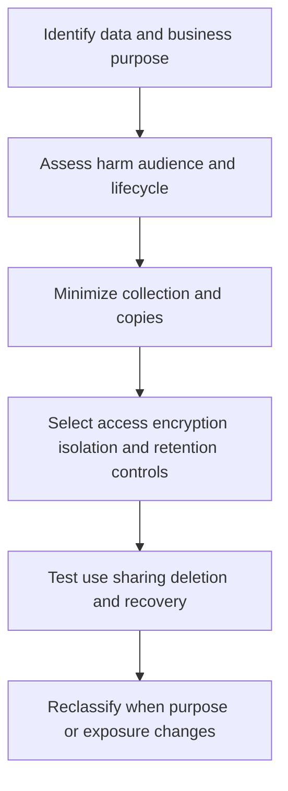

# Data Classification and Protection

> **One-line definition:** Translate data value, sensitivity, purpose, and lifecycle into controls that are proportionate, operable, and testable.

## Why This Is a Senior Skill

A mid-level engineer applies encryption or access rules when a classification is handed to them. A senior security engineer helps the organization decide what the classification means in practice, who owns it, how it travels through systems, and when controls can be relaxed or must strengthen. They connect classification to product purpose, privacy, retention, residency, access, logging, backup, deletion, and incident response.

Classification is useful only when it changes a decision. A label that does not affect storage, transport, access, processing, or disposal becomes decorative metadata. The senior specialist avoids both extremes: treating all data as equally sensitive, which creates cost and friction, and treating uncertain data as ordinary, which creates unbounded exposure.

| Aspect | Mid-level approach | Senior-specialist approach |
|---|---|---|
| Label | Applies a predefined tag | Calibrates classification with business and data owners |
| Control | Encrypts or restricts by default | Chooses controls by harm, purpose, and lifecycle stage |
| Scope | Focuses on the primary database | Follows data through copies, logs, exports, and backups |
| Change | Handles requests individually | Defines reclassification triggers and migration patterns |
| Cost | Treats protection cost as fixed | Makes protection, minimization, and retention trade-offs explicit |

## Core Frameworks

### 1. Classification Decision

Use local category names, but make the decision criteria observable.

| Decision question | Lower consequence signal | Higher consequence signal |
|---|---|---|
| Harm from disclosure | Little or public impact | Personal, financial, safety, or strategic harm |
| Harm from alteration | Easily corrected | Fraud, safety, legal, or operational harm |
| Harm from loss | Can be recreated | Irreplaceable or legally required record |
| Purpose | Broad product utility | Narrow purpose or sensitive inference |
| Audience | Public or internal | Restricted role, tenant, or regulated processor |
| Retention | Short and disposable | Long-lived obligation or historical sensitivity |

Record the classification, rationale, owner, allowed purposes, prohibited uses, and review trigger. Do not infer that one dimension determines every control.

### 2. Data Lifecycle Control Map

| Lifecycle stage | Senior control decision | Evidence |
|---|---|---|
| Collect | Is the field necessary for a stated purpose? | Data contract and purpose record |
| Use | Which roles, services, and environments may process it? | Authorization policy and access review |
| Share | Which recipients, regions, and processors are allowed? | Transfer record and contract evidence |
| Store | What encryption, isolation, backup, and key controls apply? | Configuration test and owner |
| Retain | What is the retention reason and expiry? | Retention policy and deletion job result |
| Dispose | How is deletion verified across copies? | Deletion evidence and exception record |

### 3. Protection Trade-off Matrix

| Option | Risk reduction | Delivery or operating cost | Choose when |
|---|---|---|---|
| Minimize collection | High for unnecessary data | Product and migration work | Purpose is unclear or value is low |
| Tokenize or isolate | High for direct exposure | Integration and key management | Systems need correlation but not raw values |
| Encrypt with managed keys | Medium to high | Key lifecycle and recovery work | Storage or transport exposure matters |
| Strong access and monitoring | Medium | Review and detection cost | Data must remain available to authorized workflows |
| Retain less | High over time | Historical analytics trade-off | Future value does not justify exposure |

## In Practice

### Review a real data flow

Facilitate a data-flow review with the product owner, engineering owner, data owner, privacy partner, and operations representative. Trace the field from collection to disposal, including analytics, logs, exports, support tooling, test data, backups, and third parties. For each copy, ask whether the purpose is still valid and whether the same classification applies.

### Protection decisions that enable delivery

| Delivery pressure | Blocking response | Enabling response |
|---|---|---|
| Analytics needs production-like data | Ban all test data without an alternative | Minimize, tokenize, synthesize, or isolate with documented purpose |
| Teams need troubleshooting access | Give broad database access | Provide filtered views, time-bound access, and protected audit events |
| Legacy storage cannot meet target | Demand an immediate rewrite | Bound exposure, add compensating controls, and fund a retirement path |
| Global service needs regional data | Ignore residency or block launch | Define allowed transfers, local processing, and a clear decision owner |

## Practical Exercise

Choose one sensitive field or dataset that travels through a product.

1. Draw its collection, processing, storage, sharing, backup, analytics, and disposal points in a text or diagram tool.
2. Identify the purpose, owner, classification rationale, and harm from disclosure, alteration, or loss.
3. Find unnecessary fields, copies, logs, exports, or environments.
4. Map one control to each lifecycle stage and name the evidence it will produce.
5. Compare minimization, tokenization, encryption, isolation, and retention options using risk and cost.
6. Define a deletion or reclassification test and run it on a non-production copy.
7. Present one enabling recommendation that reduces exposure without blocking the business outcome.

**Completion test:** The resulting data-flow record shows not only where data is stored, but why each copy exists and how its protection is verified.

## Knowledge Connections

- [[body-of-knowledge/DMBOK/05_Data_Security]] : data security foundations
- [[04_Service_Identity_and_Secrets]] : workload access and key ownership
- [[03_Authorization_and_Least_Privilege]] : access decisions for sensitive data
- [[software-engineering-note/13_Software_Security/08_Security_Management_and_Governance]] : governance and control accountability
- [[06_Privacy_and_Auditability]] : purpose, evidence, and privacy review

## Key Takeaways

- A classification is valuable only when it changes a lifecycle decision.
- Follow data through logs, exports, analytics, backups, support tools, and test environments.
- Minimize collection and copies before adding expensive controls.
- Treat protection cost, user value, privacy, residency, and operational recovery as one trade-off.
- Give every dataset a business owner, purpose, retention decision, and review trigger.
- Good data protection enables safe use by making boundaries and evidence clear.
