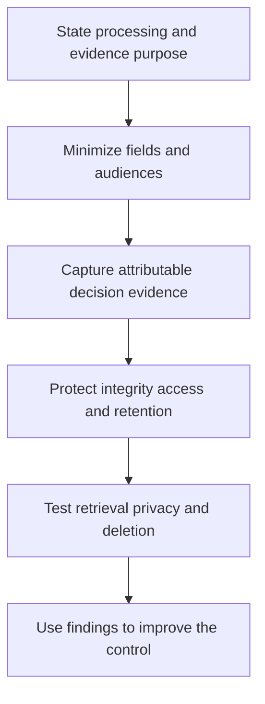

# Privacy and Auditability

> **One-line definition:** Design sensitive processing so the organization can explain what happened, why it was allowed, who was responsible, and what evidence supports that account.

## Why This Is a Senior Skill

A mid-level engineer adds an audit log when a requirement names one. A senior security engineer decides which events must be attributable, how much data an audit record should contain, who may inspect it, how long it should be retained, and how privacy risk changes the design. They distinguish useful accountability from indiscriminate surveillance and make evidence part of the operating model.

Privacy and auditability are coupled but not identical. A system can log too little to investigate misuse or log so much that it creates a second sensitive dataset. Senior judgment defines purpose, minimization, access, integrity, retention, and disclosure rules for evidence. They also make audit artifacts reproducible enough for assurance without turning delivery into an evidence theater exercise.

| Aspect | Mid-level approach | Senior-specialist approach |
|---|---|---|
| Logging | Records events named in a ticket | Defines evidence by threat, accountability, and privacy purpose |
| Privacy | Sends questions to legal late | Uses privacy impact as an input to design and prioritization |
| Evidence | Collects screenshots before an audit | Designs durable, queryable, owner-backed evidence at source |
| Access | Gives investigators broad log access | Separates investigation need, data minimization, and oversight |
| Retention | Keeps everything indefinitely | Sets purpose-based retention and proves deletion or expiry |

## Core Frameworks

### 1. Auditability Model

For a sensitive event, capture enough to reconstruct the decision without copying unnecessary personal data.

| Evidence dimension | Question | Design choice |
|---|---|---|
| Actor | Which human or workload acted? | Stable identifier with controlled disclosure |
| Action | What operation occurred? | Named business action rather than raw endpoint only |
| Object | What resource, tenant, or data class was affected? | Reference or token where raw value is unnecessary |
| Context | What assurance, approval, device, or workflow applied? | Versioned context attributes |
| Decision | Why was it allowed, denied, or elevated? | Policy version and reason code |
| Time and sequence | When did it happen and what preceded it? | Trusted timestamp and correlation identifier |
| Integrity | Can the record be altered unnoticed? | Append-only or integrity-protected storage |
| Retention | How long is the evidence needed? | Purpose, legal, and operational expiry |

### 2. Privacy Impact Triage

Use this to decide when a design needs deeper review.

| Signal | Initial action | Senior question |
|---|---|---|
| New sensitive field | Minimize and classify before implementation | Is collection necessary for the stated purpose? |
| New inference or profiling | Privacy and product review | Could the inference create unexpected harm? |
| New processor or region | Transfer and contract review | Who can access the data and under which boundary? |
| New monitoring scope | Purpose and access review | Is the telemetry proportionate and explainable? |
| New retention or reuse | Reconfirm purpose and expiry | What happens when the original purpose ends? |

### 3. Evidence Quality Review

Evidence is strong when it is complete enough for the decision, attributable to an owner, generated close to the control, protected from alteration, and retrievable within the required time. If an artifact is manual, record its limitations and the control that prevents silent omission.

## In Practice

### Design evidence with the control owner

For each important control, identify the event source, schema, owner, query or report, retention, access path, and failure signal. Test retrieval using a realistic request rather than assuming that a dashboard proves the underlying event exists. Connect evidence to a change, incident, access review, or privacy decision so its purpose remains clear.

### Avoid evidence and privacy anti-patterns

| Anti-pattern | Risk | Better move |
|---|---|---|
| Screenshot theater | Evidence is stale or not reproducible | Prefer source-generated records and versioned queries |
| Log everything | Creates a large secondary sensitive store | Define event purpose and minimize fields |
| Shared investigator access | Weak accountability and excess exposure | Use named access, case scope, and review |
| Indefinite retention | Increases breach and privacy impact | Set expiry, archive only for a stated purpose |
| Audit added at the end | Important decisions were never captured | Include evidence requirements in design and delivery |

## Practical Exercise

Choose one high-risk workflow such as sensitive-data export, administrator change, or support impersonation.

1. State the business purpose, privacy concern, and threat the audit trail must address.
2. Define actor, action, object, context, decision, time, integrity, and retention fields.
3. Remove any field that is not needed to prove the control or investigate misuse.
4. Identify who may view the evidence and how access is itself audited.
5. Write a query or report that reconstructs one successful and one denied attempt.
6. Test event loss, clock differences, deletion, and evidence retrieval under incident pressure.
7. Produce an evidence matrix linking the control, source, owner, test, retention, and known limitation.

**Completion test:** A reviewer can answer what happened and why without receiving unrestricted access to all underlying personal data.

## Knowledge Connections

- [[05_Data_Classification_and_Protection]] : data purpose and lifecycle determine evidence boundaries
- [[body-of-knowledge/DMBOK/05_Data_Security]] : data security and accountability foundations
- [[software-engineering-note/13_Software_Security/08_Security_Management_and_Governance]] : governance and control evidence
- [[career-path/08_Security_Engineer/06_Detection_Incident_Response_and_Resilience/01_Security_Observability|Security Observability]] : operational telemetry quality
- [[career-path/08_Security_Engineer/07_Vulnerability_Management_and_Governance/05_Compliance_and_Control_Evidence|Compliance and Control Evidence]] : audit-ready evidence at portfolio level

## Key Takeaways

- Auditability proves a decision and its accountability, not simply that logs exist.
- Minimize evidence fields, audiences, retention, and access just as carefully as business data.
- Generate evidence near the control so it remains reproducible and current.
- Privacy review belongs in design decisions, not only in a late approval queue.
- Test retrieval, integrity, deletion, and access under realistic operating conditions.
- Strong evidence enables trust when it is purposeful, protected, and owned.
