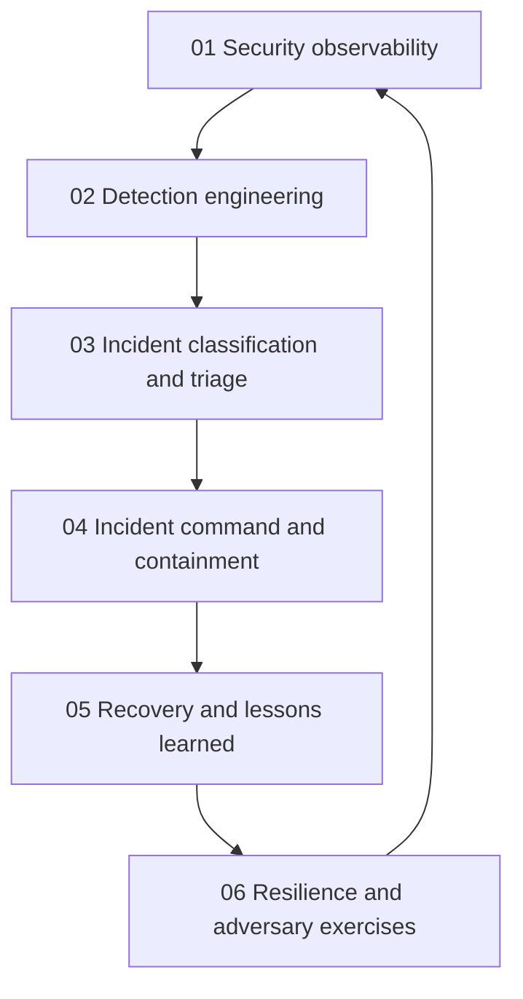

# Detection, Incident Response and Resilience

> **Core idea:** Turn security telemetry into trustworthy detection, coordinated incident decisions, recoverable operations, and measurable learning.

## What This Capability Means at Senior Level

A senior security engineer does not measure readiness by the number of dashboards, alerts, or response documents. They connect an adversary hypothesis to telemetry, detection logic, triage confidence, command authority, containment trade-offs, recovery gates, and learning actions. They make the path from signal to decision fast enough for an incident and calm enough for a review.

The specialist owns the operating system around incidents: who can declare an incident, how severity is chosen, which actions are pre-authorized, how customer and regulatory communication is coordinated, how evidence is protected, and how recovery is verified. They improve detection quality and resilience without creating alert fatigue or treating exercises as theater.

## Topic Notes

| # | Topic | Senior-specialist focus | Status | File |
|---|---|---|---|---|
| 01 | Security Observability | Design telemetry that supports detection, triage, and evidence | ✅ Done | `01_Security_Observability.md` |
| 02 | Detection Engineering | Build tested, owned, explainable detections with useful precision | ✅ Done | `02_Detection_Engineering.md` |
| 03 | Incident Classification and Triage | Turn uncertain signals into proportionate, timely decisions | ✅ Done | `03_Incident_Classification_and_Triage.md` |
| 04 | Incident Command and Containment | Lead authority, communication, evidence, and containment trade-offs | ✅ Done | `04_Incident_Command_and_Containment.md` |
| 05 | Recovery and Lessons Learned | Restore trusted service and convert failure into owned improvement | ✅ Done | `05_Recovery_and_Lessons_Learned.md` |
| 06 | Resilience and Adversary Exercises | Validate controls and recovery through safe, realistic scenarios | ✅ Done | `06_Resilience_and_Adversary_Exercises.md` |

**Completion:** 6/6 : 100%

## How the Topics Connect

**Reading order:** Establish the telemetry and evidence contract first. Then engineer detections and classify signals. Move into command and containment, followed by recovery and lessons. Use adversary exercises to validate the full loop and feed gaps back into observability and detection.

## Existing Vault Anchors

These notes assume the fundamentals are available and add senior operating judgment:

| Senior topic | Existing foundation |
|---|---|
| Security observability | [[software-engineering-note/13_Software_Security/Cybersecurity/04 Security Operations/04 Monitoring & Incident Response|Monitoring and Incident Response]] |
| Detection engineering | [[body-of-knowledge/CyBOK/07_Security_Operations_and_Incident_Management]] and [[software-engineering-note/13_Software_Security/Cybersecurity/04 Security Operations/04 Monitoring & Incident Response|Monitoring and Incident Response]] |
| Incident classification and triage | [[body-of-knowledge/CyBOK/07_Security_Operations_and_Incident_Management]] |
| Incident command and containment | [[body-of-knowledge/CyBOK/07_Security_Operations_and_Incident_Management]] |
| Recovery and lessons learned | [[software-engineering-note/13_Software_Security/Cybersecurity/04 Security Operations/04 Monitoring & Incident Response|Monitoring and Incident Response]] |
| Resilience and adversary exercises | [[software-engineering-note/13_Software_Security/08_Security_Management_and_Governance]] and [[career-path/07_SRE_and_Platform_Engineer/05_Capacity_and_Resilience/00_overview|Capacity and Resilience]] |

## Self-Assessment Checklist

- [ ] I can state what telemetry is required to investigate the top abuse paths for a service.
- [ ] Every high-value detection has an owner, hypothesis, test data, tuning path, and retirement trigger.
- [ ] I can classify an incident using impact, scope, confidence, urgency, and uncertainty.
- [ ] Responders know who may authorize containment, customer communication, and evidence handling.
- [ ] I can lead a response without losing a decision log or creating unnecessary data exposure.
- [ ] Recovery has explicit validation gates rather than a vague declaration that service is back.
- [ ] Post-incident actions have owners, due dates, risk statements, and verification evidence.
- [ ] I can design an adversary exercise that tests a control and produces measurable learning.
- [ ] I can show how alert quality and incident readiness improve over time.

## Evidence of Capability

Useful evidence includes a security telemetry contract, detection specifications and tests, a triage matrix, an incident command plan, a containment decision record, a recovery checklist, a post-incident review, and an exercise report with closed learning actions. These artifacts should demonstrate decisions and outcomes, not merely activity.

## Related

- [[career-path/08_Security_Engineer/00_overview|Security Engineer]]
- [[career-path/08_Security_Engineer/05_Identity_Access_and_Data_Protection/00_overview|Identity, Access and Data Protection]]
- [[career-path/08_Security_Engineer/07_Vulnerability_Management_and_Governance/00_overview|Vulnerability Management and Governance]]
- [[career-path/07_SRE_and_Platform_Engineer/03_Incident_Response/00_overview|Incident Response]]
- [[career-path/07_SRE_and_Platform_Engineer/05_Capacity_and_Resilience/00_overview|Capacity and Resilience]]
