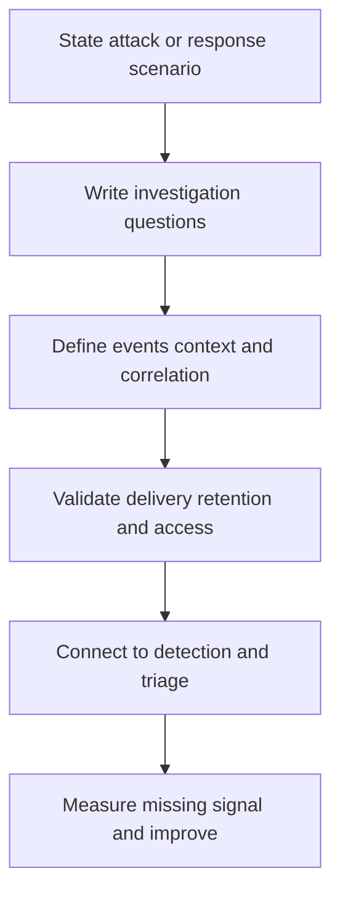

# Security Observability

> **One-line definition:** Security observability is the deliberate design of telemetry that lets responders explain suspicious behavior, make decisions, and prove what happened.

## Why This Is a Senior Skill

A mid-level engineer forwards logs to a security platform or adds an event after an alert is requested. A senior security engineer starts from attack paths and response decisions, then defines the events, context, retention, access, cost, and failure signals needed to investigate them. They know that more telemetry is not automatically better: missing context, excessive noise, privacy exposure, and unreliable timestamps can all make response slower.

Senior ownership includes the data contract between product teams and security operations. The contract names the event producer, schema, correlation method, delivery expectation, retention, classification, query owner, and test. It also states what happens when telemetry is delayed or unavailable, so the detection system does not silently claim coverage it does not have.

| Aspect | Mid-level approach | Senior-specialist approach |
|---|---|---|
| Collection | Sends available logs | Designs telemetry from threats and response questions |
| Context | Captures event names | Preserves actor, resource, action, context, and sequence |
| Coverage | Counts connected sources | Measures attack-path coverage and data quality |
| Cost | Retains everything or drops data | Sets purpose, sampling, retention, and tiering intentionally |
| Reliability | Assumes the pipeline works | Monitors delay, loss, schema drift, and access failures |

## Core Frameworks

### 1. Security Telemetry Contract

| Contract field | Decision to make | Example verification |
|---|---|---|
| Event purpose | Which threat or response question does this support? | Mapped threat scenario |
| Producer | Which service or control emits it? | Named owner and version |
| Subject and object | Who acted and what was affected? | Stable identifiers with minimization |
| Action and outcome | What happened and was it allowed? | Consistent action and result codes |
| Context | What device, tenant, assurance, or workflow mattered? | Correlation fields and freshness |
| Delivery | How quickly and reliably must it arrive? | Delay and loss SLO |
| Retention and access | Who needs it and for how long? | Policy, classification, and access test |
| Failure signal | How will missing or malformed data be detected? | Pipeline alert and fallback path |

### 2. Coverage and Quality Matrix

Assess a telemetry source across the dimensions that matter to a decision.

| Dimension | Strong signal | Weak signal |
|---|---|---|
| Completeness | All critical outcomes and denials appear | Only successful actions are visible |
| Context | Actor, object, action, time, and correlation are present | Events cannot be joined or scoped |
| Timeliness | Arrives within the response decision window | Arrives after containment is needed |
| Integrity | Source and transport are protected | Producers can rewrite or suppress records |
| Queryability | Responder can retrieve evidence quickly | Requires bespoke manual reconstruction |
| Privacy | Minimal fields and controlled access | Raw sensitive data copied into broad systems |

### 3. Observability Readiness Review

Ask four questions for each priority scenario:

1. **Can we see it?** The relevant event is emitted and delivered.
2. **Can we understand it?** Context and sequence support a decision.
3. **Can we act on it?** The signal reaches an owner within the response window.
4. **Can we prove it?** Evidence is protected, retrievable, and retained appropriately.

## In Practice

### Design from a responder question

Start with questions such as: Which identity changed a privileged role? Which workload used a credential outside its audience? Did the same actor access several tenants? Was a sensitive export approved? What changed before the alert? Each question should map to a source event, join key, query, owner, and response action.

### Anti-patterns and better moves

| Anti-pattern | Why it fails | Better move |
|---|---|---|
| Log volume as coverage | Large data volume can omit decisive context | Measure scenario coverage and retrieval time |
| Alert-first instrumentation | Events are shaped by a single rule | Define a reusable telemetry contract |
| Raw data everywhere | Privacy and cost risk grow without proportional value | Minimize, classify, tier, and control access |
| No pipeline health | Missing events look like quiet systems | Monitor delay, loss, schema drift, and suppression |
| Dashboard dependence | A picture does not preserve evidence | Keep queryable source records and versioned views |

## Practical Exercise

Choose one high-consequence scenario such as suspicious administrator activity, token misuse, or sensitive-data export.

1. Write five questions a responder must answer within the first response window.
2. Map each question to events, context fields, correlation keys, source owners, and retention.
3. Test whether the events exist in development or a safe test environment.
4. Measure completeness, latency, query time, and privacy exposure.
5. Inject a missing, delayed, duplicated, or malformed event and observe the failure signal.
6. Connect the telemetry to one detection and one triage decision.
7. Record the coverage gap, cost, owner, and next improvement milestone.

**Completion test:** A responder can reconstruct the scenario from source telemetry without asking the affected team to search through unrelated logs.

## Knowledge Connections

- [[body-of-knowledge/CyBOK/07_Security_Operations_and_Incident_Management]] : security operations foundations
- [[software-engineering-note/13_Software_Security/Cybersecurity/04 Security Operations/04 Monitoring & Incident Response|Monitoring and Incident Response]] : monitoring and response foundations
- [[02_Detection_Engineering]] : turns telemetry into tested signal
- [[03_Incident_Classification_and_Triage]] : evidence supports confidence and scope decisions
- [[career-path/08_Security_Engineer/05_Identity_Access_and_Data_Protection/06_Privacy_and_Auditability|Privacy and Auditability]] : telemetry must be purposeful and controlled

## Key Takeaways

- Design security telemetry from attack paths and response questions, not from log availability.
- A useful event preserves actor, action, object, context, outcome, and sequence.
- Measure data completeness, timeliness, integrity, queryability, and privacy exposure.
- Monitor the telemetry pipeline itself so missing signal is visible.
- Scenario coverage is more meaningful than raw event volume.
- Detection and evidence quality depend on the same trustworthy data contract.
