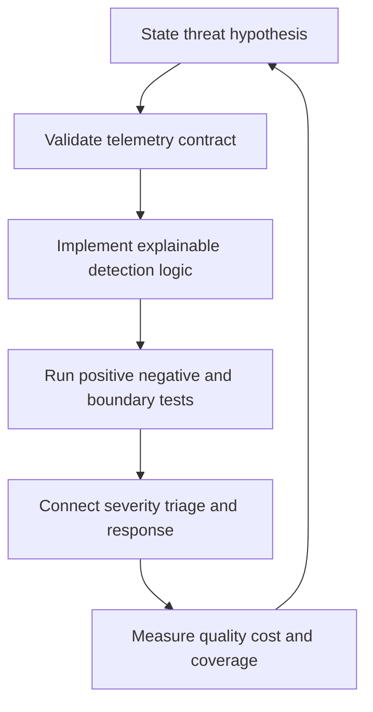

# Detection Engineering

> **One-line definition:** Detection engineering turns explicit adversary hypotheses into tested, owned, explainable, and continuously tuned signals.

## Why This Is a Senior Skill

A mid-level analyst writes or tunes a rule for a queue. A senior security engineer manages the detection lifecycle: choosing hypotheses tied to important attack paths, evaluating data quality, defining expected behavior, testing logic, measuring precision and coverage, coordinating response ownership, and retiring detections that no longer create useful signal.

Senior judgment is visible in what is not detected. They make uncertainty explicit, avoid rules that create unbounded analyst work, and balance missed attacks against false positives according to consequence. A detection is a product with users, service expectations, a maintenance owner, a change history, and a failure mode.

| Aspect | Mid-level approach | Senior-specialist approach |
|---|---|---|
| Idea | Copies a rule or indicator | States a threat hypothesis and expected behavior |
| Quality | Counts alerts | Measures precision, coverage, latency, and analyst effort |
| Testing | Tests one positive example | Uses positive, negative, boundary, replay, and regression cases |
| Operations | Sends alerts to a queue | Defines triage, escalation, evidence, and response ownership |
| Lifecycle | Leaves rules indefinitely | Tunes, versions, reviews, and retires detections intentionally |

## Core Frameworks

### 1. Detection Specification

| Field | Required decision |
|---|---|
| Hypothesis | What suspicious behavior would indicate a meaningful attack path? |
| Protected outcome | What harm or privilege change are we trying to detect? |
| Data contract | Which events, context, freshness, and retention are required? |
| Logic | What pattern, threshold, sequence, or anomaly is evaluated? |
| Expected behavior | Which legitimate workflows resemble the signal? |
| Severity and confidence | What should the responder believe and do initially? |
| Owner | Who maintains logic, data, tests, and response runbook? |
| Test set | Which synthetic, replayed, negative, and boundary cases exist? |
| Retirement trigger | When is the rule obsolete, duplicated, or too costly? |

### 2. Detection Quality Scorecard

Do not collapse quality into one number. Use a balanced view that supports a decision.

| Dimension | Useful question | Typical action when weak |
|---|---|---|
| Precision | How often is the signal relevant? | Narrow context, improve allowlist, or lower scope |
| Coverage | Which important paths or variants remain unseen? | Add data, scenarios, or complementary detection |
| Latency | How soon after behavior can we act? | Improve pipeline or change response expectation |
| Confidence | Does the signal justify its severity? | Add corroboration or communicate uncertainty |
| Analyst effort | How much work does each alert consume? | Enrich, deduplicate, suppress, or redesign |
| Resilience | Does the rule survive schema and behavior change? | Add contract tests and change ownership |

### 3. Detection Maturity Path

| Stage | Characteristics | Exit evidence |
|---|---|---|
| Hypothesis | Threat and response question are clear | Approved detection specification |
| Implemented | Logic runs on known data | Query and owner exist |
| Tested | Positive and negative cases pass | Test results and regression set |
| Operational | Triage and escalation are usable | Runbook and on-call rehearsal |
| Measured | Quality and cost are reviewed | Trend with improvement decision |
| Adaptive | Rule changes with threat and system context | Version history and retirement criteria |

## In Practice

### Build detections as an engineering backlog

Prioritize detections by consequence, attack-path coverage, data readiness, response actionability, and maintenance cost. Pair detection work with the service owner so expected behavior and deployment changes are known. Keep the rule, test data, query, runbook, and owner versioned together when possible.

### Anti-patterns and better moves

| Anti-pattern | Failure mode | Better move |
|---|---|---|
| Indicator dump | High noise and weak context | Detect behavior and enrich with context |
| Alert count target | Teams optimize for volume | Measure useful decisions and missed-path risk |
| Rule without tests | Silent regression after schema change | Maintain test cases and replay fixtures |
| Permanent allowlist | Attackers hide in an exception | Scope, expire, monitor, and review exceptions |
| Detection without action | Analysts receive signal but no next step | Define triage question, owner, and runbook |

## Practical Exercise

Create one detection for an identity or workload abuse case.

1. State the threat hypothesis, protected outcome, and expected legitimate behavior.
2. Identify required telemetry and write the query or rule in a versioned document.
3. Create at least three positive cases, three negative cases, and one boundary case.
4. Run the tests against synthetic or safely replayed events.
5. Define severity, confidence, enrichment, triage questions, and escalation owner.
6. Measure alert volume, precision, latency, analyst effort, and uncovered variants.
7. Schedule a tuning review and define the retirement trigger.

**Completion test:** An analyst who did not author the rule can explain why it fired and what action is justified.

## Knowledge Connections

- [[01_Security_Observability]] : telemetry quality is the detection dependency
- [[03_Incident_Classification_and_Triage]] : detections provide confidence and triage inputs
- [[body-of-knowledge/CyBOK/07_Security_Operations_and_Incident_Management]] : security operations foundations
- [[software-engineering-note/13_Software_Security/Cybersecurity/04 Security Operations/04 Monitoring & Incident Response|Monitoring and Incident Response]] : monitoring and response foundations
- [[career-path/08_Security_Engineer/07_Vulnerability_Management_and_Governance/02_Risk_Based_Triage|Risk Based Triage]] : risk prioritization connects detection work to portfolio decisions

## Key Takeaways

- Every detection needs a threat hypothesis, protected outcome, owner, and response action.
- Balance precision, coverage, latency, confidence, analyst effort, and resilience.
- Test both expected attacks and legitimate lookalikes before operational use.
- A detection without a triage path is an information-producing failure.
- Version, tune, review, and retire detections as systems and threats change.
- Detection engineering is measured by better decisions, not by alert volume.
