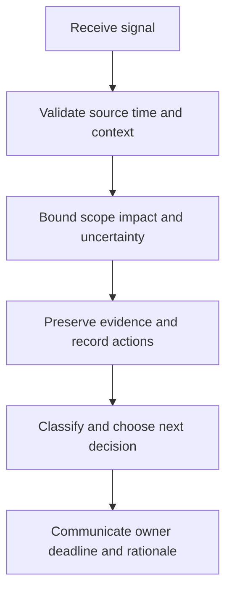

# Incident Classification and Triage

> **One-line definition:** Classify and triage security signals by impact, scope, confidence, urgency, and uncertainty so the right authority acts at the right speed.

## Why This Is a Senior Skill

A mid-level responder follows a queue severity or escalates every unusual event. A senior security engineer creates a classification system that supports fast action without overstating certainty. They distinguish an event, alert, suspected incident, confirmed incident, and crisis; define who can change the classification; and make sure triage preserves evidence while reducing harm.

The senior specialist understands that classification is a decision under uncertainty. A low-confidence signal can still require urgent containment when the possible consequence is severe. Conversely, a high-volume signal may be handled asynchronously when scope and impact are bounded. The matrix must be usable at 03:00, understandable to product and executive stakeholders, and linked to response service expectations.

| Aspect | Mid-level approach | Senior-specialist approach |
|---|---|---|
| Severity | Accepts source severity | Reclassifies by business impact and evidence |
| Scope | Investigates the triggering host or account | Tests adjacent identities, tenants, services, and time windows |
| Confidence | Treats an alert as fact | Separates signal, hypothesis, and confirmed evidence |
| Urgency | Uses a generic priority | Sets action timing by harm and reversibility |
| Handoff | Passes the ticket | Preserves context, evidence, owner, and next decision |

## Core Frameworks

### 1. Classification Matrix

Use local severity names, but keep the decision dimensions explicit.

| Dimension | Lower signal | Higher signal |
|---|---|---|
| Impact | Limited inconvenience or isolated asset | Sensitive data, safety, customer trust, or systemic service harm |
| Scope | One known identity or host | Multiple tenants, privileged identities, or unknown spread |
| Confidence | Weak anomaly with benign explanations | Corroborated evidence of malicious activity |
| Urgency | Harm is unlikely to grow quickly | Delay increases exposure or destroys evidence |
| Reversibility | Safe, reversible response available | Irreversible action or uncertain recovery |
| Obligations | No special reporting trigger | Legal, contractual, regulatory, or customer notification may apply |

Classify with the highest credible consequence while recording uncertainty. Revisit as evidence changes.

### 2. First Decision Window

A practical initial triage sequence is:

1. **Stabilize:** Ensure the signal is assigned and the responder can act safely.
2. **Validate:** Check source reliability, time, identity, asset, and known changes.
3. **Bound:** Search for related activity across scope, privilege, tenants, and time.
4. **Preserve:** Protect volatile evidence and record collection actions.
5. **Decide:** Declare, escalate, contain, monitor, or close with rationale.
6. **Communicate:** State facts, hypotheses, uncertainty, owner, and next update time.

### 3. Triage Handoff Contract

| Field | Why it matters |
|---|---|
| Trigger and source | Shows what initiated the work and its reliability |
| Current hypothesis | Prevents facts and assumptions from being mixed |
| Affected identities and assets | Allows scope work to continue without repetition |
| Evidence collected | Preserves chain, location, and gaps |
| Impact and uncertainty | Supports proportional classification |
| Actions already taken | Prevents duplicate or conflicting changes |
| Next decision and deadline | Makes ownership and urgency explicit |

## In Practice

### Keep facts and hypotheses separate

Use a short triage record with three sections: observed facts, working hypotheses, and decisions or actions. This reduces confirmation bias and gives command staff a reliable starting point. Track what evidence would raise or lower confidence. Do not wait for perfect attribution before taking a reversible action that reduces harm.

### Common triage failures

| Failure | Consequence | Better move |
|---|---|---|
| Alert severity becomes incident severity | Important context is lost | Reclassify using impact, scope, and obligations |
| Close as false positive too early | Attack path is missed | Record the benign explanation and residual uncertainty |
| Investigate one asset only | Lateral or cross-tenant scope remains hidden | Search related identities, resources, and time windows |
| Collect everything | Evidence and privacy exposure expand | Define the decision and collect minimally sufficient evidence |
| Handoff with no owner | Response stalls between teams | Name accountable owner, deadline, and next decision |

## Practical Exercise

Run a tabletop using a synthetic alert for suspicious privileged access or a possible credential compromise.

1. Write the raw signal and identify what is fact versus assumption.
2. Apply the classification matrix and record the initial confidence and uncertainty.
3. Search for related activity across identities, tenants, services, and a defined time window.
4. Preserve one volatile evidence source and document how it was collected.
5. Decide whether to monitor, escalate, declare, or contain, and state the reversibility trade-off.
6. Produce a handoff record with owner, deadline, evidence, and next decision.
7. Ask a second responder to repeat the classification from the record alone.

**Completion test:** Two responders can reach a similar initial decision while clearly identifying what remains unknown.

## Knowledge Connections

- [[01_Security_Observability]] : telemetry supports validation and scope
- [[02_Detection_Engineering]] : detection confidence and context enter triage
- [[04_Incident_Command_and_Containment]] : classification determines authority and response rhythm
- [[body-of-knowledge/CyBOK/07_Security_Operations_and_Incident_Management]] : incident management foundations
- [[software-engineering-note/13_Software_Security/Cybersecurity/04 Security Operations/04 Monitoring & Incident Response|Monitoring and Incident Response]] : monitoring and response foundations

## Key Takeaways

- Classification is a decision under uncertainty, not a label copied from an alert.
- Consider impact, scope, confidence, urgency, reversibility, and obligations together.
- Preserve evidence while taking proportionate, reversible steps to reduce harm.
- Keep observed facts, hypotheses, and decisions visibly separate.
- A good handoff preserves context, evidence, owner, deadline, and next decision.
- Reclassify as scope and evidence change rather than defending the initial label.
