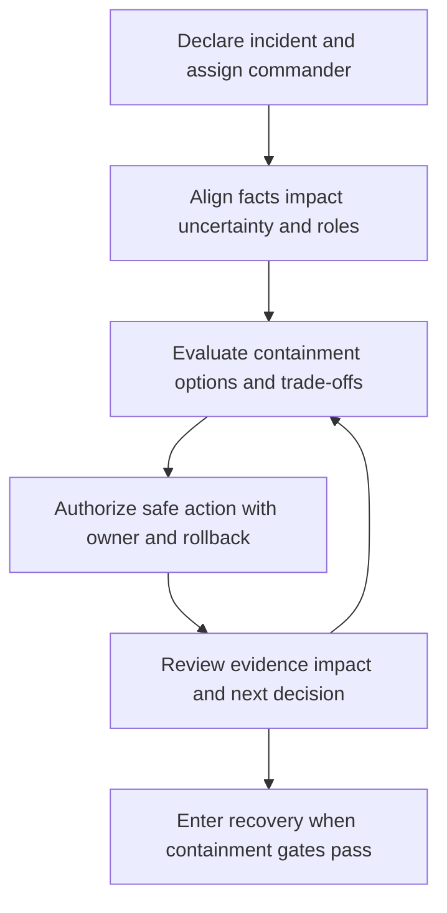

# Incident Command and Containment

> **One-line definition:** Lead an incident with explicit authority, decision rhythm, evidence discipline, and containment choices that reduce harm without creating a second crisis.

## Why This Is a Senior Skill

A mid-level responder performs assigned containment actions. A senior security engineer establishes command, separates technical investigation from coordination, makes trade-offs visible, and keeps stakeholders aligned while facts change. They know when to isolate, revoke, disable, rate-limit, or continue observing, and they understand how each action affects evidence, customers, safety, revenue, recovery, and legal obligations.

Incident command is not a title granted by seniority. It is a temporary operating model with clear roles, decision rights, communication cadence, and a record of rationale. The senior specialist creates conditions where experts can act quickly without conflicting changes, hidden assumptions, or unreviewed disclosure.

| Aspect | Mid-level approach | Senior-specialist approach |
|---|---|---|
| Coordination | Joins the response channel | Establishes command roles, rhythm, and decision authority |
| Containment | Applies the first available control | Compares harm reduction, evidence loss, availability, and reversibility |
| Communication | Reports technical detail | Gives audience-specific facts, uncertainty, impact, and next update |
| Change control | Makes urgent changes informally | Uses an emergency path with logging and rollback |
| Scope | Focuses on immediate symptoms | Coordinates identity, data, platform, product, legal, and customer impact |

## Core Frameworks

### 1. Command Roles and Decision Rights

| Role | Owns | Must not do alone |
|---|---|---|
| Incident commander | Overall priority, rhythm, escalation, and decision log | Perform every technical task |
| Technical lead | Investigation, hypotheses, evidence, and technical options | Promise business or legal outcomes |
| Operations lead | Safe changes, service health, rollback, and recovery path | Change scope without command context |
| Communications lead | Internal, customer, partner, and executive updates | State unverified facts as confirmed |
| Security or privacy advisor | Threat, evidence, privacy, and obligation analysis | Unilaterally delay urgent harm reduction |
| Scribe | Timeline, actions, decisions, and owners | Edit facts without source or rationale |

### 2. Containment Decision Matrix

| Option | Harm reduction | Availability cost | Evidence risk | Use when |
|---|---|---|---|---|
| Revoke identity or token | High for credential abuse | Medium for dependent users | Low to medium | Scope is attributable and revocation is bounded |
| Isolate host or workload | High for active compromise | Medium to high | Medium | Continued execution is dangerous |
| Disable feature or route | High for exposed path | High for product users | Low | A clear function causes ongoing harm |
| Rate-limit or restrict | Medium and reversible | Low to medium | Low | More evidence is needed while limiting spread |
| Monitor and hunt | Low immediate reduction | Low | Low | Confidence is low and harm is bounded |

Record why the chosen action is proportionate, what signal will show success, and what rollback or escalation is available.

### 3. Incident Command Rhythm

Use a fixed update cadence. At each checkpoint state current facts, working hypothesis, impact, actions, blockers, decision needed, and next update time.

## In Practice

### Prepare before the crisis

Define pre-authorized actions for common scenarios, but keep boundaries explicit. Examples include revoking a compromised session, disabling a leaked credential, isolating a workload, switching to a degraded mode, or blocking a known malicious route. For each action record authority, evidence threshold, expected side effect, rollback, and notification path.

### Communication by audience

| Audience | Needs first | Avoid |
|---|---|---|
| Responders | Facts, tasks, evidence, decisions | Unbounded speculation |
| Executives | Business impact, options, confidence, next update | Raw technical event streams |
| Customers | What they need to do, service impact, support path | Premature attribution |
| Legal or privacy | Data scope, obligations, evidence, uncertainty | Unsupported certainty |
| Engineering teams | Safe changes, dependencies, recovery criteria | Conflicting instructions |

## Practical Exercise

Lead a 45 minute tabletop for a compromised privileged workload identity.

1. Assign command, technical, operations, communications, advisory, and scribe roles.
2. Start with a limited signal and inject new evidence every five minutes.
3. Record facts, hypotheses, impact, options, decisions, owners, and timestamps.
4. Compare at least three containment actions using harm, availability, evidence, and reversibility.
5. Authorize one action and define success, rollback, and communication triggers.
6. Inject a customer impact or privacy uncertainty and update the command plan.
7. End with explicit recovery gates and a list of unresolved questions.

**Completion test:** The timeline shows who had authority, why the chosen action was proportionate, and how the team avoided conflicting changes.

## Knowledge Connections

- [[03_Incident_Classification_and_Triage]] : classification sets urgency and command needs
- [[05_Recovery_and_Lessons_Learned]] : containment must lead to verified recovery
- [[body-of-knowledge/CyBOK/07_Security_Operations_and_Incident_Management]] : incident management foundations
- [[software-engineering-note/13_Software_Security/Cybersecurity/04 Security Operations/04 Monitoring & Incident Response|Monitoring and Incident Response]] : monitoring and response foundations
- [[career-path/08_Security_Engineer/05_Identity_Access_and_Data_Protection/04_Service_Identity_and_Secrets|Service Identity and Secrets]] : revocation and blast-radius decisions

## Key Takeaways

- Incident command is an explicit temporary operating model, not an informal chat channel.
- Separate command, technical investigation, operations, communications, advisory, and scribe roles.
- Compare containment by harm reduction, availability, evidence risk, reversibility, and scope.
- Use a fixed update rhythm that makes uncertainty and next decisions visible.
- Pre-authorized actions accelerate response only when boundaries, rollback, and evidence are clear.
- A containment decision is successful when it reduces harm and preserves a credible path to recovery.
