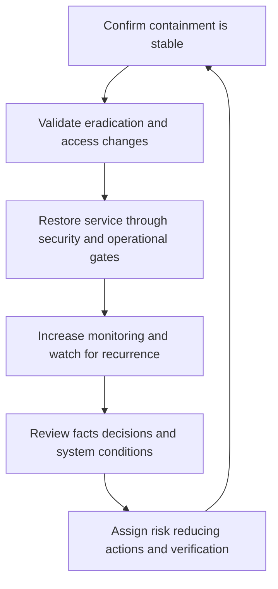

# Recovery and Lessons Learned

> **One-line definition:** Restore trusted service through explicit recovery gates, then convert incident evidence into owned changes that reduce recurrence and improve readiness.

## Why This Is a Senior Skill

A mid-level engineer helps restore a host or close the incident ticket. A senior security engineer defines what trusted recovery means, validates eradication and access changes, coordinates business and customer impact, and watches for recurrence after restoration. They resist the pressure to declare success when service is merely available but the attacker path, evidence gap, or control weakness remains.

Senior lessons learned are not a blame ritual or a list of vague recommendations. They connect observed conditions to decisions, control behavior, detection quality, incentives, and ownership. Actions are prioritized by risk reduction and feasibility, assigned to people who can deliver them, and verified with evidence. The review asks how the system made the failure likely and how it can make the safer action easier.

| Aspect | Mid-level approach | Senior-specialist approach |
|---|---|---|
| Recovery | Restores availability | Restores availability, trust, control state, and monitoring |
| Validation | Checks the immediate symptom | Proves eradication, access revocation, data scope, and recurrence absence |
| Closure | Ends when the incident channel quiets | Uses explicit exit criteria and residual-risk ownership |
| Review | Lists what went wrong | Explains conditions, decisions, and control improvement |
| Actions | Creates generic tickets | Funds, owns, sequences, and verifies risk-reducing actions |

## Core Frameworks

### 1. Recovery Gates

| Gate | Question | Evidence |
|---|---|---|
| Containment stable | Is active harm stopped or bounded? | Current telemetry and command decision |
| Eradication credible | Are malicious artifacts, persistence, and unauthorized access removed? | Hunt results, rebuild, revocation, or forensic conclusion |
| Configuration trusted | Are identity, policy, code, and infrastructure changes known? | Reviewed change set and baseline comparison |
| Data impact understood | Is affected data, tenant, and obligation scope bounded? | Investigation record and privacy or legal review |
| Service restored safely | Can users return without reopening the path? | Functional, security, and operational tests |
| Monitoring heightened | Can recurrence be detected within the response window? | Temporary or permanent detection and owner |
| Follow-up owned | Are residual risks and improvements assigned? | Action register with due dates and verification |

### 2. Lessons-to-Action Quality

| Weak action | Why weak | Stronger action |
|---|---|---|
| Improve monitoring | No behavior or owner | Add a named detection for a stated path, with test and review date |
| Train users | Blames behavior without system change | Remove unsafe defaults and verify targeted learning |
| Review access | No scope or proof | Re-certify named high-risk entitlements and measure completion |
| Fix the bug | Ignores enabling conditions | Patch, add regression coverage, improve deployment control, and verify |
| Update the runbook | Document may remain unused | Rehearse the step and measure response time |

### 3. Residual Risk Statement

At closure, state what is known, what remains uncertain, what harm is still possible, which owner accepts or treats it, and when the statement will be revisited. Closure is a risk decision, not proof that every uncertainty has disappeared.

## In Practice

### Run a blameless evidence review

Invite responders, service owners, product, operations, and relevant privacy or legal partners. Build a timeline from trusted evidence, then ask:

1. What was the earliest observable signal?
2. Which assumptions or incentives shaped decisions?
3. Which control prevented harm and which control failed or was absent?
4. Where did detection, authority, communication, or recovery slow down?
5. Which actions reduce recurrence, blast radius, detection delay, or recovery uncertainty?
6. How will each action be verified and what is the residual risk if it is late?

### Avoid premature closure

| Pressure | Unsafe shortcut | Senior response |
|---|---|---|
| Service must return | Restore without validating access state | Use staged recovery and heightened monitoring |
| Stakeholders want a root cause | State one theory as fact | Separate evidence, hypothesis, and unresolved scope |
| Action backlog is large | Assign everything to security | Give actions to the owner who can change the condition |
| Audit asks for a report | Optimize for narrative polish | Preserve source evidence and disclose limitations |

## Practical Exercise

Use a past incident, outage with security implications, or synthetic scenario.

1. Reconstruct a timeline from source events and identify gaps in evidence.
2. Define the recovery gates and mark which are proven, partial, or untested.
3. Write a residual-risk statement for the uncertainty that remains.
4. Facilitate a blameless review focused on system conditions and decisions.
5. Convert findings into actions with owner, risk reduction, due date, dependency, and verification test.
6. Select one action to rehearse immediately and record the result.
7. Schedule a follow-up review that checks whether the risk actually changed.

**Completion test:** The report shows how service was made trustworthy again and how improvement work will be proven rather than merely promised.

## Knowledge Connections

- [[04_Incident_Command_and_Containment]] : containment decisions establish recovery prerequisites
- [[06_Resilience_and_Adversary_Exercises]] : exercises validate recovery before the next incident
- [[body-of-knowledge/CyBOK/07_Security_Operations_and_Incident_Management]] : incident lifecycle foundations
- [[software-engineering-note/13_Software_Security/Cybersecurity/04 Security Operations/04 Monitoring & Incident Response|Monitoring and Incident Response]] : monitoring and response foundations
- [[career-path/08_Security_Engineer/07_Vulnerability_Management_and_Governance/04_Security_Metrics_and_Risk_Reporting|Security Metrics and Risk Reporting]] : turn lessons into portfolio-level risk signals

## Key Takeaways

- Recovery means restoring trust and control state, not only restoring availability.
- Use explicit gates for containment, eradication, configuration, data impact, restoration, and monitoring.
- Separate evidence, hypotheses, residual risk, and decisions in the review.
- A good action changes a condition, names an owner, and has a verification test.
- Blameless does not mean consequence-free: it means learning from system conditions rather than hiding them.
- Revisit closure when new evidence, recurrence, or overdue action changes the risk.
