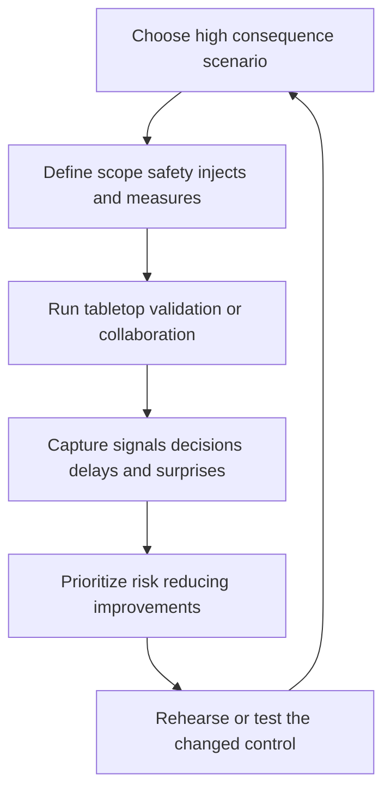

# Resilience and Adversary Exercises

> **One-line definition:** Use safe, scenario-based exercises to test whether controls, people, decisions, and recovery paths work under realistic adversary pressure.

## Why This Is a Senior Skill

A mid-level engineer runs a scan, tabletop, or simulation because a plan requires it. A senior security engineer chooses exercises that answer a decision question, sets safe scope and stop conditions, coordinates stakeholders, protects production and privacy, and turns observations into measurable changes. They test the system around the control: telemetry, authority, communication, dependencies, recovery, and customer impact.

Resilience is demonstrated behavior, not a document. An exercise is valuable when it reveals a meaningful gap or increases confidence in a control. Senior judgment avoids both unsafe realism and comfortable theater. The scenario should be credible enough to challenge assumptions, bounded enough to protect the organization, and connected to an owner who can act on the result.

| Aspect | Mid-level approach | Senior-specialist approach |
|---|---|---|
| Scenario | Reuses a generic exercise | Selects a consequence-based adversary path |
| Scope | Focuses on a tool or team | Tests people, technology, dependencies, and decisions |
| Safety | Trusts informal coordination | Defines authorization, boundaries, stop conditions, and rollback |
| Result | Counts participation | Measures detection, decision, containment, recovery, and learning |
| Follow-up | Files observations | Funds and verifies risk-reducing changes |

## Core Frameworks

### 1. Exercise Type Selection

| Exercise | Main question | Best evidence |
|---|---|---|
| Tabletop | Can people make the right decisions with incomplete facts? | Timeline, decisions, authority, communication gaps |
| Technical validation | Does a control work against a bounded behavior? | Test result, telemetry, alert, and response action |
| Purple-team collaboration | Can defenders observe and improve against realistic behavior? | Coverage, tuning, analyst effort, and control changes |
| Recovery rehearsal | Can the service restore trusted operation? | Recovery time, gates, data integrity, and residual risk |
| Dependency scenario | Does a provider or shared service failure preserve security? | Degraded mode, fallback authority, and customer impact |

### 2. Scenario Quality Checklist

A good scenario includes:

- A named protected outcome and credible adversary behavior.
- Explicit assumptions, starting state, and success measures.
- Authorized participants, data boundaries, production limits, and stop conditions.
- Injects that test uncertainty, dependency failure, customer impact, or conflicting priorities.
- An evidence plan that captures detection time, decision time, containment time, recovery time, and confidence.
- Owners and funding paths for follow-up actions.

### 3. Learning Loop

## In Practice

### Make the exercise safe and useful

Before the exercise, obtain written authorization, define systems and data that are out of scope, create a stop authority, identify rollback steps, and notify only the people who need to prevent accidental escalation. During the exercise, record expected behavior separately from observed behavior. Afterward, hold a short hot wash, then a deeper review that verifies evidence and owners.

### Measure outcomes, not theater

| Measure | Why it matters | Warning sign |
|---|---|---|
| Time to recognize | Shows telemetry and analyst signal quality | Team notices only after an inject is explained |
| Time to decide | Shows authority and information flow | Repeated debate over who may act |
| Time to contain | Shows operational control and reversibility | Action depends on an unavailable specialist |
| Time to recover | Shows resilience and dependency readiness | Recovery path is undocumented or unsafe |
| Confidence and uncertainty | Shows decision quality | Participants hide unknowns to appear ready |
| Action closure | Shows learning is operationalized | Reports accumulate without retest |

## Practical Exercise

Design and run a bounded exercise for a service you know.

1. Select a high-consequence scenario such as workload credential compromise, malicious administrator activity, or a sensitive-data export.
2. Define objective, scope, participants, stop conditions, safe data boundaries, and rollback.
3. Choose a tabletop, technical validation, purple-team, or recovery format and justify it.
4. Write three injects that test uncertainty, dependency failure, and customer or privacy impact.
5. Measure recognition, decision, containment, recovery, evidence quality, and confidence.
6. Produce an action register with owner, risk reduction, due date, and verification method.
7. Retest one changed control and compare results with the original baseline.

**Completion test:** The exercise produces a changed control or decision with evidence that the improvement was tested.

## Knowledge Connections

- [[01_Security_Observability]] : exercises validate telemetry and evidence quality
- [[02_Detection_Engineering]] : technical scenarios test detection coverage and tuning
- [[04_Incident_Command_and_Containment]] : exercises validate authority and containment
- [[05_Recovery_and_Lessons_Learned]] : exercise actions feed recovery and learning
- [[career-path/07_SRE_and_Platform_Engineer/05_Capacity_and_Resilience/00_overview|Capacity and Resilience]] : operational resilience foundations

## Key Takeaways

- Exercise design starts with a decision question and consequence, not a calendar requirement.
- Safety boundaries, stop authority, rollback, and data protection are part of technical quality.
- Test controls together with people, dependencies, authority, communication, and recovery.
- Measure recognition, decision, containment, recovery, uncertainty, and action closure.
- An exercise is valuable when it changes a control or increases justified confidence.
- Retest improvements so resilience becomes evidence rather than a claim.
