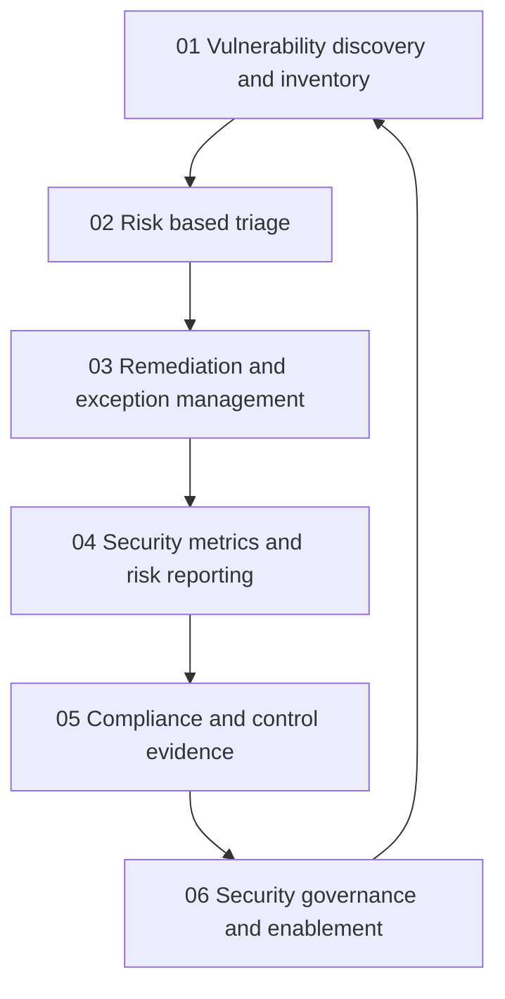

# Vulnerability Management and Governance

> **Core idea:** Convert incomplete security findings into owned risk decisions, economically sensible remediation, defensible evidence, and governance that helps teams deliver safely.

## What This Capability Means at Senior Level

A senior security engineer does not equate vulnerability management with scanning or ticket creation. They build a trustworthy view of assets, exposure, exploitability, business consequence, control strength, remediation cost, and residual risk. They decide which work must happen now, which can be mitigated, which needs a funded plan, and which exception is safe only for a bounded period.

Governance is the operating system for those decisions. The specialist turns policy and assurance needs into usable workflows, evidence generated near the control, metrics that inform action, and escalation paths that do not make security a last-minute gate. They make risk visible without inflating certainty and help engineering leaders choose investments with explicit trade-offs.

## Topic Notes

| # | Topic | Senior-specialist focus | Status | File |
|---|---|---|---|---|
| 01 | Vulnerability Discovery and Inventory | Establish complete, owned, fresh views of assets and findings | ✅ Done | `01_Vulnerability_Discovery_and_Inventory.md` |
| 02 | Risk Based Triage | Prioritize by exposure, exploitability, consequence, and uncertainty | ✅ Done | `02_Risk_Based_Triage.md` |
| 03 | Remediation and Exception Management | Choose treatment, fund remediation, and bound residual risk | ✅ Done | `03_Remediation_and_Exception_Management.md` |
| 04 | Security Metrics and Risk Reporting | Turn portfolio data into decisions for each audience | ✅ Done | `04_Security_Metrics_and_Risk_Reporting.md` |
| 05 | Compliance and Control Evidence | Produce durable, source-backed proof that controls operate | ✅ Done | `05_Compliance_and_Control_Evidence.md` |
| 06 | Security Governance and Enablement | Make policy, decision rights, and guardrails accelerate safe delivery | ✅ Done | `06_Security_Governance_and_Enablement.md` |

**Completion:** 6/6 : 100%

## How the Topics Connect

**Reading order:** Build trustworthy inventory and ownership first. Then prioritize findings with explicit risk and economic reasoning. Manage treatment and exceptions, report decisions using meaningful metrics, make evidence durable, and use governance to remove recurring delivery friction.

## Existing Vault Anchors

These notes provide the senior decision layer over existing vulnerability and governance foundations:

| Senior topic | Existing foundation |
|---|---|
| Vulnerability discovery and inventory | [[software-engineering-note/13_Software_Security/07_Vulnerability_Management]] |
| Risk based triage | [[software-engineering-note/13_Software_Security/07_Vulnerability_Management]] and [[software-engineering-note/13_Software_Security/03_Access_Control_and_Architecture]] |
| Remediation and exception management | [[software-engineering-note/13_Software_Security/07_Vulnerability_Management]] and [[document-template/14_Security/Vulnerability-Management-Report]] |
| Security metrics and risk reporting | [[software-engineering-note/13_Software_Security/08_Security_Management_and_Governance]] |
| Compliance and control evidence | [[software-engineering-note/13_Software_Security/08_Security_Management_and_Governance]] and [[document-template/14_Security/Vulnerability-Management-Report]] |
| Security governance and enablement | [[software-engineering-note/13_Software_Security/08_Security_Management_and_Governance]] |

## Self-Assessment Checklist

- [ ] I can state how complete, fresh, and owned the vulnerability inventory is.
- [ ] I can distinguish asset risk, finding risk, and uncertainty in a prioritization decision.
- [ ] I can explain why a finding should be fixed, mitigated, accepted, transferred, or retired.
- [ ] Every exception has an accountable owner, expiry, compensating control, and review trigger.
- [ ] My metrics show exposure and risk reduction rather than only scan or ticket volume.
- [ ] I can produce audit evidence from source systems without relying on screenshots alone.
- [ ] I can translate a policy requirement into a workflow, control, test, and owner.
- [ ] I can show the economic cost and residual risk of delaying remediation.
- [ ] Governance conversations with engineering end in a clear decision and a practical next step.

## Evidence of Capability

Strong evidence includes a coverage and ownership dashboard, a risk-based vulnerability report, a remediation plan, a time-bound exception record, an executive risk narrative, a control evidence matrix, and a policy-to-guardrail proposal. Each artifact identifies assumptions, uncertainty, owners, decision dates, and verification.

## Related

- [[career-path/08_Security_Engineer/00_overview|Security Engineer]]
- [[career-path/08_Security_Engineer/05_Identity_Access_and_Data_Protection/00_overview|Identity, Access and Data Protection]]
- [[career-path/08_Security_Engineer/06_Detection_Incident_Response_and_Resilience/00_overview|Detection, Incident Response and Resilience]]
- [[software-engineering-note/13_Software_Security/07_Vulnerability_Management]]
- [[software-engineering-note/13_Software_Security/08_Security_Management_and_Governance]]
