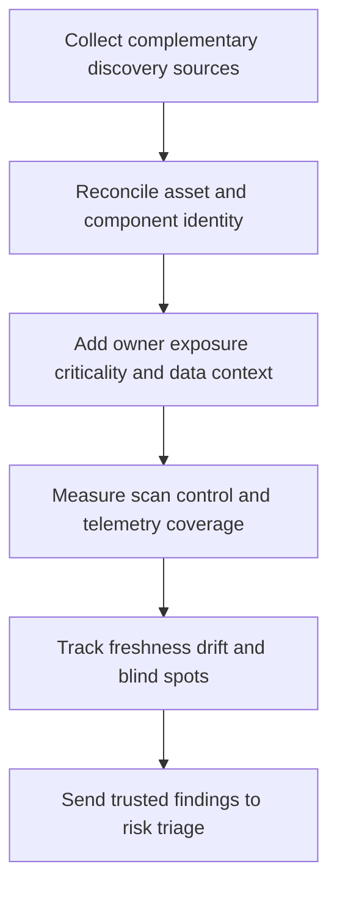

# Vulnerability Discovery and Inventory

> **One-line definition:** Build a fresh, reconciled, owner-backed view of assets, software, exposure, findings, and control coverage so risk decisions are based on what actually exists.

## Why This Is a Senior Skill

A mid-level engineer runs a scanner, exports findings, and opens tickets. A senior security engineer asks whether the scan reached the right assets, whether the finding maps to a real component and owner, whether the asset is internet exposed or business critical, and what remains invisible. They join discovery sources across cloud, endpoint, identity, code, dependencies, containers, infrastructure, and third parties without pretending that one inventory is complete.

Inventory is a confidence problem as much as a catalog problem. Stale ownership, duplicate identities, ephemeral workloads, unmanaged SaaS, and assets hidden behind providers can make a clean dashboard misleading. Senior practice exposes coverage gaps, sets freshness expectations, and gives teams a path to register or retire assets without turning security into manual paperwork.

| Aspect | Mid-level approach | Senior-specialist approach |
|---|---|---|
| Discovery | Runs a known scanner | Combines complementary sources and measures blind spots |
| Asset identity | Uses a hostname or ticket | Reconciles stable identity, environment, owner, and business context |
| Findings | Treats tool output as truth | Validates exploitability, reachability, duplication, and component use |
| Ownership | Assigns to a team queue | Establishes accountable service and risk owners |
| Freshness | Reviews on a calendar | Sets source-specific freshness and drift signals |

## Core Frameworks

### 1. Inventory Completeness Model

| Dimension | Question | Evidence |
|---|---|---|
| Existence | Can we discover the asset or workload? | Cloud, endpoint, repository, provider, and identity sources |
| Identity | Can records be joined without ambiguity? | Stable asset identifier and deduplication rule |
| Ownership | Who can change or accept risk? | Service owner, data owner, and escalation path |
| Exposure | How can an adversary or user reach it? | Network, identity, tenant, and dependency context |
| Criticality | What consequence follows from compromise? | Business service, data class, and recovery context |
| Coverage | Which controls and scans apply? | Scan, SBOM, configuration, and monitoring status |
| Freshness | When was the record last observed? | Source timestamp and stale threshold |

### 2. Discovery Source Portfolio

| Source | Strength | Blind spot to manage |
|---|---|---|
| Cloud or infrastructure inventory | Resource identity and configuration | Unmanaged or external services |
| Endpoint or workload telemetry | Runtime presence and behavior | Offline, ephemeral, or unsupported workloads |
| Repository and build data | Code, dependency, and artifact lineage | Deployed drift and runtime configuration |
| External attack-surface discovery | Internet reachability and exposed services | Internal assets and business context |
| Identity and access data | Owners, roles, and usage | Assets without a clear identity binding |
| Vendor or SaaS register | Contracted services and data processors | Shadow usage and technical detail |

### 3. Finding Identity Contract

A finding should be traceable to asset, component, version, location, evidence, owner, exposure, severity input, status, and last verification. When a scanner cannot provide one of these, record the uncertainty instead of silently converting it into a definitive ticket.

## In Practice

### Reconcile before prioritizing

Select one service and compare the asset register, cloud inventory, repository and build records, deployment platform, external exposure source, identity ownership, and scanner output. Count records that cannot be joined, assets without owners, findings on retired versions, and assets without required coverage. Use the discrepancies to improve the system rather than manually correcting one report.

### Inventory anti-patterns

| Anti-pattern | Risk | Better move |
|---|---|---|
| Scanner count as inventory | Unknown assets remain invisible | Measure discovery coverage by source and asset class |
| Ticket as ownership | Tickets close while risk remains | Bind findings to service, technical, and risk owners |
| Hostname as identity | Renames and ephemeral assets break history | Use stable identifiers and lineage |
| One scan for all risk | Configuration, dependency, and exposure gaps remain | Combine sources and record coverage limits |
| Stale dashboard | Leaders trust outdated exposure | Show freshness, drift, and last-observed time |

## Practical Exercise

Choose one product, platform, or business service.

1. Export its asset records from cloud or infrastructure, deployment, repository, identity, and vulnerability sources.
2. Reconcile records using stable identifiers and document duplicates or unmatched items.
3. Add service owner, technical owner, business criticality, data class, exposure, and recovery context.
4. Mark which discovery and security controls cover each asset and when they last ran.
5. Identify five blind spots or stale records and classify the reason.
6. Create a small coverage dashboard with denominator, freshness threshold, and owner.
7. Propose one automation or workflow change that improves inventory without adding manual approval work.

**Completion test:** A service owner can see what is in scope, what is missing, what is stale, and what action will improve confidence.

## Knowledge Connections

- [[software-engineering-note/13_Software_Security/07_Vulnerability_Management]] : vulnerability management foundations
- [[02_Risk_Based_Triage]] : inventory context makes prioritization meaningful
- [[03_Remediation_and_Exception_Management]] : ownership and evidence support treatment decisions
- [[document-template/14_Security/Vulnerability-Management-Report]] : report artifact for findings and status
- [[career-path/08_Security_Engineer/05_Identity_Access_and_Data_Protection/05_Data_Classification_and_Protection|Data Classification and Protection]] : data context informs impact

## Key Takeaways

- A scanner output is a source of evidence, not a complete inventory.
- Reconcile assets, components, owners, exposure, criticality, and freshness before ranking findings.
- Make blind spots and uncertainty visible instead of hiding them in a clean dashboard.
- Bind findings to service and risk owners, not only queues or technical teams.
- Measure coverage with explicit denominators and source-specific freshness expectations.
- Better inventory is a risk-reduction capability because it improves every later decision.
