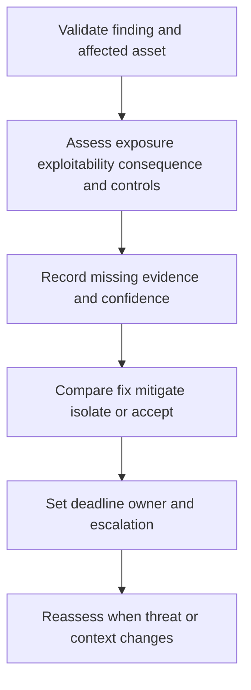

# Risk Based Triage

> **One-line definition:** Prioritize vulnerability work using exposure, exploitability, business consequence, control strength, uncertainty, and remediation economics rather than a severity label alone.

## Why This Is a Senior Skill

A mid-level engineer sorts findings by scanner severity or a default service-level target. A senior security engineer asks what is reachable, exploitable in this environment, connected to a critical business process, protected by compensating controls, and likely to be abused now. They explain uncertainty, involve the right owner, and choose a treatment deadline that reflects expected harm and available options.

Risk-based triage is not a license to ignore low-scored issues or override technical evidence with intuition. It is a disciplined way to combine evidence that tools cannot fully observe. The senior specialist uses a repeatable scorecard, calibrates it against incidents and exercises, and makes trade-offs legible to engineering and leadership.

| Aspect | Mid-level approach | Senior-specialist approach |
|---|---|---|
| Score | Copies CVSS or scanner priority | Uses score as input with local exposure and consequence |
| Context | Reviews the finding in isolation | Connects asset, path, data, identity, controls, and business process |
| Uncertainty | Treats unknown as neutral | Records unknowns and funds evidence gathering when material |
| Deadline | Applies a fixed SLA | Selects response time by expected harm and reversibility |
| Escalation | Escalates disputed findings | Frames options, residual risk, cost, and decision owner |

## Core Frameworks

### 1. Risk Triage Scorecard

| Dimension | Questions | Evidence examples |
|---|---|---|
| Exposure | Is the vulnerable path reachable, authenticated, or isolated? | External scan, network path, tenant boundary |
| Exploitability | Is a working exploit practical in this environment? | Exploit maturity, prerequisites, privilege needed |
| Consequence | What data, service, safety, or trust could be harmed? | Business criticality and data classification |
| Control strength | What prevention, detection, segmentation, or recovery reduces impact? | Policy, telemetry, exercise, and response evidence |
| Threat activity | Is there credible exploitation or targeting? | Intelligence, observed attempts, sector context |
| Uncertainty | What important input is missing or stale? | Inventory gaps, version ambiguity, unknown exposure |
| Treatment cost | What does fix, mitigate, or delay cost? | Engineering effort, outage risk, dependencies |

### 2. Priority Decision Matrix

| Exposure | Consequence bounded | Consequence severe |
|---|---|---|
| Low or isolated | Schedule with monitoring and verify assumptions | Reduce exposure first, then plan durable remediation |
| Authenticated or internal | Fix according to exploitability and control evidence | Expedite fix or compensating control with owner escalation |
| Internet or broad tenant reach | Treat quickly, validate exposure, and increase detection | Declare urgent risk, contain if needed, and involve decision authority |

The matrix is a conversation starter. Record why the selected priority differs from a tool score.

### 3. Remediation Economics

Compare the expected loss of delay with the cost and risk of treatment.

| Option | Immediate cost | Residual risk | Hidden concern |
|---|---|---|---|
| Patch or upgrade | Engineering and change risk | Usually lower if verified | Compatibility and rollback |
| Configuration change | Low to medium | Depends on coverage | Drift or undocumented dependency |
| Compensating control | Operations and monitoring cost | May leave a path open | Control failure or alert fatigue |
| Isolate or retire | Product or service impact | Low if truly removed | Migration and business dependency |
| Accept temporarily | Low immediate cost | Exposure remains | Must be owned, time-bound, and reviewed |

## In Practice

### Facilitate a triage review

Bring the technical owner, service owner, risk owner, operations representative, and security engineer. For each finding ask: What is the vulnerable path? Who can reach it? What can be harmed? What evidence supports exploitability? What control reduces impact? What will change if we wait? What is the least expensive treatment that materially lowers risk?

### Triage anti-patterns

| Anti-pattern | Failure mode | Better move |
|---|---|---|
| CVSS-only | Misses local exposure and business consequence | Use score plus context and uncertainty |
| Critical everything | Teams cannot distinguish urgency | Calibrate severity to action and consequence |
| SLA theater | Tickets meet time while risk remains | Measure verified risk reduction |
| Unbounded analysis | Decision waits for perfect certainty | Time-box evidence gathering and state assumptions |
| Technical owner decides alone | Business risk and customer impact are hidden | Name a risk owner for acceptance or escalation |

## Practical Exercise

Take five real or synthetic findings with different assets, exposures, and remediation costs.

1. Validate asset identity, affected component, exposure, exploitability, and business consequence.
2. Score each dimension in the triage scorecard and record evidence or uncertainty.
3. Rank the findings, then compare your ranking with scanner priority.
4. For the top three, compare fix, mitigate, isolate, retire, and accept options.
5. Estimate delay cost, treatment cost, outage risk, and residual risk at a useful level of precision.
6. Set owner, decision date, remediation target, and escalation trigger.
7. Review the result with a service or business owner and capture one changed assumption.

**Completion test:** Another reviewer can see why the priority and deadline are proportionate without relying on a single vendor score.

## Knowledge Connections

- [[01_Vulnerability_Discovery_and_Inventory]] : trustworthy context is the triage input
- [[03_Remediation_and_Exception_Management]] : priority becomes a treatment and exception decision
- [[software-engineering-note/13_Software_Security/07_Vulnerability_Management]] : vulnerability management foundations
- [[software-engineering-note/13_Software_Security/03_Access_Control_and_Architecture]] : exposure, privilege, and control context
- [[career-path/08_Security_Engineer/06_Detection_Incident_Response_and_Resilience/02_Detection_Engineering|Detection Engineering]] : detection strength changes residual risk

## Key Takeaways

- Risk triage combines tool evidence with exposure, consequence, controls, threat, uncertainty, and cost.
- A high technical score is not a complete business priority, and a low score is not proof of safety.
- Make uncertainty explicit and time-box the work needed to reduce material uncertainty.
- Choose deadlines by expected harm, reversibility, and available treatment options.
- Include a risk owner when the decision involves residual exposure or acceptance.
- Explain differences from scanner priority so the decision can be reviewed and calibrated later.
