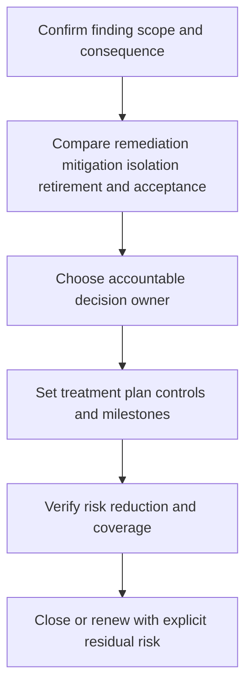

# Remediation and Exception Management

> **One-line definition:** Move security findings to a verified treatment decision while making temporary residual risk explicit, owned, economical, and time-bound.

## Why This Is a Senior Skill

A mid-level engineer opens a remediation ticket or asks for a waiver. A senior security engineer makes the treatment path explicit: fix, mitigate, isolate, retire, transfer, or accept. They understand dependencies, change risk, customer impact, and the cost of delay. They ensure that an exception is a decision about residual risk, not a second queue where findings disappear.

Senior practice also distinguishes completion from closure. A patch may be deployed but not verified across the vulnerable population. A mitigation may lower exposure but introduce monitoring cost. An accepted risk may be reasonable for a period but unsafe after a threat change. The specialist creates evidence and review triggers for each state.

| Aspect | Mid-level approach | Senior-specialist approach |
|---|---|---|
| Fix | Assigns a ticket to engineering | Sequences treatment with dependencies, rollback, and verification |
| Mitigation | Adds a compensating control | Measures control strength and residual exposure |
| Exception | Requests approval to delay | Frames consequence, rationale, expiry, owner, and trigger |
| Closure | Marks work done after deployment | Verifies scope, evidence, recurrence, and remaining risk |
| Economics | Discusses effort only | Compares delay loss, treatment cost, and business value |

## Core Frameworks

### 1. Treatment Decision

| Treatment | Suitable when | Required evidence |
|---|---|---|
| Remediate | The issue can be removed at acceptable cost and risk | Change, test, deployment coverage, and regression evidence |
| Mitigate | A durable fix needs time or has high change risk | Compensating control, owner, monitoring, and expiry |
| Isolate | Exposure can be bounded without breaking the outcome | Boundary test, access path, and operational check |
| Retire | Asset or feature no longer justifies exposure | Dependency check, removal, and inventory update |
| Transfer | Contract or provider changes who bears part of the risk | Contract, assurance, and residual-risk statement |
| Accept | Residual risk is within authority and justified | Decision owner, rationale, expiry, and review trigger |

### 2. Exception Record Contract

Every exception should state:

- Finding, asset, exposure, data, and business consequence.
- Why normal remediation is not currently proportionate.
- What risk remains and what assumptions support the decision.
- Compensating controls, their owner, test, and monitoring signal.
- Expiry date, review cadence, and triggers for early reassessment.
- Decision authority and notification path.
- Remediation milestone, funding need, or retirement plan.

### 3. Remediation Economics

| Question | Decision use |
|---|---|
| What harm could occur during the delay? | Sets urgency and escalation |
| What is the cost and change risk of the fix? | Tests whether treatment is feasible |
| What is the cost of the mitigation over time? | Prevents temporary controls becoming invisible permanent cost |
| What dependency blocks the fix? | Enables a funded sequence rather than blame |
| How will risk reduction be verified? | Separates activity from outcome |

## In Practice

### Make exceptions expire in the workflow

An exception should be visible where the risk is managed, not only in an audit folder. Link it to the asset and finding, display days to expiry, notify the owner, and create an early trigger for exploit evidence, exposure change, failed mitigation, ownership change, or missed milestone. Renewal requires new evidence and an explicit statement of why the prior plan did not complete.

### Exception anti-patterns

| Anti-pattern | Failure mode | Better move |
|---|---|---|
| Permanent waiver | Risk becomes invisible | Set expiry, trigger, and escalation |
| Security-only approval | Business consequence is unowned | Include service and risk owners |
| Mitigation without test | Assumed control may fail | Run a control test and monitor it |
| Ticket closure after patch | Unpatched copies or paths remain | Verify affected population and exposure |
| Exception volume target | Teams optimize paperwork | Measure aged risk and verified reduction |

## Practical Exercise

Choose one high-priority finding that cannot be fixed immediately.

1. Confirm affected assets, exposure, consequence, current control strength, and uncertainty.
2. Compare fix, mitigation, isolation, retirement, transfer, and acceptance options.
3. Create a treatment plan with milestones, dependencies, cost, and rollback considerations.
4. If accepting temporarily, write a complete exception record with owner, authority, expiry, triggers, and evidence.
5. Define and run a compensating-control test.
6. Add reminders and an escalation path for expiry or failed mitigation.
7. Reassess the decision after a simulated threat or exposure change.

**Completion test:** The record shows why the chosen treatment is proportionate and what would force a different decision.

## Knowledge Connections

- [[02_Risk_Based_Triage]] : risk and economics determine treatment priority
- [[01_Vulnerability_Discovery_and_Inventory]] : scope and ownership support verification
- [[software-engineering-note/13_Software_Security/07_Vulnerability_Management]] : vulnerability management foundations
- [[document-template/14_Security/Vulnerability-Management-Report]] : report template for findings, treatment, and status
- [[software-engineering-note/13_Software_Security/08_Security_Management_and_Governance]] : risk acceptance and governance context

## Key Takeaways

- A finding is not managed until treatment, owner, deadline, and verification are explicit.
- Exceptions describe residual risk and must expire, trigger review, and remain visible.
- Compensating controls require their own strength, monitoring, and failure evidence.
- Compare delay cost with fix cost, change risk, mitigation cost, and business impact.
- Closure means verified risk reduction across the affected population, not just a deployment event.
- A good treatment workflow helps teams choose a safe path instead of hiding risk in a waiver queue.
