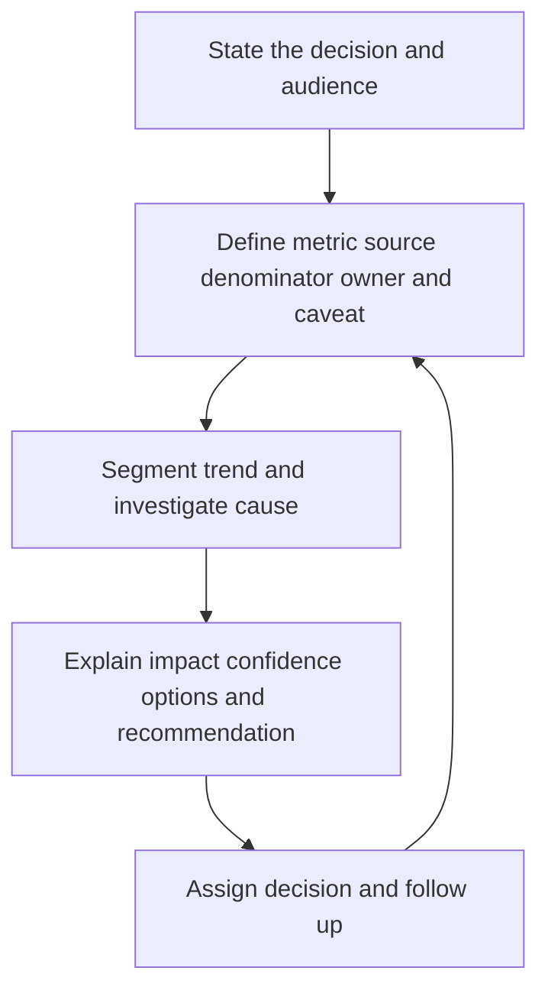

# Security Metrics and Risk Reporting

> **One-line definition:** Turn security data into audience-specific decisions about exposure, risk reduction, investment, and residual uncertainty without rewarding metric gaming.

## Why This Is a Senior Skill

A mid-level engineer reports scan counts, ticket counts, or average remediation time. A senior security engineer defines what decision a metric supports, its denominator and freshness, the assumptions behind it, and how a team could accidentally optimize the number instead of the outcome. They report to engineers, service owners, executives, auditors, and boards at different levels of abstraction without changing the underlying truth.

Good reporting is a risk conversation, not a performance scoreboard. It states what changed, why it matters, what remains uncertain, which treatment options exist, and what decision or investment is requested. The senior specialist uses leading indicators to prevent harm and lagging indicators to test whether controls and investments actually worked.

| Aspect | Mid-level approach | Senior-specialist approach |
|---|---|---|
| Metric | Reports available counts | Defines purpose, denominator, owner, and decision |
| Trend | Shows a line chart | Explains cause, uncertainty, and action |
| Audience | Sends one dashboard to everyone | Tailors detail while preserving consistent facts |
| Target | Sets a number to hit | Balances outcome, quality, cost, and unintended effects |
| Risk | Hides unknowns | Makes coverage gaps and confidence visible |

## Core Frameworks

### 1. Metric Contract

| Field | Required question |
|---|---|
| Decision | What decision will this metric inform? |
| Definition | What exactly is counted and excluded? |
| Denominator | What population makes the rate meaningful? |
| Source | Which system is authoritative and how fresh is it? |
| Owner | Who can change the result or explain it? |
| Segmentation | Which service, asset class, severity, or exposure matters? |
| Caveat | What uncertainty, bias, or blind spot applies? |
| Action | What threshold or trend triggers a response? |

### 2. Balanced Security View

| View | Example question | Metric family |
|---|---|---|
| Exposure | What can be reached and harmed now? | Internet-exposed critical assets, sensitive paths |
| Control health | Are required controls operating? | Coverage, freshness, failure, drift |
| Response | How quickly can we reduce harm? | Detection, containment, recovery time with confidence |
| Risk reduction | Is material risk decreasing? | Aged high-risk exposure, verified treatment, recurrence |
| Investment | Where will more capacity change risk? | Cost per risk reduction, dependency backlog |
| Uncertainty | What do we not know? | Unowned assets, stale scans, missing telemetry |

### 3. Risk Narrative Template

A useful report answers:

1. **Situation:** What changed in exposure, threat, control, or business context?
2. **Significance:** Which services, data, customers, or obligations are affected?
3. **Confidence:** What evidence supports the statement and what is uncertain?
4. **Options:** What can be fixed, mitigated, isolated, accepted, or funded?
5. **Recommendation:** Which decision is needed, from whom, and by when?
6. **Follow-up:** How will the organization know the risk changed?

## In Practice

### Report at three levels

| Audience | Useful focus | Avoid |
|---|---|---|
| Engineering | Affected components, fix path, dependencies, tests | Abstract risk language without an action |
| Service or business owner | Customer impact, priority, cost, residual risk | Scanner detail without consequence |
| Executive or board | Trend, material exposure, investment choices, confidence | False precision and giant ticket lists |

### Metric anti-patterns

| Anti-pattern | Why it is dangerous | Better move |
|---|---|---|
| Finding count | Counts can rise when discovery improves | Pair exposure with coverage and verified reduction |
| SLA compliance only | Teams close or reclassify without lowering risk | Track residual exposure and recurrence |
| Average time alone | Hides long-aged critical items | Use distributions, age bands, and severity context |
| Percent without denominator | Creates false confidence | State population, exclusions, and freshness |
| Single composite score | Hides trade-offs and uncertainty | Use a small balanced set with narrative |

## Practical Exercise

Create a monthly security risk report for one product or portfolio.

1. Choose one decision the report must support, such as funding remediation or accepting a dependency risk.
2. Define four to six metrics with contracts, denominators, sources, owners, and caveats.
3. Segment by exposure, criticality, data class, owner, and age where useful.
4. Investigate one unexpected trend and document the cause or uncertainty.
5. Write a one-page narrative with situation, significance, confidence, options, recommendation, and follow-up.
6. Present the report to an engineering and a business audience, noting what each asks for.
7. Remove one metric that does not change a decision and add one measure of uncertainty or verified risk reduction.

**Completion test:** The report leads to a specific decision and makes it clear how the result will be checked later.

## Knowledge Connections

- [[02_Risk_Based_Triage]] : risk context and uncertainty shape reporting
- [[03_Remediation_and_Exception_Management]] : treatment status and residual risk are outcomes
- [[software-engineering-note/13_Software_Security/08_Security_Management_and_Governance]] : governance and reporting foundations
- [[document-template/14_Security/Vulnerability-Management-Report]] : report artifact for vulnerability status
- [[career-path/08_Security_Engineer/06_Detection_Incident_Response_and_Resilience/05_Recovery_and_Lessons_Learned|Recovery and Lessons Learned]] : incident learning signals feed risk narratives

## Key Takeaways

- Every metric needs a decision, definition, denominator, source, owner, caveat, and action.
- Report exposure, control health, response, verified reduction, investment, and uncertainty together.
- Use different levels of detail for different audiences without changing the underlying facts.
- Trends need causes, confidence, and a recommendation, not only a chart.
- Beware metrics that reward closure, reclassification, or volume instead of risk reduction.
- Good reporting makes the next security decision easier and more accountable.
