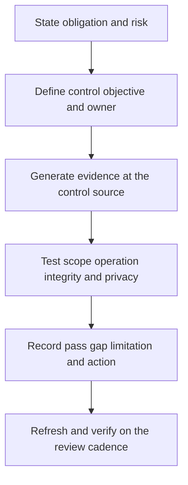

# Compliance and Control Evidence

> **One-line definition:** Build source-backed, reproducible evidence that a security control is designed appropriately, operates consistently, and has a known limitation when it does not.

## Why This Is a Senior Skill

A mid-level engineer gathers screenshots, exports tickets, or answers auditor requests. A senior security engineer designs evidence at the point where a control operates, maps requirements to accountable owners and tests, and distinguishes a policy statement from operating effectiveness. They negotiate scope and sampling with auditors while protecting sensitive data and keeping engineering effort proportional to assurance value.

Evidence is a product with users: auditors, customers, security leaders, engineers, legal partners, and incident responders. Senior judgment keeps evidence current, minimizes disclosure, preserves integrity, and exposes gaps early enough to fix them. They do not optimize for a clean audit packet at the expense of real control performance.

| Aspect | Mid-level approach | Senior-specialist approach |
|---|---|---|
| Evidence | Collects artifacts when requested | Generates durable evidence near the control |
| Mapping | Matches documents to control names | Connects requirement, risk, control, owner, test, and result |
| Effectiveness | Proves a setting exists | Tests operation over time and across representative scope |
| Gap handling | Hides or defers exceptions | States limitation, risk, owner, and remediation path |
| Privacy | Shares broad source data | Minimizes evidence and controls reviewer access |

## Core Frameworks

### 1. Control-to-Evidence Chain

| Link | Question | Example artifact |
|---|---|---|
| Requirement | What obligation or risk is being addressed? | Standard, contract, policy, or threat decision |
| Control objective | What outcome should be true? | Prevent unauthorized access or detect misuse |
| Control design | How should the control achieve it? | Architecture, workflow, or policy |
| Control operation | Did it operate during the period? | System events, test results, review records |
| Scope | Which assets, teams, and time window are included? | Population and sampling definition |
| Result | What passed, failed, or remains uncertain? | Exception, finding, and owner |
| Improvement | What changes next and how is it verified? | Remediation plan and follow-up test |

### 2. Evidence Quality Matrix

| Quality dimension | Strong evidence | Weak evidence |
|---|---|---|
| Authenticity | Source-generated and attributable | Manually edited or unclear origin |
| Completeness | Covers defined population and period | Cherry-picked examples |
| Timeliness | Current for the decision | Stale snapshot with no refresh signal |
| Reproducibility | Another reviewer can rerun or verify it | Depends on one person's memory |
| Integrity | Protected from silent alteration | Stored in an uncontrolled location |
| Minimization | Contains only needed information | Raw sensitive data copied broadly |

### 3. Audit Readiness Review

Before an audit or customer assurance request, test whether the evidence owner can answer:

1. What control or risk does this artifact prove?
2. Which population and period does it cover?
3. How was it generated, protected, and reviewed?
4. What failed, was excluded, or remains uncertain?
5. Who owns the next action and by when?

## In Practice

### Make evidence reusable

Maintain a control evidence matrix with requirement, objective, control, owner, source, frequency, population, retention, access, last test, limitation, and next review. Use versioned queries, automated exports, policy references, and change records where possible. Create a small evidence pack for one control before expanding to a full framework.

### Evidence anti-patterns

| Anti-pattern | Failure mode | Better move |
|---|---|---|
| Screenshot collection | Stale and hard to reproduce | Use source-generated evidence with timestamp and scope |
| Policy as proof | Intent is mistaken for operation | Add samples, events, tests, and review records |
| Full database export | Privacy and access risk | Provide minimized, scoped evidence |
| Audit-only remediation | Control improves temporarily | Embed the fix in workflow and monitor it |
| Hidden exception | Trust fails when discovered | State gap, residual risk, owner, and plan |

## Practical Exercise

Build an evidence pack for one security control, such as privileged-access review, vulnerability remediation, or incident-response readiness.

1. Select the requirement or risk and write the control objective.
2. Define owner, population, review period, source, frequency, and evidence access.
3. Collect source-backed design and operating evidence with minimum necessary data.
4. Test authenticity, completeness, timeliness, reproducibility, integrity, and privacy.
5. Record one failure, exclusion, or uncertainty rather than filtering it out.
6. Map the gap to an owner, risk decision, due date, and verification test.
7. Ask a peer to reproduce the evidence pack from the matrix alone.

**Completion test:** The pack explains what it proves, what it does not prove, and how the organization will close the gap.

## Knowledge Connections

- [[03_Remediation_and_Exception_Management]] : control gaps need treatment and ownership
- [[software-engineering-note/13_Software_Security/08_Security_Management_and_Governance]] : governance and assurance foundations
- [[document-template/14_Security/Vulnerability-Management-Report]] : reusable security reporting artifact
- [[career-path/08_Security_Engineer/05_Identity_Access_and_Data_Protection/06_Privacy_and_Auditability|Privacy and Auditability]] : evidence must remain purposeful and protected
- [[career-path/08_Security_Engineer/06_Detection_Incident_Response_and_Resilience/01_Security_Observability|Security Observability]] : operational sources strengthen evidence quality

## Key Takeaways

- Evidence should connect obligation, risk, control objective, owner, operation, result, and improvement.
- A policy describes intent; operating evidence shows what happened across a defined scope and period.
- Reproducibility and integrity matter as much as presentation quality.
- State gaps, exclusions, and uncertainty instead of creating a misleading clean packet.
- Minimize evidence access and sensitive fields to reduce privacy and breach impact.
- The best audit evidence is a by-product of a control that already operates well.
