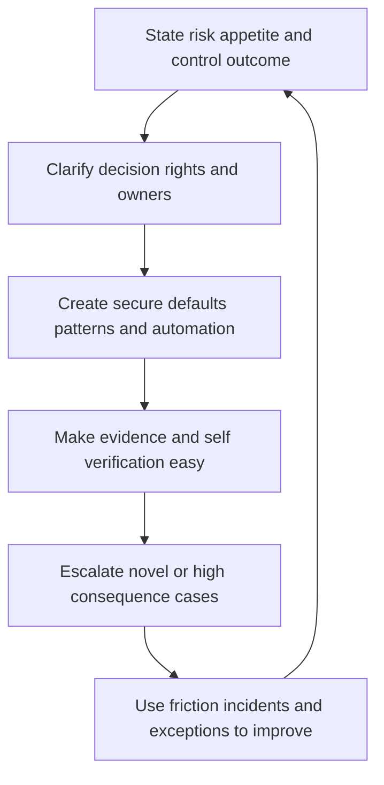

# Security Governance and Enablement

> **One-line definition:** Turn security intent into clear decision rights, usable guardrails, reusable patterns, and feedback loops that help teams deliver safely.

## Why This Is a Senior Skill

A mid-level engineer follows policy, reviews exceptions, or gives point-in-time advice. A senior security engineer improves the governance system itself. They identify where policy is ambiguous, where approvals create delay without reducing risk, and where teams lack a paved path. They clarify who decides, who operates, who must be consulted, and what evidence is sufficient.

Enablement is not lowering standards. It is making the safe action easier than the unsafe workaround through secure defaults, automation, templates, reference architectures, pre-approved patterns, training at the moment of need, and escalation paths for legitimate variation. Senior governance keeps risk appetite and obligations visible while allowing teams to make proportionate decisions close to the work.

| Aspect | Mid-level approach | Senior-specialist approach |
|---|---|---|
| Policy | Interprets written rules | Tests whether rules produce the intended behavior |
| Approval | Acts as a review gate | Moves repeatable decisions into guardrails and automation |
| Exception | Handles one request | Finds recurring causes and improves the default path |
| Guidance | Gives advice in a meeting | Creates reusable patterns, examples, and ownership |
| Governance | Reports compliance status | Connects risk appetite, decisions, evidence, and learning |

## Core Frameworks

### 1. Governance Operating Model

| Element | Senior decision |
|---|---|
| Risk appetite | Which risks are acceptable, under what conditions, and for how long? |
| Decision rights | Who may decide, advise, approve, escalate, or accept residual risk? |
| Control ownership | Who designs, operates, tests, funds, and improves the control? |
| Guardrails | Which constraints can be automated or made self-service? |
| Evidence | What proof is generated by normal delivery work? |
| Escalation | What triggers specialist attention and executive decision? |
| Feedback | How do incidents, exceptions, audits, and developer friction improve the system? |

### 2. Policy Usability Test

For each policy requirement, ask:

1. Can the team understand the intended outcome without specialist translation?
2. Is there a default implementation path that meets the control?
3. Can a team verify compliance before release rather than wait for review?
4. Does the rule define proportionate treatment for different risk contexts?
5. Is an exception path fast enough for legitimate delivery needs but accountable?
6. Does the policy create evidence that an owner can maintain?

### 3. Guardrail Decision Matrix

| Pattern | Best use | Governance value |
|---|---|---|
| Secure default | Common low-variation decision | Reduces choice and review burden |
| Automated check | Repeatable measurable requirement | Finds drift close to change |
| Reference architecture | Common system or trust boundary | Reuses proven design and evidence |
| Self-service template | Frequent documented decision | Enables delivery with bounded risk |
| Specialist review | Novel or high-consequence change | Focuses scarce expertise where judgment matters |
| Time-bound exception | Necessary temporary deviation | Preserves speed while making residual risk visible |

## In Practice

### Convert a blocking review into an enabling path

Start with a request that repeatedly arrives late or receives inconsistent advice. Map the risk, decision, evidence, and current waiting points. Separate decisions that can be automated from those requiring judgment. Create a default pattern, a self-check, a clear exception path, and an owner for keeping the guidance current. Measure lead time and control outcomes after rollout.

### Governance anti-patterns

| Anti-pattern | Failure mode | Better move |
|---|---|---|
| Security as final gate | Teams involve security too late | Embed threat, control, and evidence checks in delivery |
| Vague policy | Teams interpret risk inconsistently | State outcomes, examples, defaults, and escalation |
| Central approval for every change | Specialist queue becomes bottleneck | Delegate low-risk decisions to guarded patterns |
| Compliance theater | Artifacts exist without control effect | Tie evidence to operating behavior and outcomes |
| No feedback loop | Same exception and friction recur | Review trends and improve defaults quarterly or sooner |

## Practical Exercise

Choose a policy or review process that engineers experience as slow or unclear.

1. Collect three real requests, exceptions, or review comments and identify repeated friction.
2. State the intended risk outcome and the harm the policy is meant to prevent.
3. Separate low-variation decisions from novel or high-consequence decisions.
4. Draft a secure default, a self-check, an evidence path, and a time-bound exception route.
5. Assign decision, operation, evidence, and escalation owners.
6. Pilot the change with one team and measure lead time, adoption, control failures, and exception quality.
7. Review the results with security and engineering leadership and agree on the next iteration.

**Completion test:** The new path reduces unnecessary waiting while making risk decisions, evidence, and escalation more visible.

## Knowledge Connections

- [[04_Security_Metrics_and_Risk_Reporting]] : metrics show whether governance changes outcomes
- [[05_Compliance_and_Control_Evidence]] : usable governance generates durable evidence
- [[software-engineering-note/13_Software_Security/08_Security_Management_and_Governance]] : governance foundations
- [[software-engineering-note/13_Software_Security/07_Vulnerability_Management]] : vulnerability workflows and treatment context
- [[career-path/08_Security_Engineer/05_Identity_Access_and_Data_Protection/06_Privacy_and_Auditability|Privacy and Auditability]] : governance must protect privacy and accountability

## Key Takeaways

- Governance should clarify risk appetite, decision rights, ownership, evidence, and escalation.
- Enablement makes the safe path easier through defaults, automation, patterns, and self-service.
- Reserve specialist review for novel or high-consequence decisions instead of every routine change.
- Policy usability is a security property because unclear rules produce inconsistent controls and workarounds.
- Repeated exceptions and review friction are signals to improve the system, not only to process more requests.
- Effective governance enables delivery while keeping residual risk visible, owned, and reviewable.
