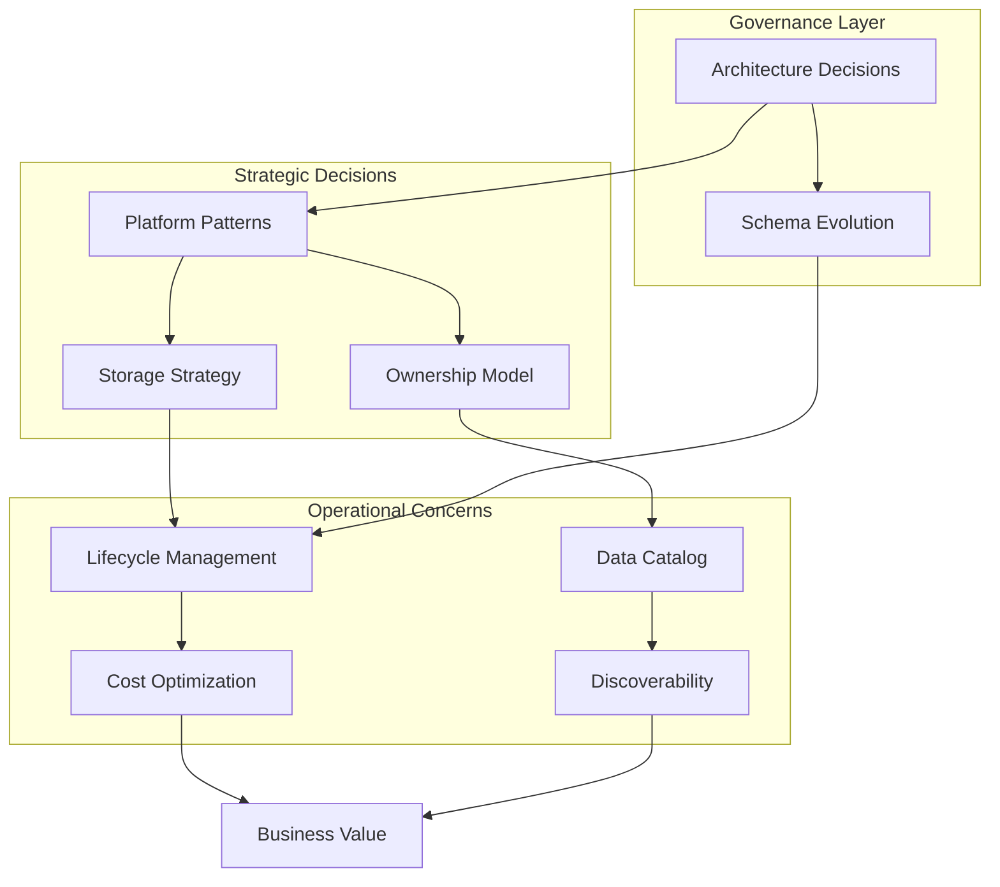

> Data Architecture is the strategic discipline of designing data systems that balance cost, performance, governance, and business agility across the entire data lifecycle.

## Why This Capability Area Matters

Senior data engineers don't just build pipelines: they architect systems that must scale across years, adapt to changing business needs, and make intelligent trade-offs between competing constraints. Data architecture decisions have decade-long consequences for cost, compliance, and organizational velocity.

This capability area covers the judgment calls that separate senior practitioners:
- Choosing between storage tiers based on access patterns and cost curves
- Selecting platform patterns that match organizational maturity
- Designing lifecycle policies that prevent technical debt accumulation
- Building discoverability systems that enable self-service without chaos
- Establishing ownership models that scale with organizational growth
- Making architectural decisions that remain flexible under uncertainty

## Topic Map

| Topic | Focus Area | Status |
|-------|-----------|--------|
| [[01_Data_Lakehouse_and_Storage_Strategy]] | Storage tier selection and lakehouse patterns | 🔲 Not Started |
| [[02_Data_Platform_Patterns]] | Lambda vs Kappa, mesh vs fabric | 🔲 Not Started |
| [[03_Data_Lifecycle_Management]] | Retention, tiering, archival strategies | 🔲 Not Started |
| [[04_Data_Catalog_and_Discoverability]] | Metadata, lineage, self-service discovery | 🔲 Not Started |
| [[05_Data_Ownership_and_Domains]] | Data mesh domains and federated governance | 🔲 Not Started |
| [[06_Data_Architecture_Decisions]] | ADR process and schema evolution | 🔲 Not Started |

## Concept Map

## Existing Vault Anchors

| Concept | Vault Location | Relevance |
|---------|---------------|-----------|
| Data Architecture | [[02_Data_Architecture]] | DMBOK framework foundation |
| Metadata Management | [[10_Metadata_Management]] | Catalog and lineage concepts |
| Operations | [[software-engineering-note/06_Software_Engineering_Operations/Software Engineering Operations Overview]] | Operational lifecycle patterns |

## Self-Assessment Checklist

Before proceeding, honestly assess your readiness:

**Storage Strategy**
- [ ] I can articulate when object storage outperforms block storage for analytical workloads
- [ ] I understand the cost implications of hot vs cold storage tiers across providers
- [ ] I can design a lakehouse that balances query performance with storage efficiency

**Platform Patterns**
- [ ] I can explain when lambda architecture creates more problems than it solves
- [ ] I understand the organizational prerequisites for data mesh adoption
- [ ] I can evaluate data fabric vs data mesh for different company sizes

**Lifecycle Management**
- [ ] I can design retention policies that satisfy both compliance and cost constraints
- [ ] I understand when to archive vs delete data
- [ ] I can implement tiering strategies that minimize manual intervention

**Governance and Ownership**
- [ ] I can establish data ownership boundaries that scale with organizational growth
- [ ] I understand how to build a data catalog that drives adoption, not just compliance
- [ ] I can write architecture decision records that remain useful years later

## Related Links

- [[DMBoK v2 - Overview]] : Foundational data management knowledge areas
- [[02_Data_Modeling_and_Design/00_overview]] : Complementary modeling discipline
- [[03_Data_Integration_and_Pipelines/00_overview]] : Implementation patterns
