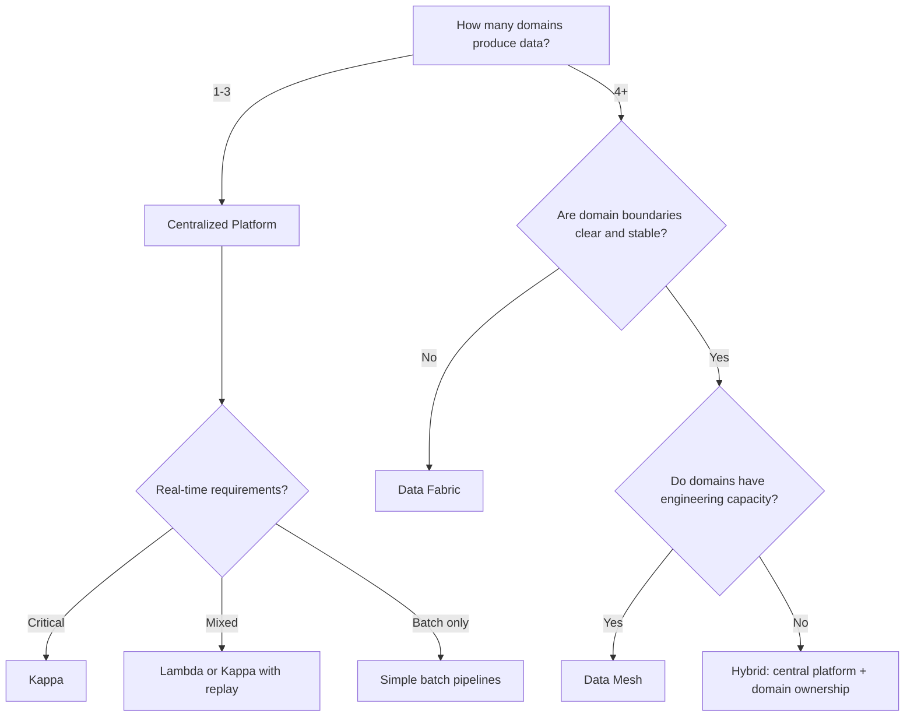

> Platform pattern selection is the decision of how to structure data flow, processing, and ownership across an organization: it determines operational complexity, team autonomy, and system resilience for years to come.

## Why This Is a Senior Skill

Mid-level engineers implement whichever pattern the team already uses. Senior engineers:
- Evaluate organizational readiness before recommending a pattern
- Understand that architecture reflects organizational structure &#40;Conway's Law&#41;
- Recognize when a simpler pattern with good execution beats a complex pattern poorly implemented
- Know the failure modes of each pattern and design compensations

The gap between a pattern on a whiteboard and a pattern in production is where most data platforms fail.

## Core Frameworks

### Lambda vs Kappa Decision Matrix

| Criterion | Lambda Architecture | Kappa Architecture |
|-----------|-------------------|-------------------|
| Complexity | High: two separate code paths | Low: single streaming path |
| Correctness | Batch layer is source of truth | Stream processing must be exactly-once |
| Operational cost | High: maintain two systems | Lower: one system, harder to debug |
| Best for | Batch + real-time with different SLAs | Event-sourced systems with replay capability |
| Risk | Inconsistency between layers | Backpressure and late-arriving data |

### Data Mesh vs Data Fabric vs Centralized

| Dimension | Centralized Lake | Data Mesh | Data Fabric |
|-----------|-----------------|-----------|-------------|
| Ownership | Central data team | Domain teams | Central platform, federated access |
| Scaling model | Scale the team | Scale the org | Scale the metadata |
| Org prerequisite | Small data team | Mature domain boundaries | Strong metadata engineering |
| Governance | Top-down | Federated, domain-owned | Automated, policy-as-code |
| Failure mode | Bottleneck, slow delivery | Inconsistency, duplication | Metadata complexity |

### Decision Flowchart

## In Practice

**Lambda Architecture in 2024:**
Lambda was designed for a world where stream processing was unreliable. Modern systems with exactly-once semantics &#40;Kafka, Flink, Spark Structured Streaming&#41; make the batch correction layer unnecessary for many use cases. Use Lambda only when:
- Stream and batch have fundamentally different computation requirements
- You cannot tolerate any late data in the batch layer
- Regulatory requirements mandate batch reconciliation

**Data Mesh Reality Check:**
Data mesh works when:
- You have 5+ domains with clear boundaries &#40;e.g., Orders, Payments, Inventory&#41;
- Each domain has or can hire data engineering capacity
- Leadership commits to federated governance
- You accept initial duplication and convergence cost

Data mesh fails when:
- Domain boundaries shift frequently &#40;early-stage startups&#41;
- Domain teams see data platform work as "not their job"
- No investment in self-service infrastructure
- The org treats it as a reorg, not a technical investment

**When to Choose Kappa:**
Kappa is the right choice when your data is naturally event-sourced and your stream processing framework supports:
- Exactly-once processing semantics
- State checkpointing and recovery
- Replay from arbitrary offsets
- Late-arriving data handling

## Practical Exercise

**Scenario:** Your organization has:
- 4 business domains: Customer, Product, Orders, Logistics
- Customer domain has 2 data engineers, Product has 1, Orders has 3, Logistics has 0
- Real-time needs: Orders dashboards, fraud detection on payments
- Batch needs: daily business reports, ML training pipelines
- Current pain: central data team is a bottleneck, 6-week request backlog

**Your Task:**
1. Map each domain's data maturity and capacity
2. Choose a platform pattern and justify it
3. Design a phased migration plan &#40;not a big-bang rewrite&#41;
4. Identify the first domain to migrate and why
5. Define success metrics for the first 6 months

## Knowledge Connections

**Existing Vault:**
- [[DMBoK v2 - Overview]] : Enterprise data architecture concepts
- [[software-engineering-note/06_Software_Engineering_Operations/Software Engineering Operations Overview]] : Operational patterns for platform teams

**Adjacent Topics:**
- [[05_Data_Ownership_and_Domains]] : Deep dive on mesh domain design
- [[01_Data_Lakehouse_and_Storage_Strategy]] : Storage implications of each pattern
- [[06_Data_Architecture_Decisions]] : How to document pattern selection

**External References:**
- Zhamak Dehghani's "Data Mesh" : the foundational text on domain-oriented decentralization
- Jay Kreps' "I Love Logs" : event-driven architecture rationale
- Martin Kleppmann's "Designing Data-Intensive Applications" : stream vs batch fundamentals

## Key Takeaways

- Architecture reflects organization: Conways Law applies to data platforms more than any other system
- Start centralized, decentralize deliberately: premature mesh adoption creates more problems than it solves
- Lambda is often overkill: modern stream processors eliminate the need for batch correction in most cases
- Kappa requires replay capability: without it, you lose the safety net that Lambda's batch layer provided
- Data fabric is metadata-heavy: only invest if you have strong metadata engineering capacity
- Phased migration beats big-bang: move one domain at a time, learn, then scale the pattern
