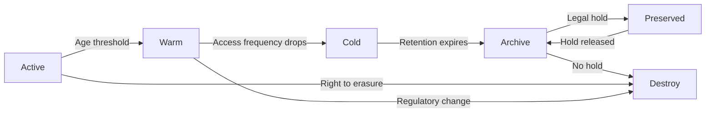

> Data lifecycle management is the discipline of defining what data to keep, for how long, in what form, and when to destroy it: balancing compliance, cost, and future analytical value.

## Why This Is a Senior Skill

Mid-level engineers implement retention policies someone else defined. Senior engineers:
- Navigate the tension between "keep everything forever" and "delete aggressively"
- Design lifecycle policies that satisfy legal, analytical, and cost constraints simultaneously
- Anticipate how today's retention decisions create tomorrow's compliance risk or missed opportunity
- Build automated tiering that requires zero human intervention at petabyte scale

Retention decisions made in haste during a growth phase become multi-million dollar liabilities during cost optimization exercises.

## Core Frameworks

### Retention Decision Matrix

| Data Type | Regulatory Requirement | Analytical Value | Recommended Retention | Tier Strategy |
|-----------|----------------------|------------------|----------------------|---------------|
| Financial transactions | 7 years &#40;SOX, tax&#41; | High for trend analysis | 7+ years | Hot 90d → Standard 1y → Archive 6y |
| User behavior logs | Varies by jurisdiction | Medium for ML, low after 1y | 2 years | Hot 30d → Standard 6m → Cold 18m |
| System metrics | None typically | High for capacity planning | 1-3 years | Hot 7d → Standard 90d → Delete |
| PII/event logs | GDPR: right to erasure | Low after anonymization | Minimize | Anonymize at 90d, delete at 1y |
| ML training data | Model audit requirements | High while model is in production | Model lifetime + 2y | Standard tier, archive old versions |

### Lifecycle State Machine



### Cost-Benefit Analysis Template

| Factor | Questions to Answer | Decision Impact |
|--------|-------------------|-----------------|
| Compliance cost | What fines for non-retention? What fines for over-retention? | Sets minimum and maximum bounds |
| Storage cost | What is cost per GB at each tier over retention period? | Drives tier transition timing |
| Query cost | How often will archived data be accessed? What retrieval cost? | Determines if cold tier is viable |
| Opportunity cost | What future analyses might need this data? | Argues for longer retention |
| Risk cost | What is breach notification cost for retained PII? | Argues for shorter retention |

## In Practice

**The Three Retention Traps:**

1. **"Storage is cheap" trap** : Object storage at $0.023/GB-month sounds cheap until you have 5PB. That's $115,000/month just for storage, before any compute or egress costs. At 50% annual data growth, that's $172K/month in year 2.

2. **"We might need it someday" trap** : Every team argues their data has future value. Without explicit use cases and value estimates, this argument leads to infinite retention. Require: who will use it, for what analysis, what is the expected value?

3. **"Legal said keep it" trap** : Legal teams often say "keep everything" to avoid risk. But over-retention creates its own legal risk: more data in a breach means larger notification obligations and higher damages.

**Designing a Lifecycle Policy:**

```yaml
# Example: User event logs lifecycle
lifecycle_policy:
  data_class: user_events
  owner: product-analytics
  
  stages:
    active:
      duration_days: 30
      storage_tier: hot
      format: parquet_partitioned
      query_engine: presto
      
    warm:
      duration_days: 150
      storage_tier: standard
      format: parquet_compacted
      query_engine: spark
      
    cold:
      duration_days: 550
      storage_tier: glacier
      format: parquet_compressed
      retrieval_time: hours
      
    destroy:
      trigger: age > 730 days
      method: secure_delete
      audit_log: true
      
  exceptions:
    legal_hold:
      trigger: hold_flag set
      action: preserve_current_tier
    pii_erasure:
      trigger: user_deletion_request
      action: anonymize_within_30_days
```

## Practical Exercise

**Scenario:** Your SaaS platform stores:
- 2TB/month of user clickstream data &#40;growing 10% monthly&#41;
- 500GB/month of application logs
- 100GB/month of financial transactions
- 50GB/month of ML training snapshots

Current: all data on hot storage, no lifecycle policies, $55,000/month storage bill.

**Your Task:**
1. Define retention periods for each data class with justification
2. Design tier transitions with age thresholds
3. Calculate projected storage costs over 3 years with and without lifecycle management
4. Write the lifecycle policy configuration for your chosen cloud provider
5. Identify edge cases: legal holds, PII erasure requests, cross-region replication

## Knowledge Connections

**Existing Vault:**
- [[software-engineering-note/06_Software_Engineering_Operations/Software Engineering Operations Overview]] : Operational lifecycle patterns
- [[01_Data_Lakehouse_and_Storage_Strategy]] : Storage tier mechanics

**Adjacent Topics:**
- [[04_Data_Catalog_and_Discoverability]] : Making archived data discoverable
- [[06_Data_Architecture_Decisions]] : Documenting retention rationale

**Regulatory References:**
- GDPR Article 17 : Right to erasure
- SOX Section 802 : Financial record retention
- HIPAA : Health data retention requirements

## Key Takeaways

- Retention is a business decision with technical implementation: engineers provide cost/risk analysis, business sets policy
- Automate everything: manual lifecycle management fails at scale, and missed deletions create compliance risk
- Archive is not the same as delete: archived data still has cost, retrieval time, and breach exposure
- Design for exceptions: legal holds and erasure requests will happen, build the mechanism before you need it
- Measure actual access patterns: don't guess tier thresholds, analyze query logs to find where access frequency drops
- Cost compounds: 50% annual data growth with no lifecycle policy means 3.4x storage costs in 3 years
