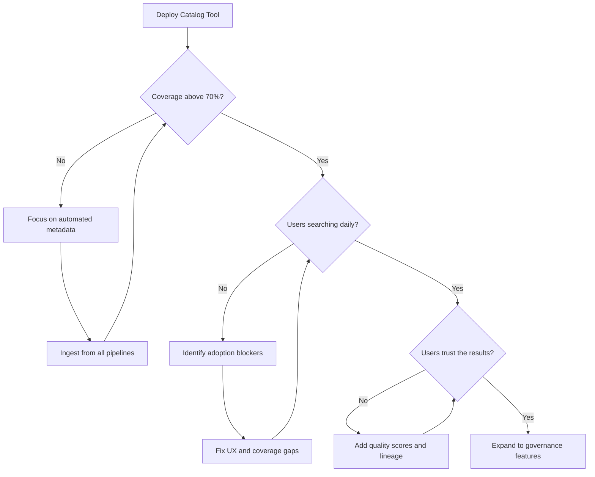

> Data discoverability is the capability that transforms a data lake from a swamp into a library: it determines whether analysts find the right dataset in 5 minutes or spend 3 days asking around.

## Why This Is a Senior Skill

Mid-level engineers implement catalog tools. Senior engineers:
- Design metadata strategies that drive adoption rather than requiring enforcement
- Understand that a catalog with 30% coverage is worse than no catalog &#40;false confidence&#41;
- Build lineage systems that answer "where did this number come from" for executives
- Recognize that discoverability is a product, not a project: it needs UX, onboarding, and iteration

Most data catalogs fail not because of technology, but because of adoption strategy.

## Core Frameworks

### Metadata Maturity Model

| Level | Characteristic | Coverage | Automation | User Experience |
|-------|---------------|----------|------------|-----------------|
| L1: Ad-hoc | Wikis and Slack channels | 5-10% | None | Search is tribal knowledge |
| L2: Basic Catalog | Tool deployed, manual tagging | 30-50% | Schema extraction only | Searchable but incomplete |
| L3: Automated | Pipeline-generated metadata | 70-80% | Lineage, profiling, freshness | Self-service with confidence scores |
| L4: Governed | Quality scores, SLAs, ownership | 90%+ | Policy enforcement, anomaly detection | Trusted datasets are highlighted |
| L5: Active | AI-powered recommendations | 95%+ | Auto-classification, PII detection | Proactive suggestions for analysts |

### Catalog Components Decision Matrix

| Component | Purpose | Build vs Buy | Senior Decision |
|-----------|---------|-------------|-----------------|
| Technical metadata | Schema, partitioning, format | Auto-extracted | Non-negotiable, automate from day one |
| Business metadata | Definitions, owners, SLAs | Crowd-sourced | Incentivize contribution, don't mandate |
| Operational metadata | Freshness, row counts, errors | Pipeline-emitted | Critical for trust signals |
| Lineage | Column-level data flow | Complex to build | Buy for production, build for learning |
| Data quality scores | Completeness, accuracy, timeliness | Hybrid | Start with simple rules, evolve to ML |

### Adoption Strategy Framework

## In Practice

**Why Most Catalogs Fail:**

1. **Coverage problem** : Manual tagging doesn't scale. If your catalog has 40% of datasets tagged, users learn to not trust it and fall back to asking colleagues.

2. **Freshness problem** : Stale metadata is worse than no metadata. A dataset tagged "refreshed daily" that hasn't run in a week destroys trust.

3. **Incentive problem** : Data producers have no incentive to document their outputs. They already know what the data means.

**Building a Catalog That Gets Used:**

Start with operational metadata because it's automatic and immediately useful:
- Last refresh time and status
- Row count trends
- Schema change history
- Upstream and downstream dependencies

Then add trust signals:
- Data quality scores &#40;even simple null-rate checks&#41;
- SLA compliance indicators
- Known caveats and limitations
- Contact information for the data owner

Finally, enable discovery:
- Business glossary integration
- Search by business term, not just table name
- "Similar datasets" recommendations
- Usage analytics &#40;most queried, most bookmarked&#41;

**Lineage at Scale:**

Column-level lineage answers the question: "This revenue number in the executive dashboard came from which source column through which transformations?" This is essential for:
- Regulatory compliance &#40;explain where numbers come from&#41;
- Impact analysis &#40;what breaks if I change this column?&#41;
- Debugging &#40;why is this metric wrong?&#41;

Implementation approaches ranked by effort:
1. **Parse SQL** : Works for simple ETL, breaks on complex UDFs
2. **Instrument frameworks** : Spark Catalyst, dbt manifest : high coverage, framework-specific
3. **Runtime tracing** : Most complete, highest operational cost
4. **Hybrid** : Parse what you can, trace what you can't

## Practical Exercise

**Scenario:** Your organization has:
- 200+ tables across 3 data warehouses
- No central catalog, documentation lives in Confluence and Slack
- Analysts spend an estimated 8 hours/week finding the right data
- Two recent incidents where decisions were made on stale data

**Your Task:**
1. Design a metadata collection strategy with phases &#40;don't boil the ocean&#41;
2. Choose between open-source &#40;DataHub, Amundsen, OpenMetadata&#41; and commercial &#40;Alation, Collibra&#41;
3. Define the minimum viable catalog: what metadata makes it useful on day one?
4. Design an adoption metric and 90-day adoption plan
5. Write a sample metadata schema for a key dataset including: description, owner, freshness SLA, quality checks, upstream lineage

## Knowledge Connections

**Existing Vault:**
- [[10_Metadata_Management]] : DMBOK metadata management concepts
- [[DMBoK v2 - Overview]] : Data governance and metadata foundations

**Adjacent Topics:**
- [[05_Data_Ownership_and_Domains]] : Who is responsible for metadata quality?
- [[03_Data_Lifecycle_Management]] : Catalog as entry point for lifecycle visibility
- [[04_Data_Catalog_and_Discoverability]] : Self-service enablement

**Tool References:**
- DataHub : LinkedIn's open-source metadata platform
- OpenMetadata : API-first approach to metadata management
- dbt docs : Lightweight lineage and documentation for analytics engineering

## Key Takeaways

- Catalog is a product, not a project: treat adoption as a UX problem, not a compliance problem
- Automate technical metadata first: schema, lineage, freshness require zero human effort and provide immediate value
- Trust signals drive adoption: quality scores, SLA indicators, and owner contacts make datasets trustworthy
- Coverage below 70% is dangerous: users learn to not trust the catalog and revert to tribal knowledge
- Column-level lineage is table stakes for regulated industries: build or buy, but don't skip it
- Measure adoption weekly: daily active searchers, bookmarked datasets, and time-to-find are your KPIs
