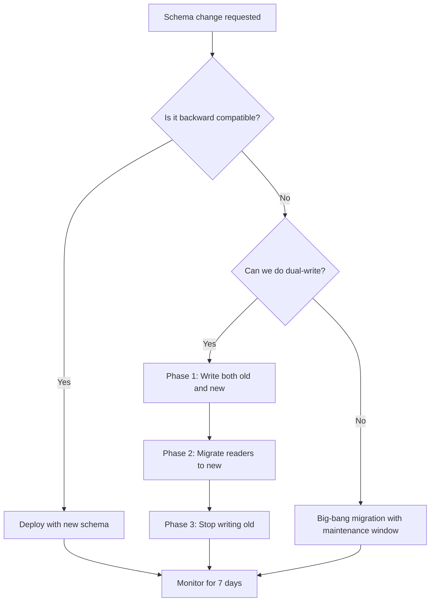

> Architecture decision records for data systems capture the context, trade-offs, and rationale behind choices that will constrain the platform for years: they are the institutional memory that prevents repeating expensive mistakes.

## Why This Is a Senior Skill

Mid-level engineers make decisions and move on. Senior engineers:
- Document decisions with enough context that future engineers understand why
- Anticipate which decisions are one-way doors &#40;hard to reverse&#41; vs two-way doors &#40;easy to change&#41;
- Design schema evolution strategies that prevent breaking changes in production
- Build migration plans that allow rollback at every step

The cost of an undocumented decision is discovered when the engineer who made it leaves and the team encounters the edge case they didn't account for.

## Core Frameworks

### ADR Template for Data Systems

| Section | Purpose | What to Include |
|---------|---------|-----------------|
| Context | Why is this decision needed now? | Business pressure, technical constraint, incident trigger |
| Options considered | What alternatives were evaluated? | At least 3 options with pros/cons for each |
| Decision | What was chosen and why? | Clear statement with primary rationale |
| Consequences | What are the expected outcomes? | Both positive and negative, short and long-term |
| Migration plan | How do we get there from here? | Phased approach with rollback points |
| Success criteria | How do we know it worked? | Measurable metrics with review timeline |

### One-Way vs Two-Way Door Decision Matrix

| Decision Type | Examples | Approach | Reversibility |
|--------------|---------|----------|---------------|
| One-way door | Storage format, table format, cloud provider | Extensive analysis, broad review, ADR required | Months to years to reverse |
| Two-way door | Query engine, orchestration tool, monitoring stack | Quick decision, iterate based on results | Weeks to reverse |
| Sliding door | Schema design, partitioning strategy | Moderate analysis, plan for evolution | Days to weeks with migration |

### Schema Evolution Strategy Matrix

| Strategy | Backward Compatible | Forward Compatible | Use When |
|----------|-------------------|-------------------|----------|
| Add nullable column | Yes | Yes | Default for most changes |
| Add column with default | Yes | Yes | New fields with sensible defaults |
| Rename column | No | No | Only with dual-write migration period |
| Change column type | Depends | Depends | Widening &#40;int to long&#41; is safe, narrowing is not |
| Drop column | Yes | No | Only after confirming no consumers read it |
| Restructure nested fields | Depends | Depends | Use schema registry for compatibility checking |

## In Practice

**Writing ADRs That Get Read:**

Most ADRs are written once and never read again. To make them useful:

1. **Keep them short** : One page maximum. If it needs more context, link to a design doc.
2. **Lead with the decision** : Don't bury the lede. Start with what was decided.
3. **Include the rejected options** : Future engineers will face the same choices.
4. **Date the constraints** : "We chose X because Y was too expensive in 2024" may not apply in 2026.
5. **Link from code** : The ADR should be findable from the codebase, not hidden in a wiki.

**Schema Evolution in Production:**

**Migration Planning Checklist:**

- [ ] Rollback procedure tested in staging
- [ ] Data validation queries defined for before/after comparison
- [ ] Consumer notification sent with timeline
- [ ] Monitoring dashboards updated for new schema
- [ ] Documentation and catalog entries updated
- [ ] On-call runbook updated for new failure modes
- [ ] Cost impact estimated for dual-write period

**Common Decision Traps:**

1. **Recency bias** : Choosing a technology because it's new, not because it solves the problem better.
2. **Resume-driven architecture** : Choosing technologies to learn rather than to serve the business.
3. **Consensus paralysis** : Waiting for everyone to agree instead of making a decision with dissent noted.
4. **Sunk cost continuation** : Continuing with a bad choice because "we've already invested so much."

## Practical Exercise

**Scenario:** Your data warehouse uses Redshift. The analytics team wants to move to Snowflake because of better concurrency for their dashboard workloads. The data engineering team prefers to stay on Redshift because their batch pipelines are optimized for it.

Current state:
- 50TB of data in Redshift
- 200+ daily batch jobs
- 50 concurrent dashboard users hitting performance issues
- $15,000/month Redshift cost, estimated $22,000/month Snowflake

**Your Task:**
1. Write an ADR for this decision using the template above
2. Evaluate at least 3 options &#40;stay, migrate, hybrid&#41;
3. Design a migration plan with rollback capability
4. Define success criteria and a 6-month review checkpoint
5. Identify the one-way doors in this decision and the two-way doors

## Knowledge Connections

**Existing Vault:**
- [[DMBoK v2 - Overview]] : Enterprise architecture principles
- [[02_Data_Architecture]] : Architectural decision context

**Adjacent Topics:**
- [[02_Data_Platform_Patterns]] : Platform selection is a key ADR
- [[01_Data_Lakehouse_and_Storage_Strategy]] : Storage decisions require ADRs
- [[03_Schema_Evolution_and_Versioning]] : Deep dive on schema change strategies

**External References:**
- Michael Nygard's ADR format : the original lightweight ADR template
- Architecture Decision Records website : patterns and examples
- Google's Design Docs at Google : engineering design documentation culture

## Key Takeaways

- One-way doors deserve ADRs, two-way doors deserve experiments: match analysis effort to reversibility
- ADRs are for future engineers: write them so someone unfamiliar with the context can understand the decision
- Schema evolution is a first-class concern: plan for change, don't pretend schemas are static
- Migration plans must include rollback: if you can't reverse it safely, you haven't planned it well enough
- Decisions have expiration dates: constraints change, revisit ADRs annually to check if they still apply
- The cost of no decision is often higher than the cost of a wrong decision: bias toward action with review checkpoints
