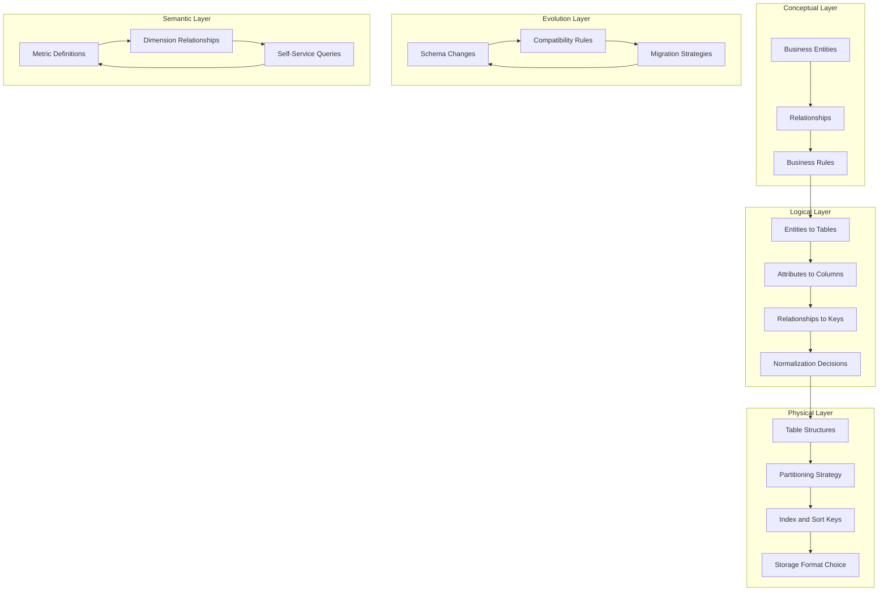

> Data modeling and design is the discipline of structuring data to serve business questions: from conceptual entities that stakeholders recognize, to logical schemas that preserve business rules, to physical tables optimized for analytical queries.

## Why This Capability Area Matters

Senior data engineers don't just create tables: they design data structures that make business questions answerable. The difference between a well-modeled domain and a poorly-modeled one is the difference between a 5-line SQL query and a 200-line CTE that no one can maintain.

This capability area covers the judgment calls that separate senior practitioners:
- Choosing the right abstraction level for conceptual models that stakeholders understand
- Designing logical schemas that preserve business rules without over-normalization
- Selecting physical structures that optimize for actual query patterns, not theoretical purity
- Managing schema evolution without breaking production consumers
- Establishing data contracts that prevent silent data quality degradation
- Building semantic layers that unify metric definitions across the organization

## Topic Map

| Topic | Focus Area | Status |
|-------|-----------|--------|
| [[01_Conceptual_and_Logical_Models]] | Entity modeling and stakeholder communication | 🔲 Not Started |
| [[02_Physical_Models_for_Analytics]] | Star schema, columnar, denormalization trade-offs | 🔲 Not Started |
| [[03_Schema_Evolution_and_Versioning]] | Handling schema changes in production | 🔲 Not Started |
| [[04_Data_Contracts]] | API-style contracts for data producers and consumers | 🔲 Not Started |
| [[05_Temporal_and_Bitemporal_Modeling]] | Time-travel, audit trails, SCD patterns | 🔲 Not Started |
| [[06_Semantic_Layer_and_Metrics_Store]] | Unified metrics and self-service analytics | 🔲 Not Started |

## Concept Map

## Existing Vault Anchors

| Concept | Vault Location | Relevance |
|---------|---------------|-----------|
| Data Architecture | [[02_Data_Architecture]] | DMBOK data modeling chapter |
| Metadata Management | [[10_Metadata_Management]] | Semantic layer metadata |
| Software Engineering Operations | [[software-engineering-note/06_Software_Engineering_Operations/Software Engineering Operations Overview]] | Schema deployment practices |

## Self-Assessment Checklist

Before proceeding, honestly assess your readiness:

**Conceptual Modeling**
- [ ] I can facilitate a domain modeling session with business stakeholders
- [ ] I understand when to use entities vs attributes vs relationships
- [ ] I can identify hidden business rules from stakeholder conversations

**Logical Modeling**
- [ ] I can normalize to 3NF and explain when to stop
- [ ] I understand the trade-offs between normalization and denormalization
- [ ] I can design schemas that preserve referential integrity

**Physical Modeling**
- [ ] I can choose between star, snowflake, and wide-table designs based on query patterns
- [ ] I understand how columnar storage affects join and filter performance
- [ ] I can design partitioning strategies that prevent small-file problems

**Schema Evolution**
- [ ] I can classify changes as backward-compatible, forward-compatible, or breaking
- [ ] I can design dual-write migrations for breaking changes
- [ ] I understand schema registry and compatibility enforcement

**Data Contracts**
- [ ] I can write data contracts that specify schema, quality, and freshness SLAs
- [ ] I can implement automated contract validation in pipelines
- [ ] I can design deprecation policies for schema changes

**Temporal Modeling**
- [ ] I understand event time vs processing time vs valid time vs transaction time
- [ ] I can implement SCD Types 1-6 and choose appropriately
- [ ] I can design bitemporal models for audit requirements

**Semantic Layer**
- [ ] I can identify metric definition conflicts across teams
- [ ] I can build a metrics store with versioned definitions
- [ ] I understand how semantic layers enable self-service analytics

## Related Links

- [[DMBoK v2 - Overview]] : Foundational data modeling knowledge area
- [[01_Data_Architecture/00_overview]] : Architecture decisions that constrain modeling
- [[03_Data_Integration_and_Pipelines/00_overview]] : Pipelines that populate the models
