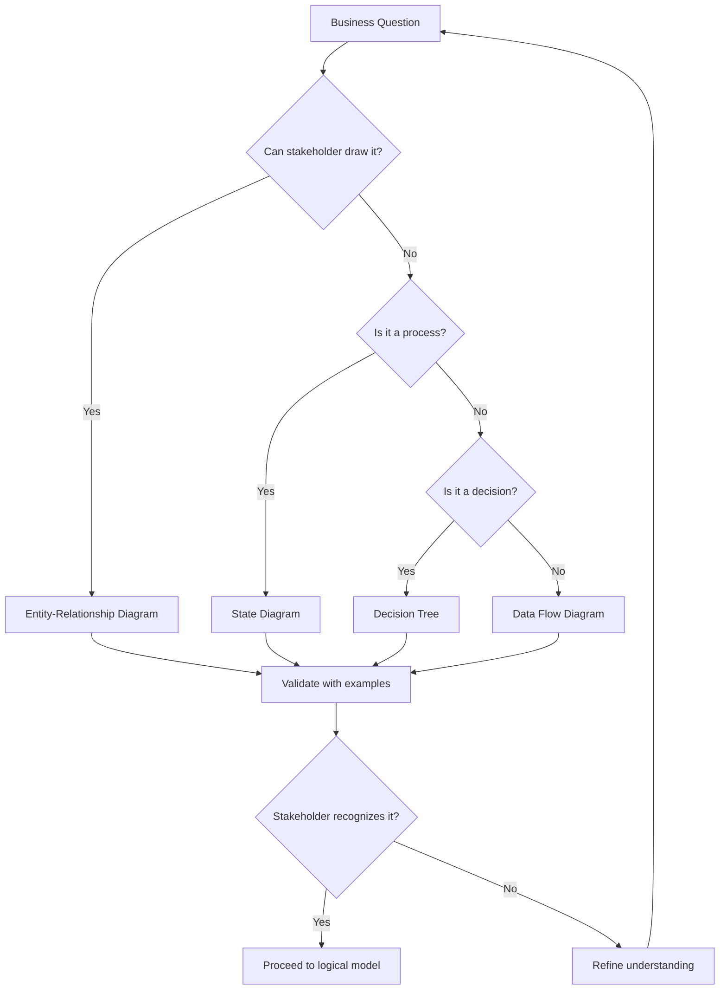

> Conceptual modeling translates business reality into entities and relationships that stakeholders recognize; logical modeling transforms those concepts into technology-agnostic schemas that preserve business rules.

## Why This Is a Senior Skill

Mid-level engineers jump straight to physical tables. Senior engineers:
- Facilitate domain modeling sessions that surface hidden business rules
- Recognize when a "simple" entity actually represents multiple business concepts
- Design logical models that remain valid as business processes evolve
- Communicate modeling trade-offs to non-technical stakeholders in business terms

The cost of skipping conceptual modeling is discovered 6 months later when analysts can't answer basic business questions because the model doesn't match how the business thinks.

## Core Frameworks

### Entity Identification Heuristics

| Signal | Likely Entity | Example |
|--------|--------------|---------|
| Noun in business language | Core entity | Customer, Order, Product |
| Unique identifier exists | Definite entity | Order ID, Customer ID |
| Has lifecycle states | Entity with status | Order: pending → shipped → delivered |
| Multiple attributes cluster | Entity candidate | Address: street, city, zip, country |
| Relationship between two things | Associative entity | OrderItem: links Order and Product |

### Normalization Decision Matrix

| Normal Form | Eliminates | Cost | When to Apply |
|-------------|-----------|------|---------------|
| 1NF | Repeating groups | Low | Always: no arrays in columns |
| 2NF | Partial dependencies | Low | Always: attributes depend on full key |
| 3NF | Transitive dependencies | Medium | Usually: reduces update anomalies |
| BCNF | Overlapping candidate keys | High | Rarely: complex, marginal benefit |
| Denormalized | Join complexity | Varies | Analytics: read-optimized models |

### Stakeholder Communication Patterns

## In Practice

**The "Customer" Entity Trap:**

Every business has a "Customer" entity, but what does it mean?
- E-commerce: Customer = person who placed an order &#40;guest checkout counts&#41;
- SaaS: Customer = account with active subscription
- B2B: Customer = company with signed contract
- Marketplace: Customer = buyer, seller, or both?

**Facilitating a Domain Modeling Session:**

1. **Start with business questions**: "What questions do you need to answer?"
2. **Extract nouns**: "You mentioned 'orders' : what information do you track about each order?"
3. **Identify relationships**: "Can a customer have multiple orders? Can an order have multiple products?"
4. **Surface business rules**: "What makes an order 'complete'? Can it be cancelled after shipping?"
5. **Validate with examples**: "Walk me through a specific order from last week."

**When Logical Models Diverge from Conceptual:**

- **Performance requirements**: Conceptual says "Order has Items" but logical denormalizes for query speed
- **Audit requirements**: Conceptual shows current state, logical tracks history &#40;temporal tables&#41;
- **Integration requirements**: Conceptual is internal, logical must match external system schemas
- **Regulatory requirements**: Conceptual has PII, logical must support anonymization

**Common Modeling Anti-Patterns:**

1. **God entity** : One table with 100+ columns that represents everything. Split it.
2. **Attribute as entity** : Creating a "Status" table when a status column suffices.
3. **Premature optimization** : Denormalizing before understanding query patterns.
4. **Ignoring soft rules** : Business says "customers usually have one address" but system allows many.

## Practical Exercise

**Scenario:** A healthcare startup needs to model:
- Patients who visit clinics
- Doctors who work at multiple clinics
- Appointments that result in diagnoses and prescriptions
- Insurance claims submitted for reimbursement

**Your Task:**
1. Identify core entities using the heuristics table
2. Draw an entity-relationship diagram &#40;use mermaid or describe relationships&#41;
3. Identify at least 3 hidden business rules by asking probing questions
4. Design a 3NF logical model with table and column definitions
5. Identify where the logical model might diverge from conceptual and why

**Deliverables:**
- Entity list with attributes
- Relationship diagram
- Business rules document
- Logical schema DDL or diagram
- Divergence analysis

## Knowledge Connections

**Existing Vault:**
- [[02_Data_Architecture]] : DMBOK data modeling chapter
- [[10_Metadata_Management]] : Model metadata and documentation

**Adjacent Topics:**
- [[02_Physical_Models_for_Analytics]] : Translating logical to physical
- [[04_Data_Contracts]] : Contracting on logical schemas
- [[05_Temporal_and_Bitemporal_Modeling]] : Adding time dimension to models

**External References:**
- "Data Modeling Made Simple" by Steve Hoberman : practical modeling techniques
- Domain-Driven Design by Eric Evans : strategic design patterns
- Event Storming by Alberto Brandolini : collaborative domain discovery

## Key Takeaways

- Start with business questions, not technology: the model should answer how the business thinks
- Entities are nouns with identity: if you can't give it a unique ID, it's probably an attribute
- Normalize to 3NF by default: denormalize deliberately for specific query patterns
- Validate with real examples: abstract models hide edge cases that concrete examples reveal
- Logical models are technology-agnostic: they should work on any database system
- Modeling is iterative: first pass captures 80%, second pass catches the edge cases
