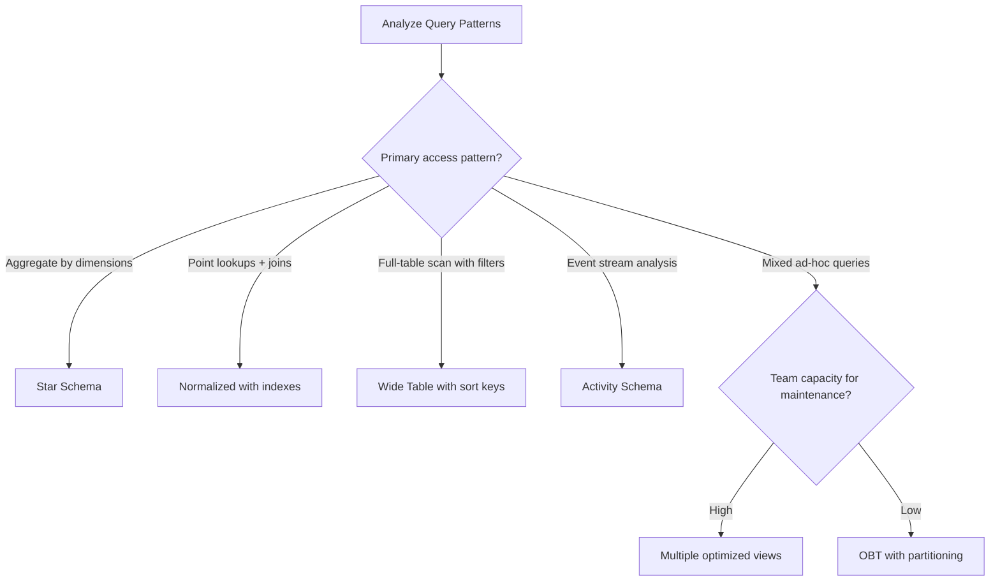

> Physical modeling for analytics is the translation of logical schemas into storage-optimized structures: choosing between star, snowflake, and wide-table designs based on query patterns, cardinality, and engine characteristics.

## Why This Is a Senior Skill

Mid-level engineers apply textbook normalization or follow a single pattern for all workloads. Senior engineers:
- Profile actual query patterns before choosing a physical design
- Understand how columnar storage engines exploit specific schema shapes
- Calculate the cost of denormalization in terms of data freshness and maintenance complexity
- Adapt physical models to the specific query engine &#40;what works for Spark may not work for Presto&#41;

The difference between a well-designed analytics schema and a poorly-designed one is often 100x in query performance and 10x in pipeline maintenance cost.

## Core Frameworks

### Schema Pattern Decision Matrix

| Pattern | Structure | Best For | Trade-offs |
|---------|-----------|----------|------------|
| Star schema | Fact + dimension tables | Standard BI, drill-down analysis | Multiple joins, dimension maintenance |
| Snowflake | Normalized dimensions | High-cardinality dimensions with shared attributes | More joins, complex queries |
| Wide table | Single denormalized table | Simple dashboards, ML feature extraction | Data duplication, update complexity |
| Activity schema | Event-level fact table | Product analytics, behavioral analysis | High volume, requires aggregation |
| OBT &#40;One Big Table&#41; | Pre-joined wide table | Self-service analytics, low-join engines | Massive duplication, stale dimensions |

### Columnar Storage Optimization

| Design Choice | Impact on Columnar Performance | When to Apply |
|--------------|-------------------------------|---------------|
| Partitioning by date | Prunes entire files for time-range queries | Time-series data with date filters |
| Sort key on filter columns | Reduces scan range for common filters | High-selectivity columns used in WHERE |
| Dictionary encoding | Compresses low-cardinality columns 10-100x | Status fields, category codes |
| Bucketing by join key | Co-locates data for efficient joins | Large table-to-large table joins |
| Clustering by correlation | Groups related rows physically | Columns frequently filtered together |

### Query Pattern to Schema Mapping

## In Practice

**Star Schema in Modern Analytics:**

The Kimball star schema remains relevant because it:
- Separates facts &#40;measurements&#41; from dimensions &#40;context&#41;
- Enables consistent drill-down and roll-up analysis
- Maps directly to how BI tools generate queries
- Allows dimensions to evolve independently of facts

**When to Denormalize:**

Denormalize when:
1. The join is on every query and the dimension is slowly changing
2. Query engine does not optimize joins well &#40;some serverless engines&#41;
3. Self-service users cannot write complex joins
4. The cost of stale data in the wide table is acceptable

Do NOT denormalize when:
1. The dimension changes frequently &#40;stale data problem&#41;
2. Multiple facts share the same dimension &#40;duplication explosion&#41;
3. You need consistent dimension values across facts

**Partitioning Strategy:**

| Data Volume | Partition Granularity | Rationale |
|------------|----------------------|-----------|
| <1GB/day | Monthly | Avoid small file problem |
| 1-10GB/day | Daily | Balance pruning and file count |
| 10-100GB/day | Daily + hourly | Fine-grained pruning for recent data |
| >100GB/day | Hourly | Prevent single partitions from being too large |

**Small File Problem:**
- Each Parquet file has metadata overhead: ~1MB minimum useful size
- 10,000 small files are slower to scan than 100 large files
- Solution: compaction jobs that merge small files periodically
- Rule of thumb: aim for 128MB-1GB per file after compaction

## Practical Exercise

**Scenario:** Your e-commerce analytics team runs these query patterns:
- Daily revenue by product category, region, and channel &#40;80% of queries&#41;
- Customer lifetime value calculations &#40;10% of queries&#41;
- Real-time inventory alerts &#40;5% of queries&#41;
- Ad-hoc exploration by data scientists &#40;5% of queries&#41;

Current: all data in normalized tables, average query time 45 seconds.

**Your Task:**
1. Design a star schema with fact and dimension tables
2. Choose partitioning and sort key strategies
3. Estimate query performance improvement
4. Identify which queries would benefit from a separate wide table
5. Write the DDL for your star schema including partitioning and clustering

## Knowledge Connections

**Existing Vault:**
- [[02_Data_Architecture]] : DMBOK physical design concepts
- [[01_Conceptual_and_Logical_Models]] : Logical models that feed physical design

**Adjacent Topics:**
- [[01_Data_Lakehouse_and_Storage_Strategy]] : Storage format choices affect physical design
- [[03_Schema_Evolution_and_Versioning]] : How physical schemas change over time
- [[06_Semantic_Layer_and_Metrics_Store]] : Abstracting physical complexity from users

**External References:**
- "The Data Warehouse Toolkit" by Ralph Kimball : dimensional modeling foundations
- Apache Iceberg partitioning documentation : modern partition evolution
- dbt best practices for analytics modeling : analytics engineering patterns

## Key Takeaways

- Profile queries before modeling: the 80/20 rule applies, optimize for the 80% pattern first
- Star schema remains king for BI: it maps to how analysts think and how BI tools generate SQL
- Columnar engines reward specific patterns: partitioning, sort keys, and encoding choices matter enormously
- Denormalization has a maintenance tax: every denormalized column is a synchronization problem
- Small files kill performance: design partitioning to produce 128MB+ files, run compaction regularly
- One size does not fit all: different query patterns may need different physical models in the same platform
