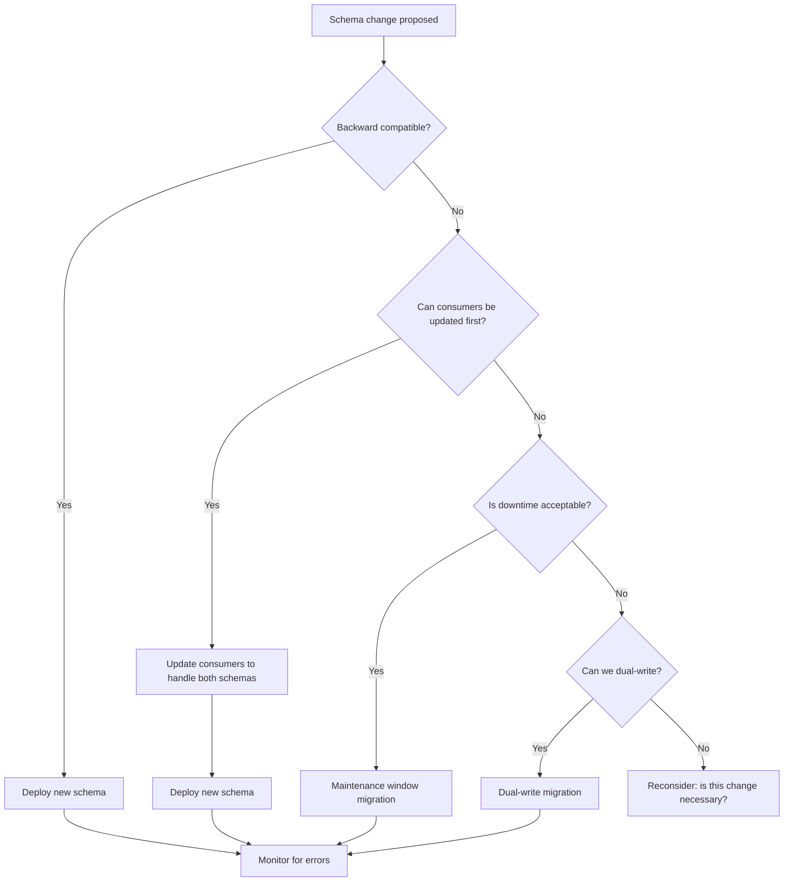

> Schema evolution is the discipline of managing schema changes in production systems without breaking consumers: it determines whether a new column deployment causes a 2 AM page or goes unnoticed.

## Why This Is a Senior Skill

Mid-level engineers make schema changes and hope nothing breaks. Senior engineers:
- Classify changes by compatibility &#40;backward, forward, full&#41; before deploying
- Design migration strategies that allow rollback at every step
- Build schema registries that enforce compatibility rules automatically
- Understand that schema evolution is a distributed systems problem with consensus challenges

A breaking schema change in a data platform can silently corrupt downstream analytics for weeks before anyone notices the numbers are wrong.

## Core Frameworks

### Compatibility Matrix

| Change Type | Backward Compatible | Forward Compatible | Full Compatible | Risk Level |
|------------|-------------------|-------------------|----------------|------------|
| Add optional field | Yes | Yes | Yes | Low |
| Add required field with default | Yes | Yes | Yes | Low |
| Remove field | Yes | No | No | Medium |
| Rename field | No | No | No | High |
| Change field type &#40;widening&#41; | Yes | Depends | Depends | Medium |
| Change field type &#40;narrowing&#41; | No | No | No | High |
| Change field order | Depends on format | Depends on format | No | Low-Medium |

### Schema Evolution Strategies

| Strategy | Mechanism | Use When | Complexity |
|----------|-----------|----------|------------|
| Schema-on-read | No enforcement, parse at query time | Exploratory data, flexible schemas | Low |
| Schema registry | Central registry with compatibility checks | Production data with many consumers | Medium |
| Dual-write migration | Write old and new schemas during transition | Breaking changes that need migration | High |
| Versioned tables | Separate tables per schema version | Regulatory requirements, audit trails | Medium |
| Blue-green deployment | New schema in parallel, switch consumers | Zero-downtime migrations | High |

### Migration Decision Flowchart



## In Practice

**Backward vs Forward Compatibility:**

- **Backward compatible** : New schema can read old data. Consumers using old schema can still read new data &#40;they ignore new fields&#41;.
- **Forward compatible** : Old schema can read new data. Producers using new schema can write data that old consumers can read.
- **Full compatible** : Both directions work. This is the gold standard but limits what changes you can make.

**Schema Registry in Action:**

```python
# Example: Confluent Schema Registry with Avro
from confluent_kafka.schema_registry import SchemaRegistryClient

schema_registry = SchemaRegistryClient({'url': 'http://schema-registry:8081'})

# Register new schema with compatibility check
schema_id = schema_registry.register_schema(
    subject='orders-value',
    schema=new_order_schema,
    # Registry checks backward compatibility automatically
)

# If incompatible, registry rejects the registration
# Producer cannot write data with incompatible schema
```

**Common Evolution Scenarios:**

1. **Adding a column** : 
   - Make it nullable or provide a default
   - Update ETL to populate the new column
   - No consumer changes needed &#40;backward compatible&#41;

2. **Renaming a column** :
   - Add new column with new name
   - Dual-write to both old and new columns
   - Update consumers to read new column
   - After all consumers migrated, stop writing to old column
   - Eventually drop old column &#40;breaking change, requires coordination&#41;

3. **Changing a column type** :
   - Widening &#40;int to long&#41;: usually safe, test edge cases
   - Narrowing &#40;long to int&#41;: dangerous, requires data validation
   - String to enum: requires validation that all values are in enum
   - Always test with production data sample before deploying

**The Silent Corruption Problem:**

Schema changes can corrupt data silently:
- Producer writes new schema, consumer reads old schema and misinterprets bytes
- Column order changes in Parquet, reader maps wrong column to wrong field
- Type change causes truncation or overflow without error

Prevention:
- Use schema registry that enforces compatibility
- Use named fields &#40;not positional&#41; in serialization formats
- Add schema version to metadata and validate on read
- Monitor for schema mismatch errors in consumer logs

## Practical Exercise

**Scenario:** Your orders table has this schema:
```sql
CREATE TABLE orders &#40;
  order_id BIGINT,
  customer_id BIGINT,
  order_date TIMESTAMP,
  total_amount DECIMAL&#40;10,2&#41;,
  status VARCHAR&#40;20&#41;
&#41;;
```

Three changes are requested:
1. Add `shipping_address` field &#40;nullable JSON&#41;
2. Rename `total_amount` to `order_total` &#40;business wants consistency&#41;
3. Change `status` from VARCHAR to ENUM with values: pending, shipped, delivered, cancelled

**Your Task:**
1. Classify each change by compatibility type
2. Design a migration strategy for each change
3. Write the migration steps with rollback procedures
4. Identify which changes require consumer coordination
5. Estimate the timeline for each migration

## Knowledge Connections

**Existing Vault:**
- [[02_Data_Architecture]] : Schema management concepts
- [[software-engineering-note/06_Software_Engineering_Operations/Software Engineering Operations Overview]] : Deployment strategies

**Adjacent Topics:**
- [[04_Data_Contracts]] : Contracts that enforce schema stability
- [[02_Physical_Models_for_Analytics]] : Physical schema changes
- [[05_Temporal_and_Bitemporal_Modeling]] : Schema versioning over time

**External References:**
- Confluent Schema Registry documentation : schema evolution for Kafka
- Apache Avro specification : schema resolution rules
- "Designing Data-Intensive Applications" Chapter 4 : encoding and evolution

## Key Takeaways

- Classify before you change: backward, forward, or full compatibility determines your migration strategy
- Schema registry is table stakes for production: manual compatibility checking does not scale
- Dual-write is the safe path for breaking changes: it costs compute but prevents downtime
- Silent corruption is the worst failure mode: use named fields, schema versions, and compatibility enforcement
- Renaming is a multi-phase migration: add new, dual-write, migrate consumers, drop old
- Test with production data: edge cases in real data break migrations that work in staging
