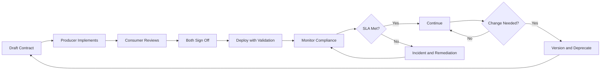

> Data contracts are API-style agreements between data producers and consumers that define schema, quality, freshness, and ownership: they transform data from an implicit promise into an explicit, testable, versioned interface.

## Why This Is a Senior Skill

Mid-level engineers assume data will arrive in the expected format and discover problems at query time. Senior engineers:
- Treat data as a product with explicit SLAs and versioned contracts
- Build automated validation that prevents bad data from reaching consumers
- Design deprecation policies that give consumers time to migrate
- Recognize that contracts shift accountability from consumers &#40;who discover issues&#41; to producers &#40;who cause them&#41;

Without contracts, data quality incidents become blame games: producers say "we didn't know you depended on that field" and consumers say "you broke our dashboard."

## Core Frameworks

### Data Contract Components

| Component | Definition | Example | Enforcement |
|-----------|-----------|---------|-------------|
| Schema | Field names, types, nullability | order_id: BIGINT NOT NULL | Schema registry validation |
| Quality rules | Completeness, accuracy, timeliness | null_rate < 0.1% for order_id | Automated quality checks |
| Freshness SLA | How recent the data must be | Updated within 1 hour of source | Freshness monitoring |
| Volume expectations | Expected row count ranges | 10K-50K rows per day | Volume anomaly detection |
| Ownership | Who to contact when it breaks | orders-team@company.com | On-call routing |
| Deprecation policy | How changes are communicated | 30-day notice for breaking changes | Change notification system |

### Contract Maturity Levels

| Level | Characteristic | Validation | Consumer Experience |
|-------|---------------|------------|---------------------|
| L0: None | Implicit expectations | None | "It usually works" |
| L1: Schema only | Field names and types | Schema registry | "At least the columns exist" |
| L2: Quality rules | Null rates, value ranges | Automated checks | "Data is mostly correct" |
| L3: SLAs | Freshness, availability guarantees | Monitoring and alerting | "I know when to expect updates" |
| L4: Versioned | Semantic versioning, deprecation | Contract testing | "I have time to migrate" |
| L5: Certified | Quality scores, audit trails | Continuous validation | "I trust this data for decisions" |

### Contract Lifecycle



## In Practice

**Why Contracts Fail:**

1. **No enforcement** : Contracts exist as documentation but bad data still flows through. Solution: automated validation at ingestion.

2. **Over-specification** : Contracts are so rigid that any change requires a formal process. Solution: distinguish breaking changes &#40;schema&#41; from non-breaking &#40;adding optional fields&#41;.

3. **No consumer input** : Producers define contracts without consulting consumers. Solution: contract review process with consumer sign-off.

4. **No deprecation policy** : Producers make breaking changes without notice. Solution: versioned contracts with minimum deprecation windows.

**Implementing Data Contracts:**

```yaml
# Example: Data contract for orders table
contract:
  name: orders
  version: 2.1.0
  owner: orders-team@company.com
  
  schema:
    fields:
      - name: order_id
        type: BIGINT
        nullable: false
        description: Unique order identifier
      - name: customer_id
        type: BIGINT
        nullable: false
      - name: order_date
        type: TIMESTAMP
        nullable: false
      - name: total_amount
        type: DECIMAL(10,2)
        nullable: false
      - name: status
        type: VARCHAR(20)
        nullable: false
        allowed_values: [pending, shipped, delivered, cancelled]
  
  quality_rules:
    - field: order_id
      rule: unique
    - field: total_amount
      rule: "value >= 0"
    - field: status
      rule: "null_rate < 0.001"
  
  freshness:
    update_frequency: hourly
    max_delay: 2 hours
    
  volume:
    expected_daily_rows: 10000-50000
    alert_if_outside: true
    
  deprecation:
    breaking_change_notice: 30 days
    non_breaking_change_notice: 7 days
```

**Contract Testing:**

Data contracts need automated validation: schema checks, quality rules, volume ranges, and freshness. Fail the pipeline if validation fails: better to delay data than deliver bad data.

## Practical Exercise

**Scenario:** Your company has 3 critical datasets:
1. **orders** : Used by finance for revenue reporting
2. **user_events** : Used by product for feature analytics
3. **inventory** : Used by operations for stock management

Current state: No contracts, frequent "data is wrong" incidents, 2-hour mean time to detect issues.

**Your Task:**
1. Draft data contracts for each dataset using the YAML template
2. Define quality rules based on business requirements &#40;what would make the data "wrong"?&#41;
3. Design a validation pipeline that checks contracts before data reaches consumers
4. Create a deprecation policy for schema changes
5. Define monitoring and alerting for contract violations

**Deliverables:**
- 3 contract YAML files
- Validation pipeline design
- Alerting strategy
- Deprecation policy document

## Knowledge Connections

**Existing Vault:**
- [[02_Data_Architecture]] : Data governance and quality concepts
- [[software-engineering-note/06_Software_Engineering_Operations/Software Engineering Operations Overview]] : API contract patterns

**Adjacent Topics:**
- [[03_Schema_Evolution_and_Versioning]] : Contracts enable safe evolution
- [[04_Data_Catalog_and_Discoverability]] : Contracts as catalog metadata
- [[05_Data_Ownership_and_Domains]] : Contracts formalize ownership accountability

**External References:**
- "Data Contracts" by Andrew Jones : comprehensive guide to data contracts
- Great Expectations : data quality validation framework
- dbt tests : lightweight contract testing for analytics

## Key Takeaways

- Contracts shift accountability to producers: they own data quality, not consumers who discover issues
- Automate validation at ingestion: contracts without enforcement are just documentation
- Version contracts like APIs: semantic versioning with deprecation windows prevents breaking changes
- Start with schema, add quality progressively: L1 &#40;schema&#41; is better than L0 &#40;nothing&#41;
- Contracts are two-way agreements: consumers must review and sign off, not just receive
- Monitor contract compliance continuously: freshness, volume, and quality violations need alerts
