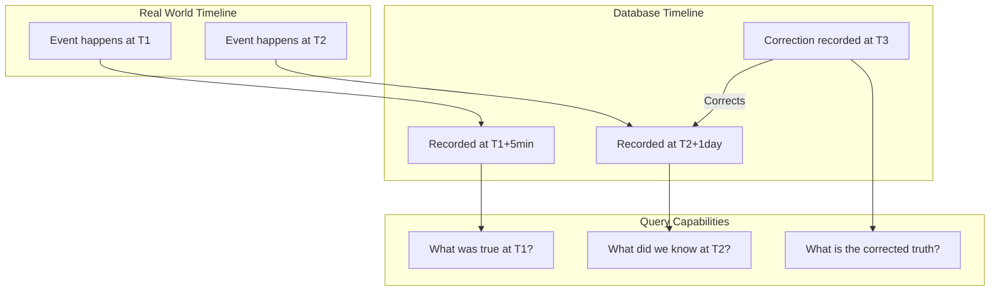

> Temporal modeling captures how data changes over time: it enables time-travel queries, audit trails, and historical analysis that answer "what was true at this point in time?"

## Why This Is a Senior Skill

Mid-level engineers store only current state and lose history. Senior engineers:
- Distinguish between when something happened &#40;event time&#41; and when we learned about it &#40;processing time&#41;
- Design slowly changing dimensions that balance storage cost with historical accuracy
- Implement bitemporal models when regulatory requirements demand audit trails
- Understand the query complexity and storage implications of temporal designs

The cost of not modeling time is discovered when an auditor asks "what was this customer's address on March 15th?" and the system only knows the current address.

## Core Frameworks

### Temporal Dimensions

| Time Type | Definition | Example | Use When |
|-----------|-----------|---------|----------|
| Event time | When the event actually occurred | Order placed at 2024-03-15 14:30 | Always: this is ground truth |
| Processing time | When the system recorded the event | Ingested at 2024-03-15 14:35 | For latency monitoring and debugging |
| Valid time | When a fact is true in the real world | Customer lived at address from Jan 1 to Mar 15 | For historical accuracy |
| Transaction time | When the fact was recorded in the database | Address updated in DB on Mar 16 | For audit trails |

### Slowly Changing Dimensions &#40;SCD&#41; Types

| Type | Strategy | Storage | History | Use When |
|------|----------|---------|---------|----------|
| Type 0 | Never change | Low | None | Immutable facts &#40;birth date&#41; |
| Type 1 | Overwrite | Low | None | Corrections, no history needed |
| Type 2 | Add new row with dates | High | Full | Track all changes with validity periods |
| Type 3 | Add "previous" column | Medium | One level | Only need current and previous value |
| Type 4 | Separate history table | Medium-High | Full | High-change attributes separated from stable |
| Type 6 | Hybrid: current + history | High | Full | Need fast current access plus full history |

### Bitemporal Model Structure



## In Practice

**When to Use Bitemporal:**

Bitemporal modeling is necessary for regulatory requirements &#40;"show us what you knew on this date"&#41;, correction tracking, dispute resolution, and ML reproducibility. It is overkill when only current state matters, corrections are rare, storage cost is constrained, or query complexity would overwhelm the team.

**SCD Type 2 Implementation:**

```sql
-- Example: Customer address with SCD Type 2
CREATE TABLE customer_addresses &#40;
  customer_id BIGINT,
  address VARCHAR&#40;255&#41;,
  valid_from DATE,
  valid_to DATE,  -- NULL means current
  is_current BOOLEAN,
  created_at TIMESTAMP,
  
  PRIMARY KEY &#40;customer_id, valid_from&#41;
&#41;;

-- Query: What was the customer's address on March 15, 2024?
SELECT address
FROM customer_addresses
WHERE customer_id = 12345
  AND valid_from <= '2024-03-15'
  AND &#40;valid_to > '2024-03-15' OR valid_to IS NULL&#41;;

-- Query: What is the current address?
SELECT address
FROM customer_addresses
WHERE customer_id = 12345
  AND is_current = TRUE;
```

**Storage and Query Trade-offs:**

| Approach | Storage Cost | Query Complexity | Update Complexity |
|----------|-------------|------------------|-------------------|
| Current only | Low | Low | Low |
| SCD Type 2 | High &#40;2-10x&#41; | Medium &#40;date filters&#41; | High &#40;close old, open new&#41; |
| Event sourcing | Very high | High &#40;reconstruct state&#41; | Low &#40;append only&#41; |
| Bitemporal | Very high | Very high &#40;two time dimensions&#41; | Very high |

**Common Temporal Anti-Patterns:**

1. **Updating in place** : Destroys history, makes audit impossible. Use SCD Type 2 or append-only.

2. **Ignoring late-arriving data** : Event happened at T1 but arrived at T2. If you only track processing time, you lose the actual event time.

3. **Time zone confusion** : Store all timestamps in UTC, convert to local time at query time. Never store mixed time zones.

4. **Date vs timestamp mismatch** : Using DATE for valid_from/to but TIMESTAMP for event_time creates granularity mismatches.

## Practical Exercise

**Scenario:** A financial services company needs to track:
- Customer account balances &#40;change daily&#41;
- Interest rates &#40;change monthly&#41;
- Customer addresses &#40;change rarely, but need audit trail&#41;
- Transaction records &#40;immutable once recorded&#41;

Regulatory requirement: "Produce the state of any account as it was known on any date in the past 7 years."

**Your Task:**
1. Choose SCD type for each entity with justification
2. Design the schema for bitemporal tracking where required
3. Write queries for:
   - Current account balance
   - Balance on a specific past date
   - All address changes for a customer
   - What the system knew about an account on a specific date &#40;audit query&#41;
4. Estimate storage growth over 7 years
5. Design a data retention policy for temporal data

## Knowledge Connections

**Existing Vault:**
- [[02_Data_Architecture]] : Temporal data concepts
- [[10_Metadata_Management]] : Metadata versioning over time

**Adjacent Topics:**
- [[03_Schema_Evolution_and_Versioning]] : Schema changes are a form of temporal modeling
- [[04_Data_Contracts]] : Contracts may specify temporal guarantees
- [[02_Physical_Models_for_Analytics]] : Partitioning by time for temporal queries

**External References:**
- "Temporal Data and the Relational Model" by C.J. Date : theoretical foundations
- Apache Iceberg time travel : modern implementation of temporal queries
- Martin Fowler's "Event Sourcing" pattern : append-only temporal design

## Key Takeaways

- Event time vs processing time: always capture both, event time is ground truth, processing time is for debugging
- SCD Type 2 is the default for history: it balances storage cost with full historical accuracy
- Bitemporal is for audit and compliance: only use when you need to know "what did we know when?"
- Storage cost multiplies with history: SCD Type 2 can be 2-10x larger than current-only, plan accordingly
- Query complexity increases with temporal dimensions: train analysts on date-range filters and validity periods
- Time zones must be consistent: store UTC, convert at query time, never mix time zones in storage
