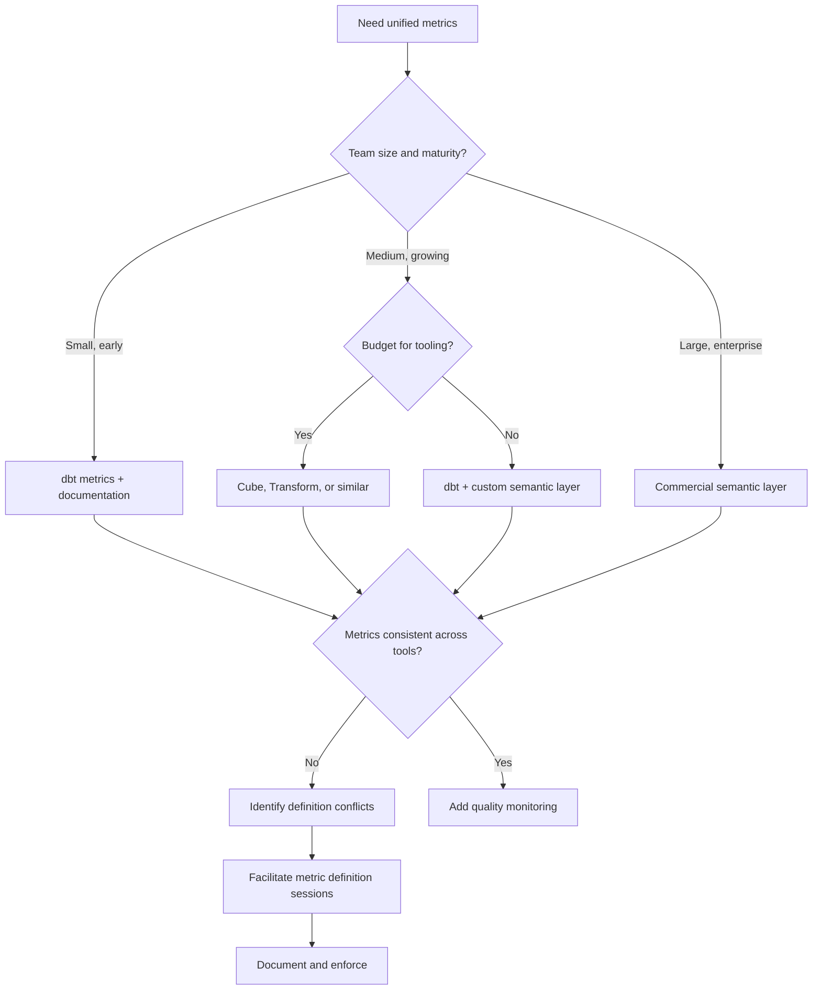

> The semantic layer is the translation layer between physical data structures and business concepts: it ensures that "revenue" means the same thing in every dashboard, report, and analysis across the organization.

## Why This Is a Senior Skill

Mid-level engineers build tables and let analysts define metrics in their BI tools. Senior engineers:
- Recognize that inconsistent metric definitions cause executive-level confusion and distrust
- Design semantic layers that enable self-service without sacrificing accuracy
- Build metrics stores that version and test metric definitions like code
- Understand that the semantic layer is where data engineering meets business strategy

When the CFO and CMO report different revenue numbers in the same quarter, the problem is not the data: it is the lack of a semantic layer that defines "revenue" once and enforces that definition everywhere.

## Core Frameworks

### Semantic Layer Components

| Component | Purpose | Example | Ownership |
|-----------|---------|---------|-----------|
| Dimensions | Business entities for grouping | Customer segment, product category | Data engineering |
| Metrics | Business measures with definitions | Revenue, conversion rate, DAU | Analytics engineering |
| Filters | Reusable filter definitions | "Active customer", "High-value order" | Domain experts |
| Relationships | How dimensions connect | Customer → Orders → Products | Data engineering |
| Calculations | Derived metrics | Revenue per customer = Revenue / Customer count | Analytics engineering |

### Metrics Store Maturity

| Level | Characteristic | Definition Location | Consistency | Governance |
|-------|---------------|-------------------|-------------|------------|
| L0: Ad-hoc | Metrics defined in BI tools | Scattered across dashboards | Low: same name, different definitions | None |
| L1: Documented | Metrics in a wiki or spreadsheet | Central documentation | Medium: documented but not enforced | Manual review |
| L2: Centralized | Metrics in a semantic layer tool | Semantic layer platform | High: single source of truth | Access controls |
| L3: Versioned | Metrics as code with testing | Git repository with CI/CD | Very high: tested and versioned | Code review, automated tests |
| L4: Certified | Metrics with quality scores and SLAs | Integrated with data catalog | Trusted: quality indicators visible | Full lifecycle management |

### Implementation Approaches



## In Practice

**The "Two Revenue Numbers" Problem:**

Finance defines revenue as: recognized revenue per accounting standards &#40;excludes refunds, deferred revenue&#41;
Sales defines revenue as: booked revenue &#40;includes signed contracts, even if not yet recognized&#41;
Marketing defines revenue as: attributed revenue &#40;only revenue from tracked marketing campaigns&#41;

All three are "correct" for their purpose. The semantic layer must:
1. **Name them differently** : recognized_revenue, booked_revenue, attributed_revenue
2. **Document the differences** : Clear definitions with examples
3. **Make the right one easy to find** : Default to the most common use case
4. **Prevent confusion** : Show the definition when hovering over the metric

**Building a Metrics Store:**

```yaml
# Example: Metric definition in dbt semantic layer
metrics:
  - name: monthly_active_users
    label: Monthly Active Users &#40;MAU&#41;
    description: >
      Count of unique users who performed at least one action
      in the trailing 30 days. Excludes internal test accounts.
    
    type: count_distinct
    expression: user_id
    
    filters:
      - field: is_internal
        operator: "="
        value: false
      - field: event_date
        operator: ">="
        value: "{{ dateadd('day', -30, current_date) }}"
    
    dimensions:
      - user_segment
      - platform
      - country
    
    owner: product-analytics@company.com
    
    tests:
      - name: mau_positive
        expression: "{{ metric('monthly_active_users') }} > 0"
      - name: mau_reasonable_range
        expression: "{{ metric('monthly_active_users') }} BETWEEN 100000 AND 500000"
```

**Semantic Layer Architecture:**

The semantic layer sits between BI tools and physical data: BI tools query the semantic layer via SQL API or GraphQL, the semantic layer engine translates business concepts to SQL queries with metric definitions and dimension relationships, and executes against optimized physical tables in the data warehouse.

**Self-Service Enablement:**

Self-service works when analysts find metrics by business name, dimensions are pre-defined, filters are reusable, and query performance is acceptable. It fails when metrics are undocumented, too many similar metrics exist, or there is no governance over who can create metrics.

## Practical Exercise

**Scenario:** Your company has these metrics defined in different places:
- **Finance dashboard** &#40;Tableau&#41;: revenue, cost, profit margin
- **Product dashboard** &#40;Looker&#41;: DAU, MAU, retention rate, conversion rate
- **Marketing dashboard** &#40;Excel&#41;: CAC, LTV, ROAS, attributed revenue
- **Sales dashboard** &#40;Salesforce&#41;: pipeline value, win rate, booked revenue

Problem: "Revenue" appears in 3 dashboards with different definitions. Executives are confused.

**Your Task:**
1. Inventory all metrics across the 4 dashboards
2. Identify conflicts: which metrics have the same name but different definitions?
3. Facilitate a metric definition session: bring stakeholders together to agree on definitions
4. Design a semantic layer with unified metric definitions
5. Create a migration plan: how do you move from 4 separate dashboards to a unified semantic layer?

**Deliverables:**
- Metric inventory spreadsheet
- Conflict resolution document
- Semantic layer YAML definitions for 5 key metrics
- Migration timeline and communication plan

## Knowledge Connections

**Existing Vault:**
- [[02_Data_Architecture]] : Enterprise data architecture concepts
- [[10_Metadata_Management]] : Metadata for semantic layers

**Adjacent Topics:**
- [[04_Data_Contracts]] : Contracts can include semantic definitions
- [[04_Data_Catalog_and_Discoverability]] : Catalog integrates with semantic layer
- [[02_Physical_Models_for_Analytics]] : Physical models that serve the semantic layer

**External References:**
- dbt Semantic Layer documentation : open-source semantic layer approach
- Cube.js documentation : headless BI and semantic layer
- "The Analytics Engineering Guide" by dbt Labs : modern analytics engineering practices

## Key Takeaways

- One definition, many uses: the semantic layer defines metrics once and enforces that definition everywhere
- Metrics are code: version them in Git, test them, review them like software
- Name conflicts are the real problem: "revenue" means different things to different teams, name them distinctly
- Self-service requires governance: without a semantic layer, self-service becomes self-confusion
- Start with the most contentious metrics: revenue, customers, and conversion rates are usually where conflicts live
- The semantic layer is a product: it needs UX, documentation, and iteration based on user feedback
